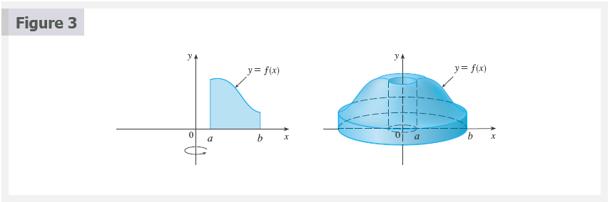
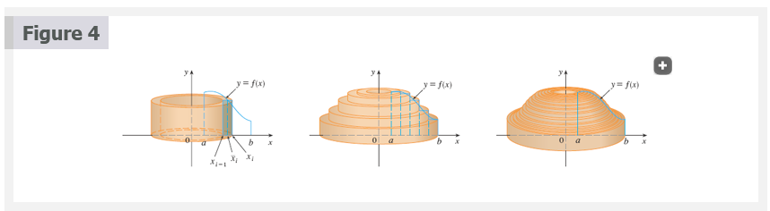
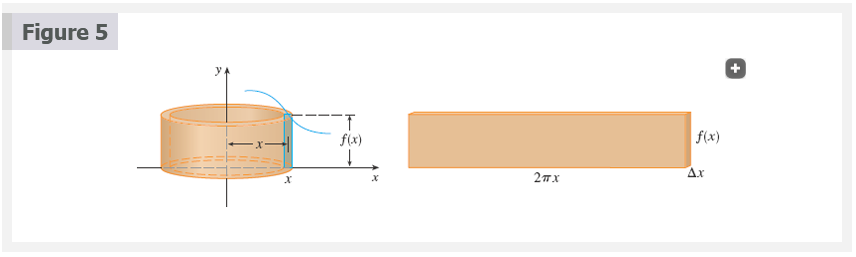
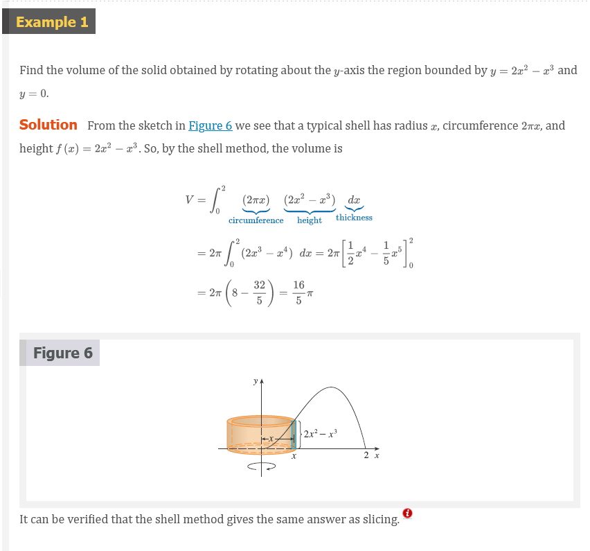
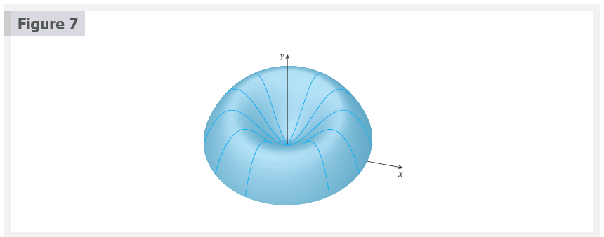
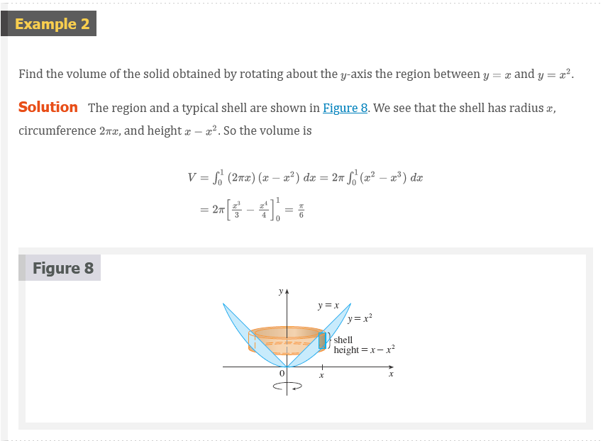
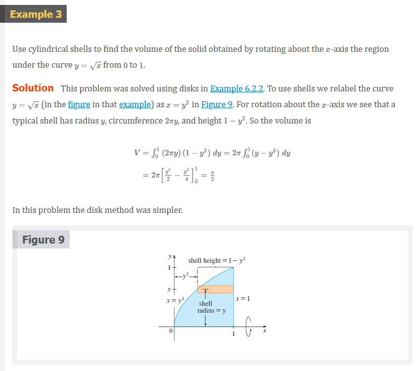
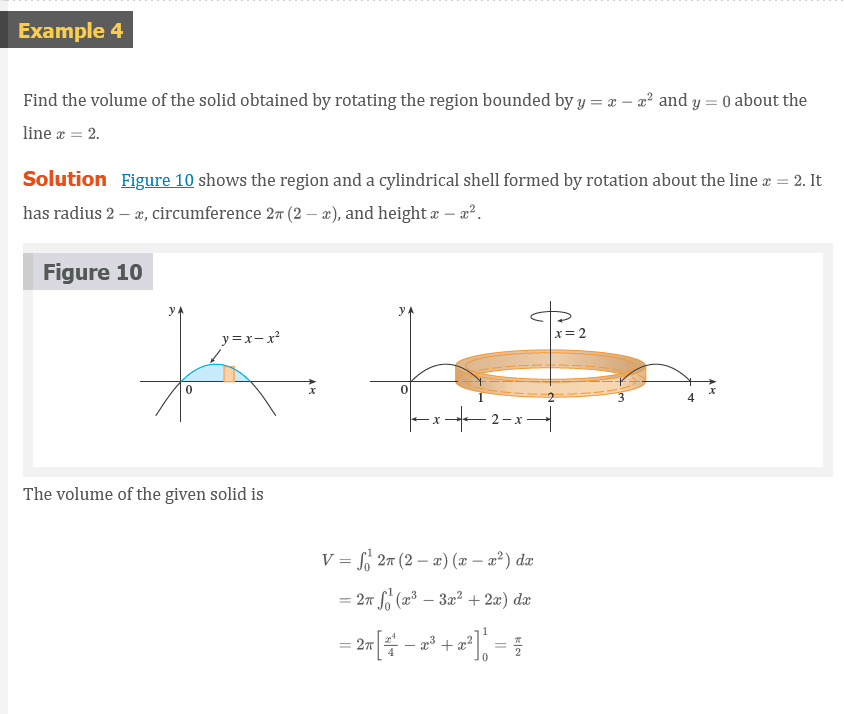

# Chapter 6.3: Volumes by Cylindrical Shells

## Volumes by Cylindrical Shells

Some volume problems are very difficult to handle by the methods of the
preceding section. For instance, let's consider the problem of finding the
volume of the solid obtained by rotating about the $y$-axis the region bounded
by $y = 2x^{2} - x^{3}$ and $y = 0$. (See Figure 1.) If we slice perpendicular
to the $y$-axis, we get a washer.  But to compute the inner radius and the outer
radius of the washer, we'd have to solve the cubic equation $y = 2x^{2} - x^{3}$
for $x$ in terms of $y$; that's not easy.

Fortunately, there is a method, called the method of cylindrical shells, that is
easier to use in such a case. Figure 2 shows a cylindrical shell with inner
radius $r_{1}$, outer radius $r_{2}$, and height $h$. Its volume $V$ is
calculated by subtracting the volume $V_{1}$ of the inner cylinder from the
volume $V_{2}$ of the outer cylinder:

$$
\begin{aligned}
  V &= V_{2} - V_{1} \\
   &= \pi r_{2}^{2}h - \pi r_{1}^{2} = \pi(r_{2}^{2} - r_{1}^{2})h \\
   &= \pi(r_{2} + r_{1})h \\
   &= 2 \pi \frac{r_{2} + r_{1}}{2}h(r_{2} - r_{1}) \\
\end{aligned}
$$

If we let $\Delta{r} = r_{2} - r_{1}$ (the thickness of the shell) and $r =
\frac{1}{2}(r_{2} + r_{1})$ (the average radius of the shell), then this formula
for the volume of a cylindrical shell becomes

## Formula 1

$$
V = 2 \pi rh \Delta{r}
$$

and it can be remembered as

$$
V = [\text{circumference}][\text{height}][\text{thickness}]
$$

Now let $S$ be the solid obtained by rotating about the $y$-axis the region
bounded by $y = f(X)$ [where $f(x) \ge 0$], $y = 0$, $x = a$, and $b > a \ge 0$,
where. (See Figure 3.)

We divide the interval $[a, b]$ into $n$ subintervals $[x_{i - 1}, x_{i}]$ of
equal width $\Delta{x}$ and let be the midpoint of the $i$th subinterval. If the
rectangle with base $[x_{i - 1}, x_{i}]$ and height $f(\overline{x}_{i})$ is
rotated about the $y$-axis, then the result is a cylindrical shell with average
radius $\overline{x}_{i}$, height $f(\overline{x}_{i})$, and thickness
$\Delta{x}$ (See Figure 4). So by Formula 1 its volume is

$$
V_{i} = (2 \pi \overline{x}_{i})[f(\overline{x}_{i})]\Delta{x}
$$

Therefore an approximation to the volume $V$ of $S$ is given by the sum of the
volumes of these shells:

$$
V \approx \sum_{i = 1}^{n} V_{i} = \sum_{i = 1}^{n} 2 \pi \overline{x}_{i}f(\overline{x}_{i})\;\Delta{x}
$$

This approximation appears to become better as $n \to \infty$. But, from the
definition of an integral, we know that

$$
\lim_{n \to \infty} \sum_{i = 1}^{n} 2 \pi \overline{x}_{i}f(\overline{x}_{i})\;\Delta{x} = \int_{a}^{b} 2 \pi xf(x)\;dx
$$

Thus the following appears plausible:

## Formula 2

The volume of the solid in Figure 3, obtained by rotating about the $y$-axis the
region under the curve $y = f(x)$ from $a$ to $b$, is

$$
V = \int_{a}^{b} 2 \pi xf(x)\;dx \;\;\;\;\; \text{ where } 0 \le a < b
$$

The argument using cylindrical shells makes Formula 2 seem reasonable, but later
we will be able to prove it (See Exercise 7.1.73).

The best way to remember Formula 2 is to think of a typical shell, cut and
flattened as in Figure 5, with radius $x$, circumference $2 \pi x$, height
$f(x)$, and thickness $\Delta{x}$ or $dx$:

$$
\begin{array}{cccc}
  \int_{a}^{b} & \underbrace{2 \pi x} & \underbrace{[f(x)]} & \underbrace{dx} \\
   & \text{circumference} & \text{height} & \text{thickness} \\
\end{array}
$$

## Disks and Washers versus Cylindrical Shells

When computing the volume of a solid of revolution, how do we know whether to
use disks (or washers) or cylindrical shells? There are several considerations
to take into account: Is the region more easily described by top and bottom
boundary curves of the form $y = f(x)$, or by left and right boundaries $x =
g(y)$? Which choice is easier to work with? Are the limits of integration easier
to find for one variable versus the other? Does the region require two separate
integrals when using $x$ as the variable but only one integral in $y$? Are we
able to evaluate the integral we set up with our choice of variable?

If we decide that one variable is easier to work with than the other, then this
dictates which method to use. Draw a sample rectangle in the region,
corresponding to a cross-section of the solid. The thickness of the rectangle,
either $\Delta{x}$ or $\Delta{y}$, corresponds to the integration variable. If
you imagine the rectangle revolving, it becomes either a disk (washer) or a
shell.

## Video Lectures

- [📺 Shell method for rotating around vertical line](https://www.khanacademy.org/math/old-ap-calculus-ab/ab-applications-definite-integrals/ab-shell-method/v/shell-method-for-rotating-around-vertical-line)
- [📺 Evaluating integral for shell method example](https://www.khanacademy.org/math/old-ap-calculus-ab/ab-applications-definite-integrals/ab-shell-method/v/evaluating-integral-for-shell-method-example)
- [📺 Shell method for rotating around horizontal line](https://www.khanacademy.org/math/old-ap-calculus-ab/ab-applications-definite-integrals/ab-shell-method/v/shell-method-for-rotating-around-horizontal-line)
- [📺 Shell method with two functions of x](https://www.khanacademy.org/math/old-ap-calculus-ab/ab-applications-definite-integrals/ab-shell-method/v/shell-method-with-two-functions-of-x)
- [📺 Calculating integral with shell method](https://www.khanacademy.org/math/old-ap-calculus-ab/ab-applications-definite-integrals/ab-shell-method/v/calculating-integral-with-shell-method)
- [📺 Shell method with two functions of y](https://www.khanacademy.org/math/old-ap-calculus-ab/ab-applications-definite-integrals/ab-shell-method/v/shell-method-with-two-functions-of-y)
- [📺 Part 2 of shell method with 2 functions of y](https://www.khanacademy.org/math/old-ap-calculus-ab/ab-applications-definite-integrals/ab-shell-method/v/part-2-of-shell-method-with-2-functions-of-y)
- [📄 Shell method worksheet](https://www.khanacademy.org/math/old-ap-calculus-ab/ab-applications-definite-integrals/ab-shell-method/a/stacy-scaling-3)

 

# Resources

- [📺 Shell method for rotating around vertical line](https://www.khanacademy.org/math/old-ap-calculus-ab/ab-applications-definite-integrals/ab-shell-method/v/shell-method-for-rotating-around-vertical-line)
- [📺 Evaluating integral for shell method example](https://www.khanacademy.org/math/old-ap-calculus-ab/ab-applications-definite-integrals/ab-shell-method/v/evaluating-integral-for-shell-method-example)
- [📺 Shell method for rotating around horizontal line](https://www.khanacademy.org/math/old-ap-calculus-ab/ab-applications-definite-integrals/ab-shell-method/v/shell-method-for-rotating-around-horizontal-line)
- [📺 Shell method with two functions of x](https://www.khanacademy.org/math/old-ap-calculus-ab/ab-applications-definite-integrals/ab-shell-method/v/shell-method-with-two-functions-of-x)
- [📺 Calculating integral with shell method](https://www.khanacademy.org/math/old-ap-calculus-ab/ab-applications-definite-integrals/ab-shell-method/v/calculating-integral-with-shell-method)
- [📺 Shell method with two functions of y](https://www.khanacademy.org/math/old-ap-calculus-ab/ab-applications-definite-integrals/ab-shell-method/v/shell-method-with-two-functions-of-y)
- [📺 Part 2 of shell method with 2 functions of y](https://www.khanacademy.org/math/old-ap-calculus-ab/ab-applications-definite-integrals/ab-shell-method/v/part-2-of-shell-method-with-2-functions-of-y)
- [📄 Shell method worksheet](https://www.khanacademy.org/math/old-ap-calculus-ab/ab-applications-definite-integrals/ab-shell-method/a/stacy-scaling-3)

Textbook

+ [📄 Cengage e-Textbook: Calculus Early Transcendentals, Eighth Edition, Stewart](https://webassign.com/)

