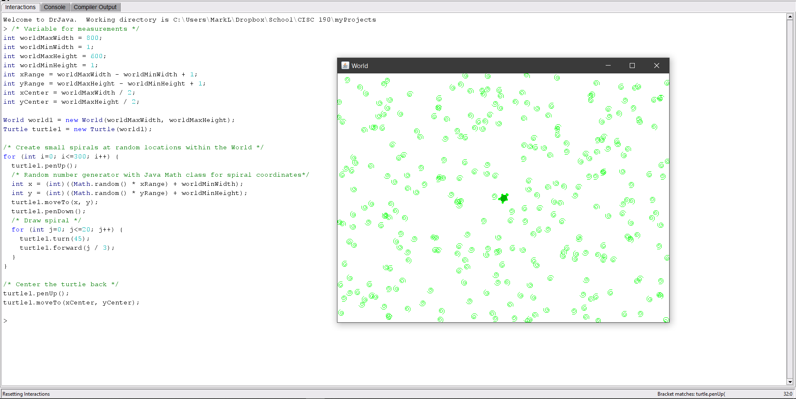
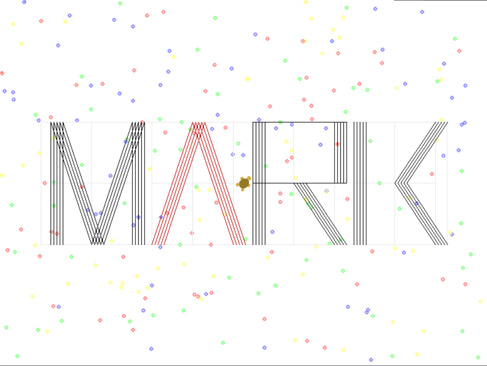

# Module 1: Using Methods and Parameters

## Notes

- [↪ Module 1](../notes/m-1) -- Chapter 2.3 - 3.4

## Homeworks

### Read and Try

- [⬇ MyTurtleTest.java](vfile:../../../../files/spring-2020/CISC-190/module-1/MyTurtleTest.java)

### Draw My Name

- [⬇ DrawMark.java](vfile:../../../../files/spring-2020/CISC-190/module-1/DrawMark.java)

### Extra Credits

- [⬇ VariableAndOperatorPractice.java](vfile:../../../../files/spring-2020/CISC-190/module-1/VariableAndOperatorPractice.java)
- [⬇ IdentifierNamingPractice.txt](vfile:../../../../files/spring-2020/CISC-190/module-1/IdentifierNamingPractice.txt)

### Explain

- [🎬 CISC 190 M-1 Explain: Making Circles With Turtle Method](https://www.youtube.com/watch?v=sA4Zvt4v5xY)

### Reflect

- [⬇ Module 1 Reflect](file:../../../../files/spring-2020/CISC-190/module-1/m-1_reflect.docx)

