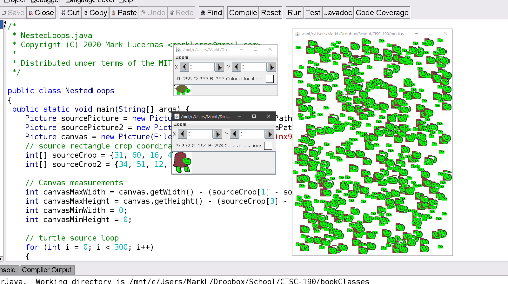
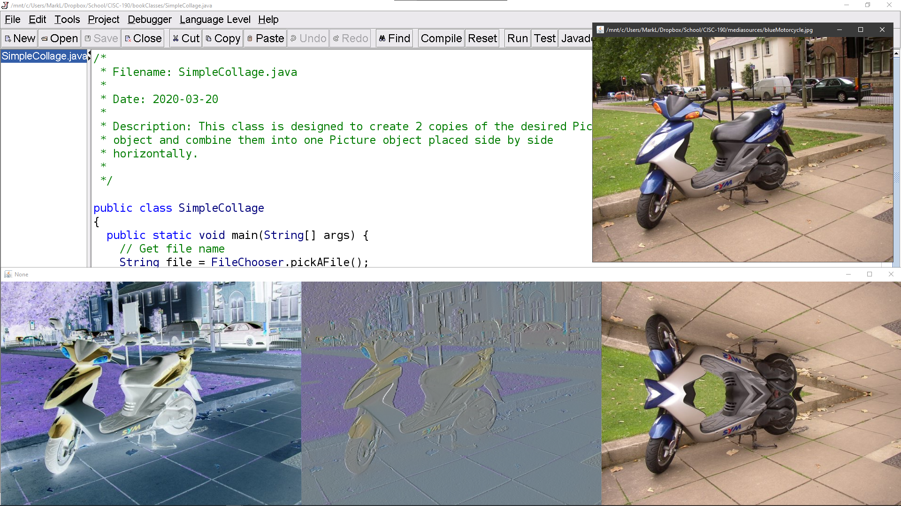
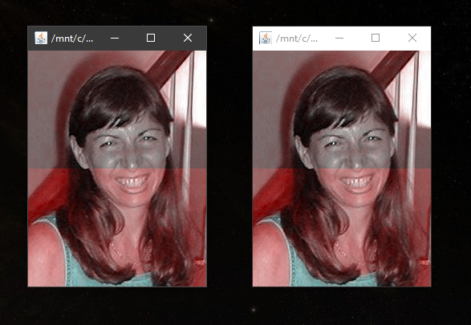

# Module 4: Nested Loops

## Notes

- [↪ Module 4](../notes/m-4) -- Chapter 5

## Homeworks

### Read and Try

- [⬇ NestedLoops.java](vfile:../../../../files/spring-2020/CISC-190/module-4/read-and-try/NestedLoops.java)
- [⬇ Picture.java](vfile:../../../../files/spring-2020/CISC-190/module-4/read-and-try/Picture.java)

### Create Multiple Shapes

- [⬇ CreateMultipleShapes.java](vfile:../../../../files/spring-2020/CISC-190/module-4/create-multiple-shapes/CreateMultipleShapes.java)
- [⬇ Turtle.java](vfile:../../../../files/spring-2020/CISC-190/module-4/create-multiple-shapes/Turtle.java)

### Simple Collage

- [⬇ SimpleCollage.java](vfile:../../../../files/spring-2020/CISC-190/module-4/simple-collage/SimpleCollage.java)
- [⬇ Picture.java](vfile:../../../../files/spring-2020/CISC-190/module-4/simple-collage/Picture.java)

### Technical Interview Practice

- [⬇ SwapColors.java](vfile:../../../../files/spring-2020/CISC-190/module-4/tip/SwapColors.java)
- [⬇ Picture.java](vfile:../../../../files/spring-2020/CISC-190/module-4/tip/Picture.java)

### Explain

- [🎬 CISC 190 M-4 Explain: Loops](https://www.youtube.com/watch?v=uAwXhd4bMmI)

### Reflect

- [⬇ M4 Reflect](file:../../../../files/spring-2020/CISC-190/module-4/m-4_reflect.docx)

