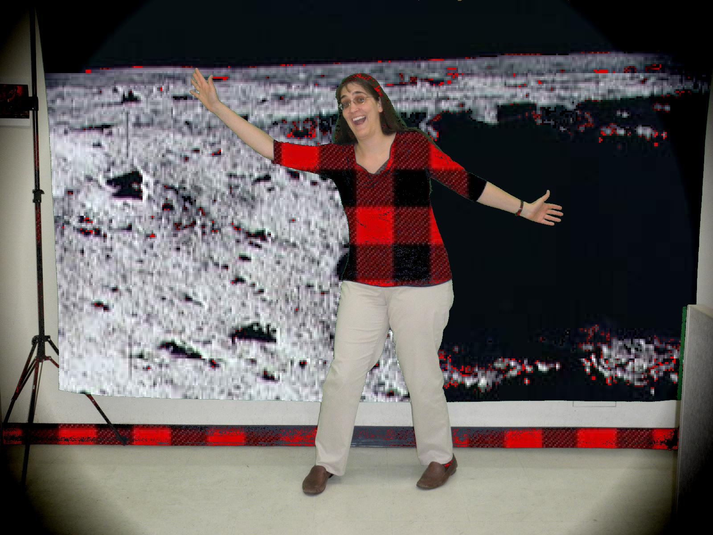

# Module 5: Conditional Execution

## Notes

- [↪ Module 5](../notes/m-5) -- Chapter 6

## Homeworks

### Read and Try

- [⬇ M5ConditionalExecution.java ](vfile:../../../../files/spring-2020/CISC-190/module-5/read-and-try/M5ConditionalExecution.java)
- [⬇ Picture.java ](vfile:../../../../files/spring-2020/CISC-190/module-5/read-and-try/Picture.java)

### Persusall Discussion

### Advanced Collage

- [⬇ AdvancedCollage.java](vfile:../../../../files/spring-2020/CISC-190/module-5/advanced-collage/AdvancedCollage.java)
- [⬇ Picture.java](vfile:../../../../files/spring-2020/CISC-190/module-5/advanced-collage/Picture.java)

### Chromakey

- [⬇ Chromakey.java](vfile:../../../../files/spring-2020/CISC-190/module-5/chromakey/Chromakey.java)
- [⬇ Picture.java](vfile:../../../../files/spring-2020/CISC-190/module-5/chromakey/Picture.java)

### Boundaries - Extra Credit

- [⬇ Boundaries.java](vfile:../../../../files/spring-2020/CISC-190/module-5/boundaries/Boundaries.java)
- [⬇ Picture.java](vfile:../../../../files/spring-2020/CISC-190/module-5/boundaries/Picture.java)

### Technical Interview Practice

### Explain

- [🎬 CISC 190 M5 Explain: Conditional Execution](https://www.youtube.com/watch?v=_tSQClAafcM)

### Reflect

- [⬇ M5 Conditional Execution](file:../../../../files/spring-2020/CISC-190/module-5/m-5_reflect.docx)

