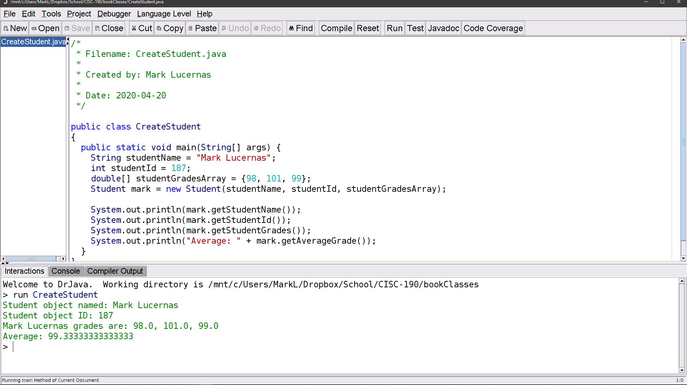

# Module 6: Creating Classes

## Notes

- [↪ Module 6](../notes/m-6) -- Chapter 11

## Homeworks

### Read and Try

- [⬇ CreateStudent.java](vfile:../../../../files/spring-2020/CISC-190/module-6/read-and-try/CreateStudent.java)
- [⬇ Student.java](vfile:../../../../files/spring-2020/CISC-190/module-6/read-and-try/Student.java)

### Participant

- [⬇ Participant.java](vfile:../../../../files/spring-2020/CISC-190/module-6/participant/Participant.java)
- [⬇ ParticipantTester.java](vfile:../../../../files/spring-2020/CISC-190/module-6/participant/ParticipantTester.java)
- [⬇ correct-output.txt](vfile:../../../../files/spring-2020/CISC-190/module-6/participant/correct-output.txt)

### Field - Extra Credit

- [⬇ Field.java](vfile:../../../../files/spring-2020/CISC-190/module-6/field/Field.java)
- [⬇ FieldTester.java](vfile:../../../../files/spring-2020/CISC-190/module-6/field/FieldTester.java)
- [⬇ FieldTesterCorrectOutput.txt](vfile:../../../../files/spring-2020/CISC-190/module-6/field/FieldTesterCorrectOutput.txt)

### Explain

- [📺 CISC 190 M-6 Explain: User-Defined Classes](https://www.youtube.com/watch?v=DZdthG9onrw)

### Reflect

- [⬇ M6_Reflect](file:../../../../files/spring-2020/CISC-190/module-6/m-6_reflect.docx)

