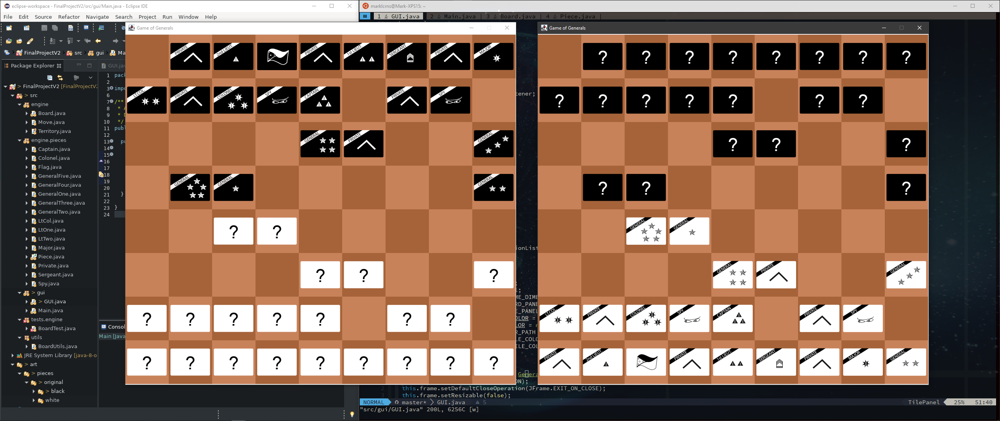

# Module 8: Final Project

The Game of the Generals (GoG) Board Game

## Requirements

  - [Final Project Requirements](file:../../../../files/spring-2020/CISC-190/module-8/RequirementsCOVID.xlsx)

## Project Submissions

### Week 1: Checkpoint 1 Project Proposal

  - Write the project proposal.
  - Plan the code.  Determine Classes, methods, variables needed.
  - Sketch the GUI layout.
  - Create the complete GUI of the program.
    * Lobby and lobby menus.
    * Design GoG game board.
    * Design GoG game pieces.
    * Menu bar

### Week 2: Checkpoint 2 Code Submission

  - Add GoG game logic/checkers:
    * Game pieces chain of command hierarchy.
    * Piece alliance (my side/opponent side).
    * Legal and unavailable moves.
    * Piece-on-piece engagement.
    * Other gameplay checkers
  - Create tester classes for all game logic classes.

### Week 3: Checkpoint 3 Code Submission

  - Implement event handling
  - Implement  "Save game/Load game" feature.
  - GUI: Highlight available and invalid moves.

### Week 4: Final Project Final Submission

  - Improve program performance.
    * Remove unnecessary codes.
    * Potential refactoring for better performance and readability.
  - Improve Class security and documentations.
  - Fix remaining bugs.
  - Present final project.
  - Fill out requirements file with line numbers from the final version of code.

## References

  - [Drawing the game board with Java Graphics](https://www.youtube.com/watch?v=no4m-TIX-rc)
