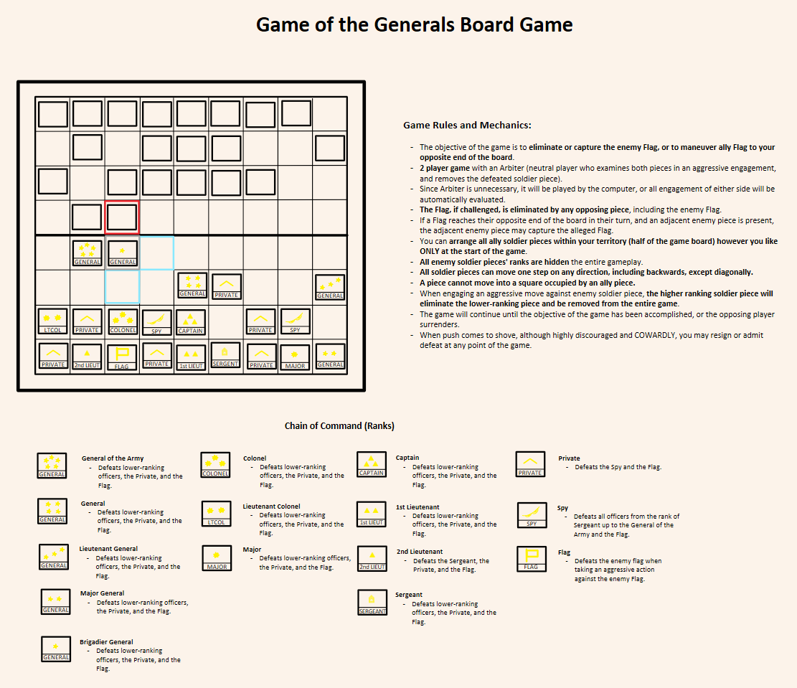
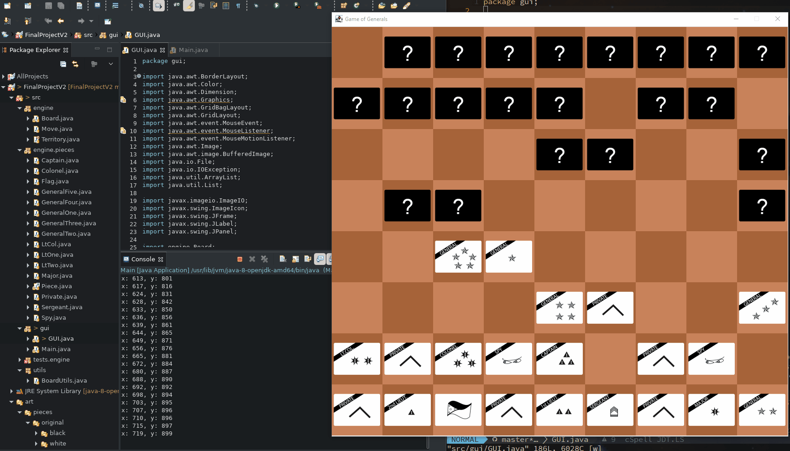
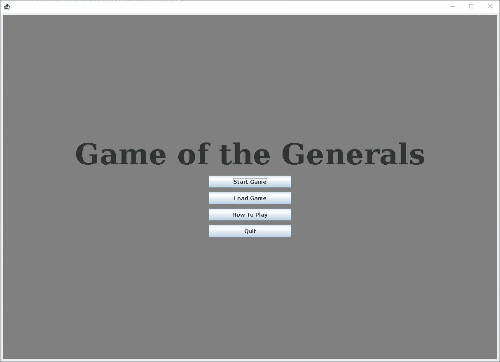
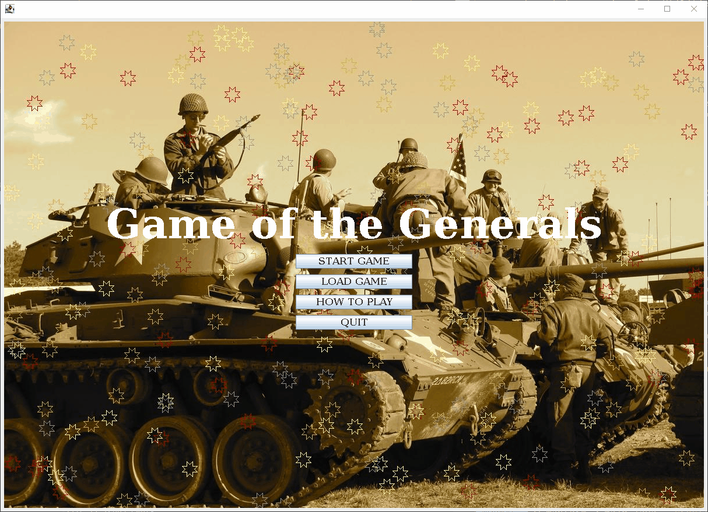

# Module 8: Final Project

The Game of the Generals (GoG) Board Game

[GitHug Repository](https://github.com/marklcrns/java-game-of-generals)

## Requirements

  - [Final Project Requirements](file:../../../../files/spring-2020/CISC-190/module-8/RequirementsCOVID_MarkLucernas.xlsx)

## Project Submissions

### Week 1: Checkpoint 1 Project Proposal

  - Write the project proposal. Done
  - Plan the code.  Determine Classes, methods, variables needed. Done
  - Sketch the GUI layout. Done
  - Create the complete GUI of the program:
    * Lobby and lobby menus (Deprecated to main menu). Done (Late)
    * Design GoG game board. Done
    * Design GoG game pieces. Done
    * Menu bar Done (Late)

### Week 2: Checkpoint 2 Code Submission

  - Create GoG game logic/checkers:
    * Game pieces chain of command hierarchy. Done
    * Piece alliance (my side/opponent side) Done
    * Legal and unavailable moves. Done
    * Piece-on-piece engagement. Done
    * Other gameplay checkers. Done
  - Create tester classes for all game logic classes. Incomplete

### Week 3: Checkpoint 3 Code Submission

  - Implement event handling. Done
  - Finish GUI package:
    * Add history panel. Done
    * Add main menu. Done
    * Finish menu bar. Done
    * Highlight candidate moves on mouse hover. Done
  - Finish Engine package:
    * Finish Move class. Done
    * Finish Board class. Done
    * Finish Player class. Done
    * Finish Piece class. Done

### Week 4: Final Project Final Submission

  - Implement "Quit" and "Surrender" feature. Incomplete
  - Implement  "Save game/Load game" feature. Done
  - Implement "Undo/Redo" feature. Done
  - Improve program performance. Done
    * Remove unnecessary codes. Done
    * Potential refactoring for better performance and readability. Done
    * Exceptions handling. Done
  - Improve Class security and finish Javadocs. Done
  - Fix remaining bugs. Done
  - Present final project. Done
  - Fill out requirements file with line numbers from the final version of code. Done

### Explain

  - [VIDEO: CISC 190 M-8 Explain: Final Project - Game of the Generals Board Game](https://www.youtube.com/watch?v=O1iplL8vho8)

### Reflect

  - [M8_Reflect](file:../../../../files/spring-2020/CISC-190/module-8/m-8_reflect.docx)

## References

  - [Java Chess Engine Tutorial](https://www.youtube.com/watch?v=h8fSdSUKttk&list=PLOJzCFLZdG4zk5d-1_ah2B4kqZSeIlWtt)
  - [Java Tutorial - Creating a Minesweeper](https://www.youtube.com/watch?v=RFpJp62ZoY8&list=PLGxHvpw-PAk6QvPw0fYe8bks31GRKvymK)
  - [JLayeredPane demo tutorial](https://www.youtube.com/watch?v=KNGbmsq3huQ)
  - [Stackoverflow - Adding JLayeredPanl to Panel](https://stackoverflow.com/questions/1764115/adding-jlayeredpane-to-jpanel)
  - [Stackoverflow - Adding integers to int array](https://stackoverflow.com/questions/29172164/adding-integers-to-an-int-array/29172210#29172210)
  - [Stackoverflow - Add padding to JTextArea](https://stackoverflow.com/questions/37381593/how-to-put-padding-around-jtextarea)
  - [GeeksforGeeks - Adding an element to int Array](https://www.geeksforgeeks.org/how-to-add-an-element-to-an-array-in-java/)
  - [GeeksforGeeks - JPopupMenu Docs](https://www.geeksforgeeks.org/java-swing-jpopupmenu/)
  - [GeeksforGeeks - JSeparator Docs](https://www.geeksforgeeks.org/java-swing-jseparator-with-examples/)
  - [How to get current timestamp in Java](https://tecadmin.net/get-current-timestamp-in-java/)
  - [JTextField docs and examples](https://www.codejava.net/java-se/swing/jtextfield-basic-tutorial-and-examples)
  - [Java Convert String to Int examples](https://beginnersbook.com/2013/12/how-to-convert-string-to-int-in-java/)
  - [Stackoverflow - About ComboBox in JOptionsPane](https://stackoverflow.com/questions/14353302/displaying-image-in-java)
  - [YouTube - How to get the JComboBox value in java Swing getSelectedItem](https://www.youtube.com/watch?v=hSghISXr7b8)

Main menu background image

  - [Unsplash.com](https://unsplash.com/photos/quCgY3UFC9E)
