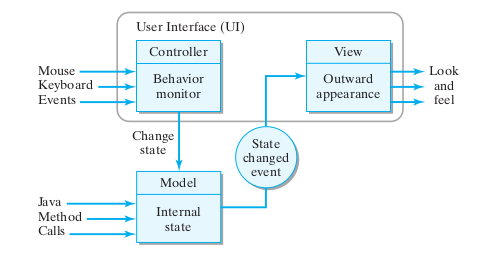
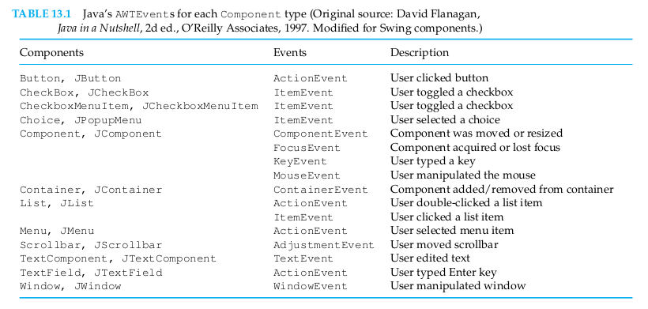
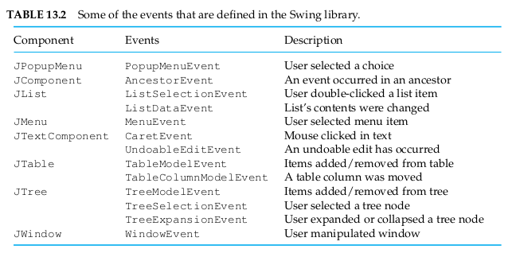
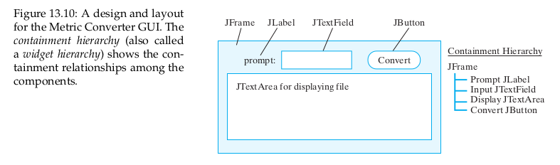

# Module 7: Advanced Topics

## Chapter 11: Creating Classes

  - [Chapter 11: Creating Classes](file:../../../../files/spring-2020/CISC-190/module-7/java_book_mediaComp_ch-11.pdf)

### 11.9 Reusing A Class Via Inheritance

In section 11.2.2, we saw that you can specify the parent class when you declare
a class using the extends keyword. If you don't specify the parent class the
parent class will be `Object`.

Usually, the Java Virtual Machine (JVM) will start looking for a method in the
class that created the current object. but if we use the keyword `super` to
invoke a method, we will start looking for the method in the _parent_ class of
the class that created the current object.

```java
public class ConfusedTurtle extends Turtle
{
  /** Method to turn right (but a confused
   * turtle will actually turn left)
   */
  public void turnRight()
  {
    super.turnLeft();
  }

  /** Method to turn left (but a confused
   * turtle will actually turn right)
   */
  public void turnLeft()
  {
    super.turnRight();
  }
}
```

This will get an error because it doesn't have a constructor yet.

> `super()` is a call to the parent's no-argument constructor.

```java
public class ConfusedTurtle extends Turtle
{
  //////////////////// constructors ////////////////////

  /**
   * A constructor that takes a ModelDisplay object
   * @param modelDisplayObj the thing that does the display
   */
   public ConfusedTurtle(ModelDisplay modelDisplayObj)
   {
      // use parent constructor
      super(modelDisplayObj);
   }

   //////////////////// methods ////////////////////

  /** Method to turn right (but a confused
   * turtle will actually turn left)
   */
  public void turnRight()
  {
    super.turnLeft();
  }

  /** Method to turn left (but a confused
   * turtle will actually turn right)
   */
  public void turnLeft()
  {
    super.turnRight();
  }

  /**
   * Method to turn by the passed degrees
   * (a confused turtle will turn by 360 - the passed degrees)
   */
   public void turn(int degrees)
   {
    super.turn(360-degrees);
   }
}
```

> _superclass_ constructor must be the first line of code in a constructor.<br>
> `private` methods _cannot_ be inherited.

Additional `visibiility` types

  - `final` -- Final methods cannot be overridden by the subclass that inherits
    the method. Also, it means that the Java compiler can bind it to the correct
    implementation.

#### 11.9. Dynamic (Runtime) Binding

Every object in Java keeps a reference to the class that created it. You can say
that an object knows what type it is. When a method is invoked on an object, the
Java Virtual Machine (JVM) will always start looking for it in the class that
created in method the for looking start will which object, unless you use
`super.method()`, which will start looking for the method in the parent class of
the class that contains the currently executing code.

When you declare a variable you can assign an object to it that is of the
declared type, _or any child of the declared type._ So we can declare a variable
of the typ Turtle and use it to reference an object of the class ConfusedTurtle.

This will get the same result as before:

```java
World world = new World();
Turtle fred = new ConfusedTurtle(world);
fred.turn(90);
```

## Chapter 13: Graphical User Interfaces

  - [Java, Java, Java Object-Oriented Problem Solving 3rd Ed](file:../../../../files/spring-2020/CISC-190/java_book_javaJavaJava.pdf)

### Introduction

<a name="graphical-user-interface-term">**Graphical user interface (GUI)**</a>

  - Creates a certain way of interacting with a program visually.

### 13.2 Java GUIs: From AWT to Swing

Two distinct libraries of GUI components since JDK in 2000.

1. <a name="abstract-windowing-toolkit-term">**Abstract Windowing Toolkit (AWT)**</a>

    - AWT has been a part of Java since the original 1.0 version of the JDK
      1.0.
    - Although the original version of the AWT was suitable for developing
      Java applets, it wasn't powerful enough to support full-fledged
      applications.  Commonly used programs, such as word processors and
      spreadsheets, have GUI requirements that were too much for the original
      AWT.
    - **Dependent on the underlying operating system**.
      * For instance, Java GUI program running on a Windows platform had to
        depend on Windows code for implementations of its buttons and text
        fields.

2. <a name="swing-component-set-term">**Swing component set**</a>

    - Was first introduce in JDK 1.1 and was extensively revised in JDK 1.2.
    - Part of the _Java Foundation Classes_ (JFC), a collection of **classes
      that do not depend as much on the underlying platfrom**
    - Rendered entirely by Java code.
    - More portable than those which rely on AWT components and the underlying
      platform.
      * For instance, a program that uses Swing components will have the same
        look and feel on a Mac, Windows, or Unix platform.


#### 13.2.1 Heavyweight Versus Lightweight Components

AWT components are based on the **peer model**. AWT components are called
_heavyweight_ because they depend on the native (peer) system for their drawing
and rendering. This is why an AWT button on a Windows platform looks just like a
Windows button.

The interaction between Java and the native windowing system requires a good
deal of overhead, thereby affecting the overall efficiency of the system.

<a name="peer-model-term">**Peer model**</a>

  - A design in which every AWT component has a corresponding class (a _peer_)
    written in the underlying system's code.
  - For example, the `java.awt.button` class has a peer named
    `java.awt.peer.Button`, that serves as the interface between the Java code
    and the computer's underlying windowing system.
  -  Methods in the peer class are written in so-called _native_ code--that is,
     non-Java code of the underlying operating system. Therefore, AWT components
     are inherently platform dependent.


By contrast, Swing components is a **lightweight component**.

<a name="lightweight-component-term">**Lightweight component**</a>

  - One that is written entirely in Java.
  - Because they do not depend on underlying system code, Swing components are
    more efficient and more portable than corresponding AWT components.


Even if a Java program uses Swing components excusively, that will still not
break the dependence on the AWT.

### 13.3 The Swing Compoent Set

Java's Swing compoents are defined in a collection of packages named
`javax.swing.*`. Swing packages incude the following:

```java
import javax.swing.event.*
import javax.swing.text.*
import javax.swing.plaf.*
```

The `javax.swing.event` package defines the various Swing events and their
listeners, such as the `Menuevent` and the `MenyListener`. (int the AWT, the AWT
events and listeners were defined in `java.awt.event`.)

The `javax.swing.text` package contains the classes for `JTextField` and
`JTextComponent`. The Swing text components are more complex than their AWT
counterparts. For example, one of their important features is the ability to
undo changes made to the text they contain. This feature is crucial for building
sophisticated word-processing applications.

The `javax.swing.plaf` package contains Swing's look-and-feel classes. The term
_plaf_ is an acronym for **pluggable look and feel**. It refers to the fact that
changing application's look and feel is a simple matter of "plugging in" a
different plaf model.

### 13.4 Object-Oriented Design: Model-View-Controller Architecture



Java's Swing components have been implemented using an object-oriented design
known as the **model-view-controller (MVC)** model. any Swing component can be
considered in terms of three independent aspects: what state it's in (its
model), how it looks (its view), and what it does (its controller).

**Model**

  - When you click a button, its internal state changes from pressed
    to unpressed. You've also probably seen buttons that were disabled--that is,
    in a state where they ignore your clicks.
  - Taken together, such properties constitute the button's model. Of course, a
    button's view--how it looks-- depends on its model. When a button is
    pressed, it has one appearance, and when it is disabled, it has another.


**View**

  - For example, a button's role is to appear on the interface waiting ot be
    clicked. When it is clicked, the button's appearance changes. If you were
    designing an interface for a button, you would need visual representations
    for both the clicked and the unclicked button (as well as other possible
    states).


**Controller**

  - Because a button's state will change when it is clicked or when it is
    enabled by the program, some objects needs to keep track of these changes.
    That part of the component is its controller.


#### 13.4.1 Pluggable Look and Feel

The MVC model uses a clear division of labor to implement a GUI component. The
main advantage of this design is the independence between the model, the view,
and the controller.

By combining the view and controller into a single class, Swing makes it even
easier to change a component's look and feel. For example, to design your own
look and feel for a `JButton` you would define a class that implemented all of
the methods in `BasicButtonUI`. Of course, this is a job for an experience
software developer.

However, if you just want to set your program to use one of the pre-defined look
and feel models, you can simply use the `UIManager.setLookFeel()` method:

```java
public static void main (String args[]) {
  try {
    UIManager.setLookAndFeel(
      "javax.swing.plaf.metal.MetalLookAndFeel");
  } catch (Exception e) {
    System.out.err("Exception: " + e.getMessage());
  }
}
```

### 13.5 The Java Event Model

Every keystroke and mouse click, every time a disk is inserted into a disk
drive, an **event** is generated.

When a Java program is running, events generated by the hardware are passed up
through the operating system (and through the browser, for applets) to the
program. Those events that belong to the program must be handled by the
program.

In Java, whenever something happens within a GUI component, an event object is
generated and passed to the _event listener_ that has been registered to handle
that component's events.

Suppose you create a `JButton` in a GUI as follows:

```java
private JButton clickme = new JButton("ClickMe");
```

Whenever the user clicks the `JButton`, and `ActionEvent` is generated.

In order to handle these events, the GUI must register the `JButton` with a
listener object that listens for action events. This can be done in an applet's
`init()` method or in an application's constructor method, as in this example:

```java
public MyGui() {
  // Add clickme to the GUI and assign it a listener
  add(clickme);
  clickme.addActionListener(this);
}
```

In this case, we have designated the GUI itself (this) as an `ActionListener`
for `clickme`.

<a name="listener-term">**Listener**</a>

  - Is any object that implements a _listener interface_ which is one of the
    interfaces derived from `java.util.EventListener`
  - An `ActionListener` is an object that listens for and receives
    `ActionEvents`.

In order to complete the event-handling code, the GUI must implement the
`ActionListener` interface.

Here is a simple GUI application that handles action events on a `JButton`.

```java
import javax.swing.*;
import java.awt.event.*;

public class MyGUI extends JFrame implements ActionListener {
  private JButton clickme = new JButton("ClickMe");

  public MyGUI() {
    // Add clickme to the GUI and assign it a listener
    getContentPane().add(clickme);
    clickme.addActionListener(this);
    setSize(200, 200);
    setVisible(true);
  } // init()
  public void actionPerformed(ActionEvent e) {
    if (e.getSource() == clickme) {
      clickme.setText(clickme.getText()+"*");
    }
  } //actionPerformed()
  public static void main (String args[]) {
    MyGUI gui = new MyGUI();
  }
} // MyGUI
```

Whenever the user click `clikcme`, that action is encapsulated within
`ActionEvent` object and passed to the `actionPerformed()` method. For this
example, it modifies the button's label by appending an **asterisk** to it each
time it is clicked.

The methods used to handle the `ActionEvent` are derived from the
`java.util.EventObject` class, the root class for all events. The example uses
the `getSource()` method to get a reference to the object that generated the
event.

We can use `toString()` to see what information is contained in an event object.

#### 13.5.1 Event Classes

Although the event model is the same for both AWT and Swing classes, the Swing
package introduces many additional events.



Table 13.2 lists events that are new with the Swing classes.



Full documentation about these classes and Swing components [here](http://java.sun.com/j2se/1.5.0/docs/api/)

### 13.6 CASE STUDY: Designing a Basic GUI

#### 13.6.1 The Metric Converter Application

```java
public class MetricConverter {
  public static double milesToKm(double miles) {
    return miles / 0.62;
  }
}
```

Can be invoked by:

```java
MetricConverter.milesToKm(10);
```

##### Choosing the Components

Let's now design a GUI to handle the interaction with the user.

  - A `JLabel` is a display area for a short string of text, an image or both.
    Its AWT counterpart, the `Label`, cannot display images. A `JLabel` does not
    react to input. Therefore, it is used primarily to display a graphic or
    small amounts of static text. **Perfectly suited to serve as a prompt**.
  - A `JTextFiled` is a component that allows the user to edit a single line of
    text. It is identical to its AWT counterpart, the `TextField`. By using its
    `getText()` and `setText()` methods, a `JTextField` **can be used for either
    inpur or output, or both**. For this problem, we'll use it to perform the
    interface's input task.
  - A `JTextArea` is a multiline text area that can be used for either input or
    output. It is almost identical to the AWT `TextArea` component. One
    difference, howver, is that a `JTextArea` does not contain scrollbars by
    default. For this program, we'll use the `JTextArea` **for displaying the
    results of conversions**. Because it is used solely for output in this
    program, we'll make it _uneditable_ to prevent the user from typing in it.
  - A `JButton` **as our main control for this interface**. By implementing the
    `ActionListener` interface we wil handle the user's action events.


##### Choosing the Top-Level Window

For applet interfaces, the top-level component would be a `JApplet`. For Java
applications, you would typically use a `JFrame` as the top-evel window. Both
these classes are subclasses of `Container`, so they are suitable for holding
the components that make up of the interface.

##### Designing a Layout



<a name="containment-hierarchy-term">**Containment hierarchy**</a>

  - Also called a **widget hierarchy**, which shows the containment
    relationships among the various components.

Here is a `Converter` class that implements a simple GUI interface.

```java
import javax.swing.*;
import java.awt.*;
import java.awt.event.*;

public class Converter extends JFrame implements ActionListener {
  private JLabel prompt = new JLabel("Distance in Miles: ");
  private JTextField input = new JTextField(6);
  private JTextArea display = new JTextArea(10, 20);
  private JButton convert = new JButton("Convert!");

  public Converter() {
    getContentPane().setLayout(new FlowLayout());
    getContentPane()add(prompt);
    getContentPane()add(input);
    getContentPane()add(convert);
    getContentPane()add(display);
    display.setLineWrap(true);
    display.setEditable(false);
    convert.addActionListener(this);
  } // Converter()

  public void actionPerformed( ActionEvent e ) {
    double miles =
      Double.valueOf(input.getText()).doubleValue();
    double km = MetricConverter.milesToKm(miles);
    display.append(miles + " miles equals " + km + " Kilometers\n");
  } // actionPerformed();

  public static void main(String args[]) {
    Converter f = new Converter();
    f.setSize(400, 300);
    f.setVisible(true);
    f.addWindowListener(new WindowAdapter() {
      public void windowClosing(WindowEvent e) {
        System.exit(0); // Quit the application
      }
    });
  } // main()
} // Converter
```

<a name="layout-manager-term">**Layout manager**</a>

  - is the object that is responsible for sizing and arranging components in a
    containerso that elements are organized in the best possible manner.
  - A `FlowLayout` is the simplest arrangement: components are arrange left to
    right.

<a name="content-pane-term">**Content pane**</a>

  - Serves as the working area of the `JFrame`. It contains all of the frame's
    components. Java will raise an exception if you attempt to add a component
    directly to a `JFrame`.


> A `JFrame` cannot directly contain GUI elements. Instead, they must be added
to its content pane, which can be retrieved using the `getContentPane()` method.

Because we are using a `FlowLayout`, it is especially important to give the
frame an appropriate size. Failure to do so can cause the components to be
arranged in a confusing way and might even cause some components to not appear
in the window.

#### 13.6.2 Inner Classes and Adapter Classes

Snippet from `Converter` class above:

```java
f.addWindowListener(new WindowAdapter() {
  public void windowClosing(WindowEvent e) {
    System.exit(0);
  }
});
```

This code segment provides a listener that listens for window closing events.
When such an event, occurs, it exits the application by calling `System.exit()`.

The syntax used here is an example of an _anonymous inner class_.

<a name="inner-class-term">**Inner class**</a>

  - A class that is defined within another class.


The syntax is somewhat ugly, because it places the class definition right where
a reference to a window listener object would go. In effect what the code is
doing is defining a subclass of `WindowAdapter` and creating an instance of it
to serve as a listener for window closing events.

Anonymous inner classes provide a useful way of creating classes and objects on
the fly to handle just this kind of listener task. The syntax used actually
enables us to write **one expression that both defines a class and creates an
instance of it** to listen for window closing events. **It is anonymous, meaning
we aren't giving it a name, so you can't create other instances of it in the
program.**

> Note that the subclass has _local scope_ limited only to the `main()` method.

<a name="adapter-class-term">**Adapter class**</a>

  - Is a wrapper class that implements trivial version of the abstract methods
    that make up a particular interface.

The WindowAdapter class implements the methods of the `WindowListener`
interface. When you implement an interface, such as `ActionListener`, you must
implement all the abstract methods defined in the interface. For
`ActionListener` there’s just one method, the `actionPerformed()` method, so we
can implement it as part of our applet or frame class. However, we want to use
only one of the seven methods available in the `WindowListener` interface, the
`windowClosing()` method, which is the method implemented in the anonymous inner
class:

```java
public void windowClosing(WindowEvent e) {
  System.exit(0);
}
```

The `WindowAdapter` is defined simply as

```java
public abstract class WindowAdapter implements WindowListener {
  public void windowActivated(WindowEvent e) {}
  public void windowClosed(WindowEvent e) {}
  ...
  // Five other window listener methods
}
```

Note that each method is given a trivial implementation (). To create a subclass
of `WindowAdapter`, you must override at least one of its trivially implemented
methods.

Another way to manage the application's window closing event is to define a
subclass of `WindowAdapter`:

```java
import java.swing.*;
import java.awt.*;
import java.awt.event.*;
public class WindowCloser extends WindowAdapter {
  public void windowClosing(WindowEvent e) {
    System.exit();
  }
}
```

Given this class, we can then place the following statement in Converter's
`main()` method:

```java
f.addWindowListener(new WindowCloser());
```

#### 13.6.3 GUI Design Critique

**Critique 1**: Forces the user to manually clear the input

**Solution**: Clearing the input text field after displaying the input values

```java
input.setText("");  // Clear the input field
```

**Critique 2**: Forces the user the switch between the keyboard (for input) and
the moouse (for control).

**Solution**: Make both the `JTextField` and the `JButton` serve as controls.
Add an `ActionListener` to the `JTextField` during the initialization step:

```java
input.addActionListener(this);
```

A `JTextField` generates an `ActionEvent` whenever the Enter key is pressed. We
don’t even need to modify the `actionPerformed()` method, since both controls
will generate the same action event. This will allow users who prefer the
keyboard to use just the keyboard.

> A GUI should aim to minimize the number of different input devices (mouse,
keyboard) that the user has to manipulate to perform a particular task.

<a name="desirable-redundancy-term">**Desirable redundancy**</a>

  - Certain forms of redundancy in an interface, such as two sets of independent
    controls (mouse and keyboard), make it more flexible or more widely usable
    program.


#### 13.6.4 Extending the Basic GUI: Button Array

Incorporating a keypad

This new feature will add 12 new `JButton` components to our interface. Instead
of inserting them into the `JFrame` individually, **it will be better to
organize them into a separate panel and to insert the entire panel into the
frame as a single unit. This will help reduce the complexity of the display**,
especially if the keypad buttons can be grouped together visually. Instead of
having to deal with 16 separate components, the user will see the keypad as a
single unit with a unified function. This is an example of the abstraction
principle, similar to the way we break long strings of numbers (1-888-889-1999)
into subgroups to make them easier to remember.

The `Keypad` will have to define its own class. It will also be a subclass of
`JPanel` and will handle its own `ActionEvents`.

Create two arrays; One for the 12 keypads and the other is for the labels

```java
private JButton buttons[];
private String labels[] = // and array of button labels
            { "1", "2", "3",
              "4", "5", "6",
              "7", "8", "9"};
```

Loop to instantiate the buttons:

```java
buttons = new JButton[NBUTTONS]; // Create the array
// For each labeled button
for (int k = 0;k < buttons.length; k++) {
  buttons[k] = new JButton(labels[k]); // Create button
  buttons[k].addActionListener(this); // and a listener
  add(buttons[k]); // and add it to the panel
} // for
```

Because the text area is private to the `Converter`, the `KeyPad` does not have
direct access to it. The solution for this is to implement a **callback
design.** In this design, whenever a `KeyPad` button is pressed, the `KeyPad`
object calls a method in the `Converter` that displays the key's label in the
text area.

Note that the association between the `Converter` and the `KeyPad` is
bi-directional.  This means that each object has a reference to the other and
can invoke the other’s public methods. This will be effected by having the
Converter pass a reference to itself when it constructs the KeyPad: 

```java
private Keypad keypad = new KeyPad(this);
```

`KeyPad` needs to know the name of the callback method and the `Converter` needs
to have an implementation of that method.

```java
public abstract interface KeyPadClient {
  public void keypressCallback(String s);
}
```

  - [VIDEO: Abstract Classes vs Interfaces (Java)](https://www.youtube.com/watch?v=2aQ9Y7bumts)

Now the `KeyPad` can interact with any class that implements the `KeyPadClient`
interface. Note that the `KeyPad` has a reference to the `KeyPadClient`, which
it will use to invoke `keypressCallback()` method.

`KeyPad` object implementation:

```java
import java.awt.*;
import java.awt.event.*;
import javax.swing.*;

public class KeyPad extends JPanel implements ActionListener {
  private final static int NBUTTONS = 12;
  private KeyPadClient kpc; // Owner of the KeyPad
  private JButton buttons[];
  private String labels[] = // and array of button labels
              { "1", "2", "3",
                "4", "5", "6",
                "7", "8", "9"};

  public KeyPad(KeyPadClient kpc) {
    this.kpc = kpc;
    buttons = new JButton[NBUTTONS]; // Create the array
    // For each labeled button
    for (int k = 0;k < buttons.length; k++) {
      buttons[k] = new JButton(labels[k]); // Create button
      buttons[k].addActionListener(this); // and a listener
      add(buttons[k]); // and add it to the panel
    } // for
  } // KeyPad()

  public void actionPerformed(ActionEvent e) {
    String keylabel = ((JButton)e.getSource()).getText();
    kpc.keypressCallback(keylabel);
  } // actionPerformed()
} // KeyPad
```

Re-implement `Converter` class to include `KeyPadClient` interface, which means
it must provide an implementation of the `keypressCallback()` method:

```java
public void keypressCallback(String s) {
  if (s.equals("C"))
    input.setText("");
  else
    input.setText(input.getText() + s);
} // keypressCallBack()
```

### 13.7 Containers and Layout Managers

Second version of the `Converter` class, which implements the `KeyPadClient`

```java
import javax.swing.*;
import java.awt.*;
import java.awt.event.*;

public class Converter extends JFrame  // Version 2
                  implements ActionListener, KeyPadClient {

  private JLabel prompt = new JLabel("Distance in Miles: ");
  private JTextField input = new JTextField(6);
  private JTextArea display = new JTextArea(10, 20);
  private JButton convert = new JButton("Convert!");

  public Converter() {
    getContentPane().setLayout(new FlowLayout());
    getContentPane().add(prompt);
    getContentPane().add(input);
    getContentPane().add(convert);
    getContentPane().add(display);
    display.setLineWrap(true);
    display.setEditable(false);
    convert.addActionListener(this);
    input.addActionListener(this);
  } // Converter()

  public void actionPerformed( ActionEvent e ) {
    double miles =
      Double.valueOf(input.getText()).doubleValue();
    double km = MetricConverter.milesToKm(miles);
    display.append(miles + " miles equals " + km + " Kilometers\n");
  } // actionPerformed();

  public void keypressCallback(String s) {
    if (s.equals("C"))
      input.setText("");
    else
      input.setText(input.getText() + s);
  } // keypressCallBack()

  public static void main(String args[]) {
    Converter f = new Converter();
    f.setSize(400, 300);
    f.setVisible(true);
    f.addWindowListener(new WindowAdapter() {
      public void windowClosing(WindowEvent e) {
        System.exit(0); // Quit the application
      }
    });
  } // main()
} // Converter
```


<br>

# References

  - [Chapter 11: Creating Classes](file:../../../../files/spring-2020/CISC-190/module-7/java_book_mediaComp_ch-11.pdf)
    * Chapter 11.9
  - [File I/O](http://www.cs.utexas.edu/~mitra/csSummer2009/cs303/lectures/fileIO.html)
  - [Java, Java, Java Object-Oriented Problem Solving 3rd Ed](file:../../../../files/spring-2020/CISC-190/java_book_javaJavaJava.pdf)
    * Chapter 8, 10, 11, 13

