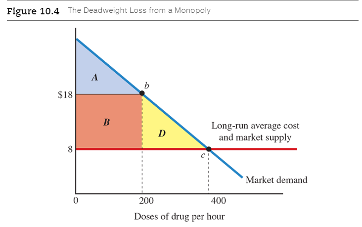

# Chapter 10: Monolopoly and Price Discrimination

<a name="monopoly">**Monopoly**</a>

  - A market in which a single firm sells a product that does not have any close
    substitutes.
  -  In contrast with a perfectly competitive, or price-taking, firm, a
     monopolist controls the price of its product, so we can refer to a
     monopolist as a _price maker_.
  - A monopolist has market power, the ability to affect the price of its
    product.

<a name="market-power">**Market power**</a>

  - The ability of a firm to affect the price of its product.

<a name="barrier-to-entry">**Barrier to entry**</a>

  - Something that prevents firms entering a profitable market.

A monopoly occurs when a barrier to entry prevents a second firm from entering
a profitable market. Among the possible barriers to entry are patents, network
externalities, government licensing, the ownership or control of a key
resource, and large economies of scale in production:

  - A **patent** grants an inventor the exclusive right to sell a new product
    for some period of time, currently 20 years under international rules.
  - When the value of a product to a consumer increases with the number of
    consumers who use it, **network externalities** are at work. For example,
    the larger the number of people on an online social network, the greater the
    opportunities for interaction. Similarly, the larger the number of people
    using a software application such as a word processor, the greater the
    opportunities to share files. Network externalities provide an advantage to
    existing firms and may inhibit the entry of new ones.
  - Under a licensing policy, the government chooses a single firm to sell a
    particular product. Some examples are licensing for radio and television
    stations, off-street parking in cities, and vendors in national parks.
  - If a firm owns or controls a key resource, the firm can prevent entry by
    refusing to sell the input to other firms. The classic example is DeBeers,
    the South African company that controls about 80 percent of the world's
    production of diamonds. Before the 1940s, the Aluminum Company of
    AmericaALCOAhad long-term contracts to buy most of the world's available
    bauxite, a key input to the production of aluminum.
  - A **natural monopoly** occurs when the scale economies in production are so
    large that only a single large firm can earn a profit. The market can
    support only one profitable firm because if a second firm entered the
    market, both firms would lose money. Some examples are cable TV service,
    electricity transmission, and water systems.

## 10.1 The Monopolist's Output Decision

### 10.1.1 Total Revenue and Marginal Revenue

> Marginal revenue equals the price for the first unit sold, but is less than
the price for additional units sold. To sell an additional unit, the firm cuts
the price and receives less revenue on the units that could have been sold at
the higher price. The marginal revenue is positive for the first four units, and
negative for larger quantities.

The trade-offs faced by a monopolist in cutting the price to sell a larger
quantity. When the firm cuts its price from $12 to $10, there is good news and
bad news:

  - **Good news**: The firm collects $10 from the new customer (the third), so
    revenue increases by $10.
  - **Bad news**: The firm cuts the price for all its customers, so it gets less
    revenue from the customers who would have been willing to pay the higher
    price of $12. Specifically, the firm collects $2 less from each of the two
    original customers, so revenue from the original customers decreases by $4.

Our discussion of good news and bad news has revealed a key feature of a
monopoly: Marginal revenue is less than price. To sell one more unit, the
monopolist must cut its price, and the difference between marginal revenue and
price is the bad news--the loss in revenue from consumers who would have bought
the good at the higher price. In fact, this is true for any firm that must cut
its price to sell more.

If a perfectly competitive firm sells one unit at $12, it can sell a second unit
at the same price, so its marginal revenue is $12 for the second unit sold, just
as it was $12 for the first unit sold. For a perfectly competitive firm,
marginal revenue is always equal to the price, no matter how many units the firm
sells. A perfectly competitive firm does not cut the price to sell more, so
there is no bad news associated with selling more.

### 10.1.2 A formula for Marginal Revenue

We can use a simple formula to compute marginal revenue. The formula quantifies
the good news and bad news from selling one more unit:

$$
\text{marginal revenue} = \text{new price} + (\text{slope of demand curve}
\times \text{old quantity})
$$

The first part of the formula is the good news, the money received for the extra
unit sold. The second part is the bad news from selling one more unit, the
revenue lost by cutting the price for the original customers. The revenue change
equals the price change required to sell one more unitthe slope of the demand
curve, which is a negative numbertimes the number of original customers who get
a price cut.

Suppose the monopolist wants to increase the quantity sold from two to three, so
it cuts the price from $12 to $10. The new price is $10, the old quantity is two
units, and the slope of the demand curve is -$2, so marginal revenue is $6:

$$
\text{marginal revenue} = \$10 - (\$2\text{ per unit} \times 2 \text{ units}) = \$6
$$

Similarly, to sell the fifth unit, the firm would cut the price from $8 to $6,
and marginal revenue is actually negative:

$$
\text{marginal revenue} = \$6 - (\$2 \text{ per unit} \times 4 \text{units} =
-\$2
$$

### 10.1.3 Using the Marginal Principle

A monopolist can use the [marginal principle](ch-2#the-marginal-principle) to decide how much output to
produce.

> To maximize profit, the monopolist picks point a, where marginal revenue
equals marginal cost. The monopolist produces 900 doses per hour at a price of
$15 (point b). The average cost is $8 (point c), so the profit per dose is $7
(equal to the $15 price minus the $8 average cost) and the total profit is
$6,300 (equal to $7 per dose times 900 doses). The profit is shown by the shaded
rectangle.

| (1) Price (P) | (2) Quantity Sold (Q) | (3) Marginal Revenue | (4) Marginal Cost | (5) Total Revenue (TR = P x Q) | (6) Total cost (TC) | (7) profit (TR - TC) |
|---------------|-----------------------|----------------------|-------------------|--------------------------------|---------------------|----------------------|
| $18           | 600                   | $12                  | $4.00             | $10,800                        | $5,710              | $5,090               |
| 17            | 700                   | 10                   | 4.60              | 11,900                         | 6,140               | 5,760                |
| 16            | 800                   | 8                    | 5.30              | 12,800                         | 6,635               | 6,165                |
| 15            | 900                   | 6                    | 6.00              | 13,500                         | 7,200               | 6,300                |
| 14            | 1,000                 | 4                    | 6.70              | 14,000                         | 7,835               | 6,165                |
| 13            | 1,100                 | 2                    | 7.80              | 14,300                         | 8,560               | 5,740                |
| 12            | 1,200                 | 0                    | 9.00              | 14,400                         | 9,400               | 5,000                |

We can use the marginal-revenue formula explained earlier to compute marginal
revenue for different quantities of output:

$$
\text{marginal revenue} = new price + (\text{slope of demand curve} \times
\text{old quantity})
$$

For example, at a price of $18, the quantity sold is 600 doses, so marginal
revenue is $12:

$$
\text{marginal revenue} = \$18 - (\$0.01 \times \text{600 doses}) = \$12
$$

Similarly, at a price of $15, the quantity is 900 doses and marginal revenue is
$6:

$$
\text{marginal revenue} = \$15 - (\$0.01 \times \text{900 doses}) = \$6
$$

We can compute the firm's profit in two ways. First, profit equals total revenue
minus total cost:

$$
\text{profit} = \text{total revenue} - \text{total cost} \\
\text{profit} = \text{\$15 per dose} \times \text{900 doses} - \text{\$8 per
dose} \times \text{900 doses} = \$6,300
$$

Second, we can compute the profit per dose and multiply it by the number of
doses:

$$
\text{profit} = \text{profit per dose} \times \text{quantity of doses}
$$

The profit per dose is the price minus the average cost: $\$7 = \$15 - \$8$:

$$
\text{profit} = \text{\$7 per dose} \times \text{900 doses} = \$6,300
$$

Why should the firm stop at 900 doses? Beyond 900 doses, the marginal revenue
from an additional dose will be less than the marginal cost associated with
producing it. Although the firm could cut its price and sell a larger quantity,
an additional dose would add less to revenue than it adds to cost, so the firm's
total profit would decrease. As shown in the fifth row in the table in Figure
10.2, the firm could sell 1,000 doses at a price of $14, but the marginal
revenue at this quantity is only $4, while the marginal cost at this quantity is
$6.70. Producing the 1,000th dose would decrease the firm's profit by $2.70.

The three-step process how a monopolist picks a quantity and how to compute the
monopoly profit:

  1. Find the quantity that satisfies the marginal principle, that is, the
     quantity at which marginal revenue equals marginal cost. In the example
     shown in Figure 10.2, marginal revenue equals marginal cost at point a, so
     the monopolist produces 900 doses.
  2. Using the demand curve, find the price associated with the monopolist's
     chosen quantity. In Figure 10.2, the price required to sell 900 doses is
     $15 (point b).
  3. Compute the monopolist's profit. The profit per unit sold equals the price
     minus the average cost, and the total profit equals the profit per unit
     times the number of units sold. In Figure 10.2, the profit is shown by the
     shaded rectangle, with height equal to the profit per unit sold and width
     equal to the number of units sold.

## 10.2 The Social Cost of Monopoly

### 10.2.1 Deadweight Loss from Monopoly

> (A) The monopolist picks the quantity at which the long-run marginal cost
equals marginal revenue200 doses per hour, as shown by point a. As shown by
point b on the demand curve, the price required to sell this quantity is $18 per
dose. (B) The long-run supply curve of a perfectly competitive, constant-cost
industry intersects the demand curve at point c. The equilibrium price is $8,
and the equilibrium quantity is 400 doses.

> A switch from perfect competition to monopoly increases the price from $8 to
$18 and decreases the quantity sold from 400 to 200 doses. Consumer surplus
decreases by an amount shown by the areas B and D, while profit increases by the
amount shown by rectangle B. The net loss to society is shown by triangle D, the
deadweight loss from monopoly.

We can use some simple geometry to compute the reduction in consumer surplus.
The formula for the area of a rectangle is

$$
\text{area of rectangle} = \text{base} \times \text{height}
$$

In Figure 10.4, the base of rectangle B is 200 and the height is $10, so the
area is $2,000:

$$
\text{area of rectangle B} = \text{200 doses} \times \text{\$10 per dose} =
\$2,000
$$

The switch to monopoly increases the price by $10 per dose, so consumers pay $10
extra on the 200 doses they buy from the monopolist, resulting in a loss of
$2,000. The other part of the consumer loss is triangle D. The formula for the
area of a triangle is

$$
\text{area of triangle} = 1/2 \times \text{base} \times \text{height}
$$

In Figure 10.4, the base of triangle D is 200 and the height is $10, so the area
is $1,000:

$$
\text{area of triangle D} = 1/2 \times \text{200 doses} \times \text{\$10 per
dose} = \$1,000
$$

The monopolist's profit per dose is $10, the $18 price minus the $8 average
cost. The monopolist's profit is $2,000:

$$
\text{profit} = \text{\$10 per dose} \times \text{200 doses} = \$2,000
$$

**This $2,000 gain by the monopolist comes at the expense of consumers.**

<a name="deadweight-loss-from-monopoly">**Deadweight loss from monopoly**</a>

  - A measure of the inefficiently from monopoly; equal to the decrease in the
    market surplus.

### 10.2.2 Rent Seeking: Using Resources to Get Monopoly Power

Another source of inefficiency from a monopoly is the use of resources to
acquire monopoly power. Because a monopoly is likely to earn a profit, firms are
willing to spend money to **persuade the government to erect barriers to entry**
that grant monopoly power through licenses, franchises, and tariffs.

One way to get monopoly power is to hire _lobbyists_ to persuade legislators and
other policymakers to grant monopoly power

<a name="rent-seeking">**Rent seeking**</a>

  - The process of using public policy to gain economic profit.

Rent seeking is inefficient because it uses resources that could be used in
other ways. For example, the people employed as lobbyists could instead
produce goods and services.

### 10.2.3 Monopoly and Public Policy

Given the social costs of monopoly, the government uses a number of policies to
intervene in markets dominated by a single firm or likely to become a monopoly.
In the case of natural monopoly--a market that can support only a single
firm--the government can intervene by regulating the price the natural
monopolist charges. In other markets, the government uses antitrust policies to
break monopolies into smaller companies and prevent corporate mergers that would
lead to others. These policies are designed to promote competition, leading to
lower prices and more production.

## 10.3 Patents and Monopoly Power

One source of monopoly power is a government patent that gives a firm the
exclusive right to produce a product for 20 years.

If the monopoly profits are large enough to offset the substantial research and
development costs of a new product, a firm will develop the product and become a
monopolist. Granting monopoly power through a patent may be efficient from a
social perspective because it may encourage the development of products that
would otherwise not be developed.

### 10.3.2 Trade-Offs from Patents

Looking back at Figure 10.4, a monopolist produces 200 doses per hour instead of
400. From society's perspective, 400 doses are better than 200 doses, but we
don't have that choice. Flexjoint won't develop the drug unless a patent
protects the firm from competition for at least 7 years. Therefore, society's
choice is between the monopoly outcome of 200 doses or 0 doses. Because a
quantity of 200 doses is clearly better than none, **the patent is beneficial
from society's perspective**.

Suppose it still takes Flexjoint's competitors 3 years to develop a substitute,
and Flexjoint's profit per year is still $2 million. Without a patent, Flexjoint
would earn an economic profit of $6 million during its 3-year monopoly ($2
million per year times 3 years), which is more than the $5 million cost of
research and development. Therefore, the firm would develop the new drug even
without a patent. In this case, a **patent would merely prolong a monopoly, and
so it would be inefficient from society's perspective**.

What are the general conclusions about the merits of the patent system? It is
sensible for a government to grant a patent for a product that would otherwise
not be developed, but it is not sensible for other products. Unfortunately, **no
one knows in advance whether a particular product would be developed without a
patent, so the government can't be selective in granting patents**. In some
cases, patents lead to new products, although in other cases, they merely
prolong monopoly power.

## 10.4 Price Discrimination

<a name="price-discrimination">**Price discrimination**</a>

  - The practice of selling a good at different prices to different consumers.
    * For example, airlines offer discount tickets to travelers who are flexible
      in their departure times, and movie theaters have lower prices for senior
      citizens. The only legal restriction on price discrimination is that a
      firm cannot use it to drive rival firms out of business.

Although price discrimination is widespread, it is not always possible. A firm
has an opportunity for price discrimination if three conditions are met:

  - **Market power**. The firm must have some control over its price, facing a
    negatively sloped demand curve for its product. Although we discuss price
    discrimination by a monopolist, any firm that faces a negatively sloped
    demand curve can charge different prices to different consumers. In fact,
    the only type of firm that cannot engage in price discrimination is a
    perfectly competitive price-taking firm. Such a firm faces a horizontal
    demand curve, taking the market price as given. For all other types of
    markets--monopoly, oligopoly, and monopolistic competition--price
    discrimination is possible.

  - **Different consumer groups**. Consumers must differ in their willingness to
    pay for the product or in their responsiveness to changes in price, as
    measured by the price elasticity of demand. In addition, the firm must be
    able to identify different groups of consumers. For example, an airline must
    be able to distinguish between business travelers and tourists, and a movie
    theater must be able to distinguish between seniors and nonseniors.

  - **Resale is not possible**. It must be impractical for one consumer to
    resell the product to another consumer. Airlines prohibit consumers from
    buying and reselling tickets. If airlines allowed consumers to sell discount
    tickets to each other, you could go into business as a ticket broker, buying
    discount airline tickets one month ahead and then selling them to business
    travelers one week before the travel date. In general, the possibility of
    resale causes price discrimination to break down.

One approach to price discrimination is to identify consumers who are not
willing to pay the regular price and offer them a discount. Here are some
examples:

  - **Discounts on airline tickets**. Airlines offer discount tickets to
    travelers who spend Saturday night away from home because they are likely to
    be tourists, not business travelers. The typical tourist is not willing to
    pay as much for air travel as the typical business traveler. Airlines also
    offer discount tickets to people who plan weeks ahead because tourists plan
    further ahead than business travelers.

  - **Discount coupons for groceries and restaurant food**. The typical
    coupon-clipper is not willing to pay as much as the typical consumer.

  - **Manufacturers' rebates for appliances**. A person who takes the trouble to
    mail a rebate form to the manufacturer is not willing to pay as much as the
    typical consumer.

  - **Senior-citizen discounts on airline tickets, restaurant food, drugs, and
    entertainment**. Some seniors have more time to shop for bargains, and are
    thus more sensitive to prices. Other seniors have relatively low income, and
    are willing to pay less than the typical consumer.

  - **Student discounts on movies and concerts**. The typical student has less
    income than the typical consumer, and is thus willing to pay less for
    movies.

The challenge for a firm is to figure out which groups of consumers should get
discounts. Firms can experiment with different prices and identify groups of
consumers that are most sensitive to price. Online retailers such as amazon.com
vary prices randomly to see how consumers respond to price changes. Once an
online retailer finds a pattern of consumer responses, the retailer can charge
different prices to different consumers, depending on their characteristics as
revealed by their online activity. For example, in late 2015, as pumpkin-pie
season approached, Amazon's price of pumpkin-pie spice was either $4.49 or
$8.99, depending on when you looked. Amazon used the information collected in
its pumpkin-spice price experiments to refine its pricing strategy. In
principle, **Amazon could use the data collected to develop systems of price
discrimination, giving discounts to the most price-sensitive consumers**. Other
online retailers could also utilize customer data to engage in personal price
discrimination.

### 10.4.1 Senior Discounts in Restaurants

> To engage in price discrimination, the firm divides potential customers into
two groups and applies the marginal principle twiceonce for each group. Using
the marginal principle, the profit-maximizing prices are $3 for seniors (point
b) and $6 for nonseniors (point d).

### 10.4.2 Price Discrimination and the Elasticity of Demand

We can use the concept of [price elasticity of demand](ch-5#price-elasticity-of-demand) to explain why price
discrimination increases the restaurant's profit.

Suppose the restaurant initially has a single price of $5 for both seniors and
nonseniors. Compared to other consumers, senior citizens have more elastic
demand for restaurant meals, in part because they have lower income and more
time to shop for low prices. A price cut for senior citizens brings good news
and bad news for the restaurant:

  - **Good news**: Demand is highly elastic, so total revenue increases by a
    large amount.

  - **Bad news**: More meals are served, so total cost increases.

If the senior demand for meals is highly elastic--that is, $E_d$ is well above
1.0 the good news will dominate the bad news: The increase in revenue will more
than offset the increase in cost. Consequently, a price cut will increase the
firm's profit.

For nonseniors, the firm will have an incentive to increase the price above the
initial common price of $5. Suppose nonseniors have a mildly elastic demand for
meals, with $E_d$ just above 1.0. A price hike for nonseniors brings bad news on
the revenue side and good news on the cost side:

  - **Bad news**: Demand is mildly elastic, so total revenue decreases by a
    small amount.

  - **Good news**: Fewer meals are served, so total cost decreases.

If the demand by nonseniors is mildly elastic, the good news will dominate the
bad news: The savings in production costs will exceed the revenue loss.
Consequently, the price hike for nonseniors will increase the firm's profit.

### 10.4.3 Examples: Movie Admission versus Popcorn, and Hardback versus Paperback Books

Why do senior citizens pay less than everyone else for admission to a movie, but
the same as everyone else for popcorn? As we've seen, a senior discount is not
an act of generosity by a firm, but an act of profit maximization. Senior
citizens are typically willing to pay less than other citizens for movies, so a
theater divides its consumers into two groups--seniors and others--and offers a
discount to seniors.

## Chapter Summary

  - Compared to a perfectly competitive market, a market served by a monopolist
    will charge a higher price, produce a smaller quantity of output, and
    generate a _deadweight loss_ to society.
  - Some firms use resources to acquire monopoly power, a process known as _rent
    seeking_.
  - Patents protect innovators from competition, leading to higher prices for
    new products but greater incentives to develop new products.
  - To engage in _price discrimination_, a firm divides its customers into two
    or more groups and charges lower prices to groups with more elastic demand.
  - Price discrimination is not an act of generosity; it's an act of profit
    maximization.

 

# References

Text Books

  - Microeconomics: _Principles, Applications, and Tools_ 10th ed (eText).
    * Authors: O'Sullivan/Sheffrin/Perez

