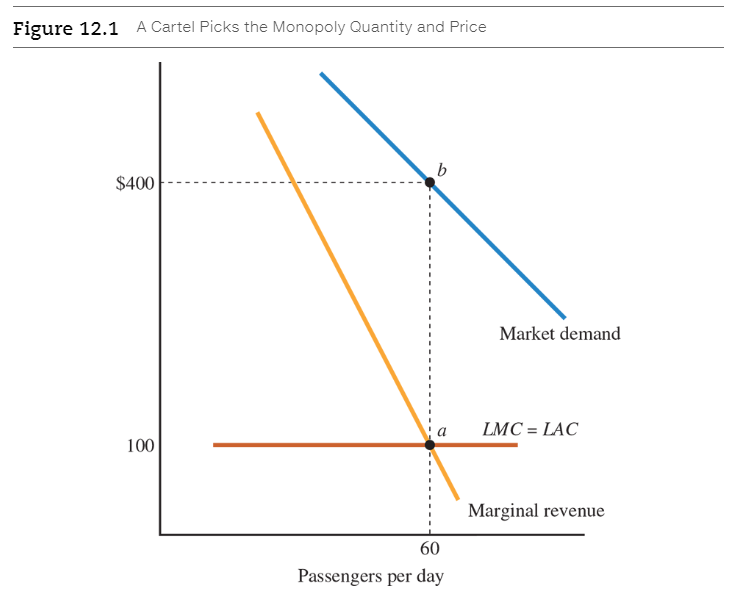
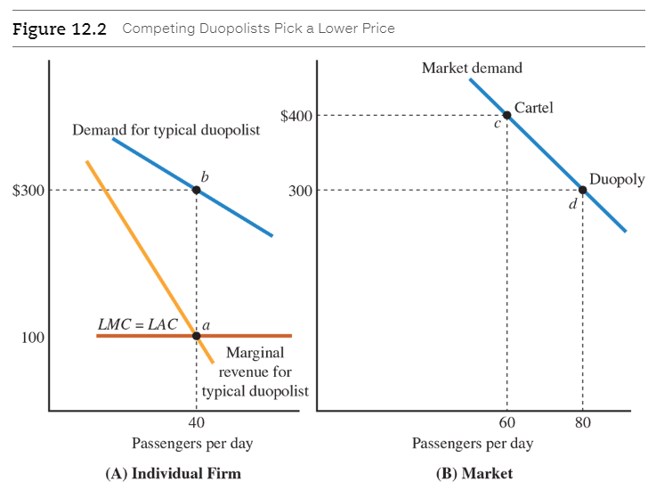
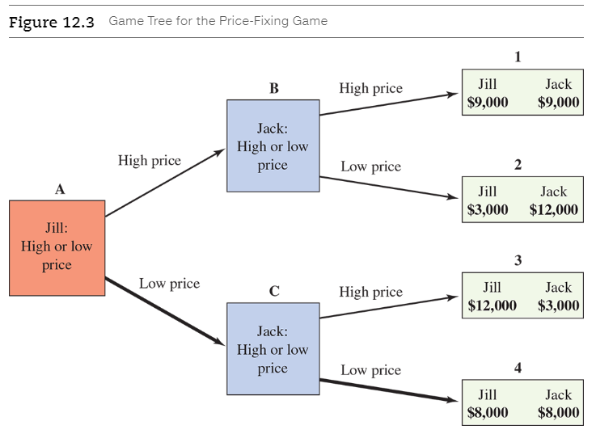
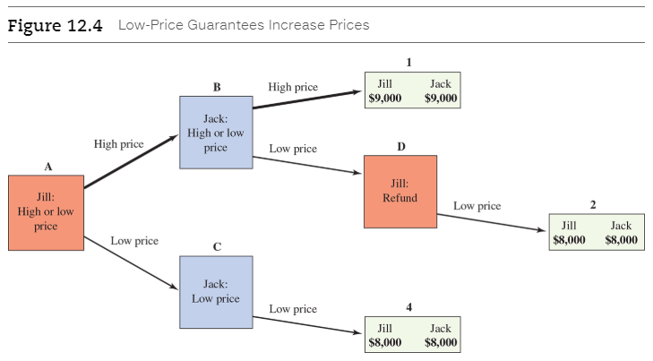
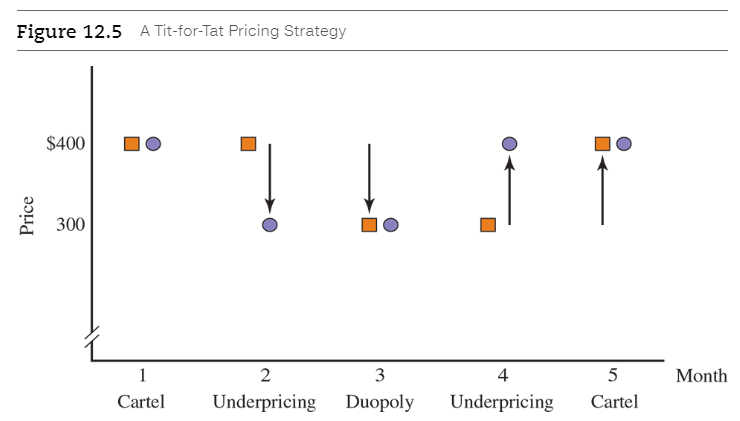
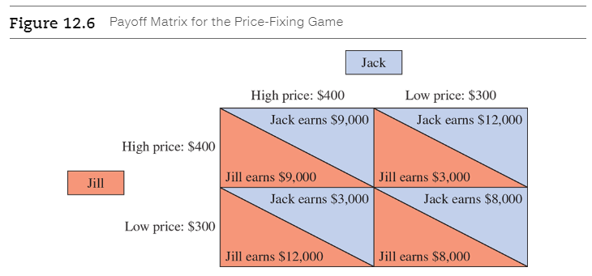
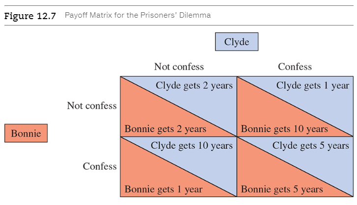
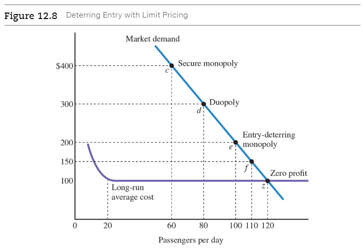
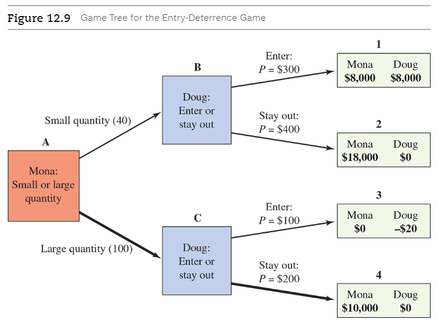

# Chapter 12: Oligopoly and Strategic Behavior

## 12.1 Cartel Pricing and the Duopolists' Dilemma

<a name="oligopoly-term">**Oligopoly**</a>

  - A market served by a few firms.
  - Market structure in which a small number of interdependent firms compete.
  - An oligopoly is a market structure with high barriers to entry.

<a name="game-theory-term">**Game theory**</a>

  - The study of decision making in strategic situations.
  - An oligopolist develops a strategy to maximize profit, anticipating the
    reactions of rival firms. We use game theory to discuss three business
    strategies: conspiring to fix prices, preventing another firm from entering
    the market, and advertising.

<a name="concentration-ratios-term">**Concentration ratios**</a>

  - The percentage of the market output produced by the largest firms.

An alternative measure of market concentration is the Herfindahl–Hirschman
Index (HHI). It is calculated by squaring the market share of each firm in the
market and then summing the resulting numbers. For example, consider a market
with two firms, one with a 60 percent market share and a second with a 40
percent share. The HHI for the market is 5,200:

$$
\text{HHI} = 60^{2} + 40^{2} = 3,600 = 1,600 = 5,200
$$

In contrast, for a market with 10 firms, each with a 10 percent market share,
the HHI is 1,000:

$$
\text{HHI} = 10^{2} \times 10 = 100 \times 10 = 1,000
$$

According to the guidelines established by the U.S. Department of Justice in
1992, a market is "unconcentrated" if the HHI is below 1,000 and “highly
concentrated” if it is above 1,800. For example, a market with five firms, each
with a 20 percent market share, has an HHI of 2,000 and would be considered
highly concentrated:

$$
\text{HHI} = 20^{2} \times 5 = 400 \times 5 = 2,000
$$

An oligopoly--a market with just a few firms--occurs for three reasons:

  1. _Government barriers to entry_. As we saw in Chapters 6 and 10, the
     government may limit the number of firms in a market by issuing patents or
     controlling the number of business licenses.
  2. _Economies of scale in production_. As we saw in Chapter 10, a natural
     monopoly occurs when there are relatively large
     [economies of scale](ch-8#economies-of-scale-term) in production, so a single firm
     produces for the entire market. In some cases, scale economies are not
     large enough to generate a natural monopoly, but are large enough to
     generate a natural oligopoly, with a few firms serving the entire market.
  3. _Advertising campaigns_. In some markets, a firm cannot enter a market
     without a substantial investment in an advertising campaign. For example,
     the breakfast-cereal oligopoly results from the huge advertising campaigns
     required to get a foothold in the market. As in the case of economies of
     scale in production, just a few firms will enter the market.


### 12.1.1 Cartel Pricing and the Duopolists' Dilemma

<a name="duopoly-term">**Duopoly**</a>

  - A market with two firms.

We’ll use a market with two firms--a duopoly--to explain the key features of an
oligopoly. The basic insights from a duopoly apply to oligopolies with more than
two firms. Consider a duopoly in the market for air travel between two
hypothetical cities. The two airlines can use prices to compete for customers,
or they can cooperate and conspire to raise prices. To simplify matters--and to
keep the numbers manageable--let’s assume that the average cost of providing air
travel is constant at $100 per passenger. As shown in Figure 12.1, the average
cost is constant, which means that marginal cost equals average cost.

<a name="cartel-term">**Cartel**</a>

  - A group of firms that act in unison, coordinating their price and quantity
    decisions.




> The monopoly outcome is shown by point a, where marginal revenue equals
marginal cost. The monopoly quantity is 60 passengers and the price is $400. If
the firms form a cartel, the price is $400 and each firm has 30 passengers (half
the monopoly quantity). The profit per passenger is $300 (equal to the $400
price minus the $100 average cost), so the profit per firm is $9,000.

$$
\text{profit} = (\text{price} - \text{average cost}) \times \text{quantity per film} =
(\text{\$400} - \text{\$100}) \times 30 = \$9,000
$$

<a name="price-fixing-term">**Price fixing**</a>

  - An arrangement in which firms conspire to fix prices
  - Price fixing are illegal under U.S. antitrust laws.


What would happen if the two firms competed rather than conspired to fix the
price? If they competed, each firm would have its own demand curve. As we saw
in the previous chapter, the firm-specific demand curve for the typical firm
lies to the left of the market demand curve because consumers can choose from
two firms. At a particular price, consumers will be divided between the two
firms, so each firm will serve only part of the market. In Figure 12.2, the
demand curve for the typical duopolist is below the market demand curve. For
example, at a price of $300, point d shows that the market quantity is 80
passengers, while point b shows that each firm has 40 passengers.



> (A) The typical firm maximizes profit at point a, where marginal revenue
equals marginal cost. The firm has 40 passengers. (B) At the market level, the
duopoly outcome is shown by point d, with a price of $300 and 80 passengers. The
cartel outcome, shown by point c, has a higher price and a smaller total
quantity.

Panel A in Figure 12.2 shows the quantity and price choice of an individual
firm. Given the firm-specific demand curve and marginal-revenue curve, the
marginal principle is satisfied at point a, where marginal revenue equals
marginal cost. The firm has 40 passengers at a price of $300 (point b). The two
firms are identical, so each has 40 passengers at a price of $300. Given an
average cost of $100, each firm earns a profit of $8,000:

$$
\text{price} = (\text{price} - \text{average cost}) \times \text{quantity per
firm} = (\text{\$300} - \text{\$100}) \times 40 = \$8,000
$$

#### Price fixing and the Game Tree

Clearly, each firm will earn more profit under a price-fixing cartel, but will a
cartel succeed, or will firms cheat on a cartel agreement? We can answer this
question with the help of a game tree

<a name="game-tree-term">**Game tree**</a>

  - A graphical representation of the consequences of different actions in a
    strategic setting.




> The equilibrium path of the game is square A to square C to rectangle 4: Each
firm picks the low price and earns a profit of $8,000. The duopolists’ dilemma
is that each firm would make more profit if both picked the high price, but both
firms pick the low price.

**Table 12.2** Dubopolist's Profits When They Choose Different Prices

|                      | Jill, High Price | Jack, Low Price |
|----------------------|------------------|-----------------|
| Price                | $400             | $300            |
| Average cost         | $100             | $100            |
| Profit per passenger | $300             | $200            |
| Number of passengers | 10               | 60              |
| Profit               | $3,000           | $12,000         |

In the first column of Table 12.2, Jill charges the high price and has only 10
passengers at a price of $400, so her profit is $3,000:

$$
\text{profit} = (\text{price} - \text{average cost}) \times \text{quantity
perfirm} = (\$400 - \$100) \times 10 = \$3,000
$$

In the second column, Jack charges the low price and has 60 passengers at a
price of $300, so his profit is $12,000:

$$
\text{profit} = (\text{price} - \text{average cost}) \times \text{quantity per
firm} = (\$300 - \$100) \times 60 = \$12,000
$$

### 12.1.2 Equilibrium of the Price-Fixing Game

We can predict the equilibrium of the price-fixing game by a process of
elimination. We’ll eliminate the rectangles that would require one or both firms
to act irrationally, leaving us with the rectangle showing the equilibrium of
the game:

  - If Jill chooses the high price, we’ll move along the upper branches of the
    tree and eventually reach rectangle 1 or 2, depending on what Jack does.
    Although Jill would like Jack to choose the high price, too, this would be
    irrational for Jack. He can earn $12,000 profit by choosing the low price,
    compared to $9,000 with the high price. Therefore, we can eliminate
    rectangle 1.
  - If Jill chooses the low price, we’ll move along the lower branches of the
    tree and eventually reach rectangle 3 or 4, depending on Jack’s choice. Jack
    won’t choose the high price because he can earn $8,000 with the low price,
    compared to $3,000 with the high price. Therefore, we can eliminate
    rectangle 3.


We’ve eliminated the two profit rectangles that represent a high price for Jack--
rectangles 1 and 3. For Jack, the low price is a dominant strategy: Regardless
of what Jill does, Jack’s best choice is the low price.

<a name="dominant-strategy-term">**Dominant strategy**</a>

  - An action that is the best choice for a player, no matter what the other
    player does.


Two profit rectangles are left--2 and 4--and Jill’s action will determine which
rectangle is the equilibrium. Jill knows Jack will choose the low price
regardless of what she does. She could choose the high price and allow Jack to
capture most of the market, leaving her with a profit of only $3,000 in
rectangle 2. A better choice is to pick the low price and get a profit of $8,000
in rectangle 4. In other words, it would be irrational for Jill to allow herself
to be underpriced, so the outcome of the game is shown by profit rectangle 4:
Each player chooses the low price. The thick arrows show the equilibrium path of
the game, from square A to square C to rectangle 4.

Both firms will be unhappy with this equilibrium because each could earn a
higher profit with rectangle 1. To get there, however, each firm must choose the
high price. The duopolists’ dilemma is that although both firms would be better
off if they both chose the high price, each firm chooses the low price. The
dilemma occurs because there is a big payoff from underpricing the other firm
and a big penalty from being underpriced, so both firms pick the low price. As
we’ll see later in the chapter, to avoid the dilemma, the firms must find some
way to prevent underpricing.

<a name="duopolist's-dilemma-term">**Duopolist's dilemma**</a>

  - A situation in which both firms in a market would be better off if both
    chose the high price, but each chooses the low price.


### 12.1.3 Nash Equilibrium

We have used a game tree to find the equilibrium in a price-fixing game. It is
an equilibrium in the sense that each player (firm) is doing the best he or she
can, given the actions of another player. The label for such an equilibrium is
Nash equilibrium. This concept is named after John Nash, the recipient of the
1994 Nobel Prize in economics, who developed his equilibrium concept as a
21-year-old graduate student at Princeton University. Nash’s life story, which
includes a 25-year bout with schizophrenia and a dramatic recovery, is
chronicled in the book A Beautiful Mind, later made into a movie starring
Russell Crowe as Nash.

<a name="nash-equilibrium-term">**Nash equilibrium**</a>

  - An outcome of a game in which each player is doing the best he or she can,
    give the action of the other players.


The concept of the Nash equilibrium has been applied to a wide variety of
decisions. Analysts have used it to study the nuclear arms race, terrorism,
evolutionary biology, art auctions, environmental policy, and urban
development. Later in the chapter, we use it to predict the outcomes of
games of entry deterrence and advertising.

## 12.2 Overcoming the Duopolists' Dilemma

The duopolists’ dilemma occurs because the two firms are unable to coordinate
their pricing decisions and act as one. Each firm has an incentive to underprice
the other because the low-price firm will capture a larger share of the market
and earn a larger profit. Firms can avoid the dilemma in two ways: low-price
guarantees and repetition of the pricing game, with retaliation for
underpricing.

### 12.2.1 Low-Price Guarantees

To eliminate the possibility of underpricing, one firm can guarantee it will
match a lower price of a competitor. Suppose Jill places the following
advertisement in the local newspaper:

```
If you buy an airline ticket from me and then discover that Jack offers the
same trip at a lower price, I will pay you the price difference. If I charge
you $400 and Jack’s price is only $300, I will pay you $100.
```

<a name="low-price-guarantee-term">**Low-price guarantee**</a>

  - A promise to match a lower price of a competitor.


Suppose Jack makes a similar commitment to match a lower price from Jill.
Figure 12.4 shows the effect of low-price guarantees on the game tree. Jill now
has two decision nodes. As before, she starts the game in square A. If Jill
picks the high price and then Jack picks the high price, we end up at rectangle
1, as before. But if Jill picks the high price and Jack picks the low price, we
get to square D. Jill will issue a refund of $100 to each of her consumers. In
effect, she has retroactively chosen the low price, and payoff rectangle 2 is
the duopoly outcome, with both firms picking the low price. For the lower half
of the game tree, recall that Jack has committed to match a lower price by Jill,
so the old payoff rectangle 3 disappears, leaving us with rectangle 4, where
both firms choose the low price and get the duopoly profit.



> When both firms have a low-price guarantee, it is impossible for one firm to
underprice the other. The only possible outcomes are a pair of high prices
(rectangle 1) or a pair of low prices (rectangles 2 or 4). The equilibrium path
of the game is square A to square B to rectangle 1. **Each firm picks the high
price and earns a profit of $9,000.**

### 12.2.2 Repeated Pricing Games with Retaliation for Underpricing

Up to this point, we’ve assumed the price-fixing game is played only once. Each
firm chooses a price and keeps it for the lifetime of the firm. What happens
when two firms play the game repeatedly, picking prices over an extended period
of time? We’ll see that repetition makes price fixing more likely because firms
can punish a firm that cheats on a price-fixing agreement, whether it’s formal
or informal.

  1. A _duopoly pricing strategy_. Jill chooses the lower duopoly price for the
     remaining lifetime of her firm. Once Jill is underpriced, she abandons the
     idea of cartel pricing and accepts the duopoly outcome, which is less
     profitable than the cartel outcome but more profitable than being
     underpriced by the other firm.
  2. A _grim-trigger strategy_. When Jack underprices Jill, she responds by
     dropping her price to a level at which each firm will make zero economic
     profit. This is called the grim-trigger strategy because grim consequences
     are triggered by Jack’s underpricing.
  3. A _tit-for-tat strategy_. Starting in the second month, Jill chooses
     whatever price Jack chose the preceding month. This is the tit-for-tat
     strategy--one firm chooses whatever price the other firm chose in the
     preceding period.  As long as Jack chooses the cartel price, the cartel
     arrangement will persist.  But if Jack underprices Jill, the cartel will
     break down.


<a name="grim-trigger-strategy-term">**Grim-trigger strategy**</a>

  - A strategy where a firm responds to underpricing by choosing a price so low
    that each firm makes zero economic profit.


<a name="tit-for-tat-strategy-term">**Tit-for-Tat strategy**</a>

  - A strategy where one firm chooses whatever price the other firm chose in the
    preceding period.


Figure 12.5 shows how a tit-for-tat system works. Jack underprices Jill in the
second month, so Jill chooses the low price for the third month, resulting in
the duopoly outcome. To restore the cartel outcome, Jack must eventually choose
the high price, allowing Jill to underprice him for one month. This happens in
the fourth month, and the cartel is restored in the fifth month. Although Jack
can gain at Jill’s expense in the second month, if he wants to restore cartel
pricing, he must allow her to gain at his expense during some other month. Under
a tit-for-tat strategy, a duopolist does exactly what his or her rival did the
last round. This encourages firms to cooperate rather than compete. Several
studies have shown that a tit-for-tat strategy is the most effective strategy to
promote cooperation.



> Under tit-for-tat retaliation, the first firm (Jill, the square) chooses
whatever price the second firm (Jack, the circle) chose the preceding month.

These three pricing schemes promote cartel pricing by penalizing the firm that
underprices the other firm. To decide whether to underprice Jill, Jack must
weigh the short-term benefit against the long-term cost:

  - The short-term benefit is the increase in profit in the current period. If
    Jack underprices Jill, he can increase his profit from the cartel profit of
    $9,000 to the $12,000 earned by a firm that underprices the other firm.
    Therefore, the short-term benefit of underpricing is $3,000.
  - The long-term cost is the loss of profit in later periods. Jill will respond
    to Jack’s underpricing by cutting her price, and this decreases Jack’s
    profit. For example, if Jill retaliates with the duopoly price, Jack’s
    future profit will be $8,000 per day instead of the $9,000 he could have
    earned by going along with the cartel price. The cost of underpricing is the
    daily loss of $1,000 in profit.


If the two firms expect to share the market for a long time, the long-term cost
of underpricing will exceed the short-term benefit, so underpricing is less
likely. The threat of punishment makes it easier to resist the temptation to
cheat on the cartel.

### 12.2.3 Price Fixing and the Law

Under the Sherman Antitrust Act of 1890 and subsequent legislation, explicit
price fixing is illegal. It is illegal for firms to discuss pricing strategies
or methods of punishing a firm that underprices other firms. In one of the early
price-fixing cases (Addyston Pipe, 1899), six manufacturers of cast-iron pipe
met to fix prices. Several months after the Supreme Court ruled that their
cartel pricing was illegal, the firms merged into a single firm, so instead of
acting like a monopolist, they became a monopolist. Here are some other examples
of price fixing:

  1. Electric generators (1961). Executives from General Electric and
     Westinghouse were convicted of fixing prices for electrical generators,
     resulting in fines of more than $2 million and imprisonment or probation
     for 30 corporate executives.
  2. Carton-board pricing in Europe (1994). The European Union Commission fined
     19 manufacturers of carton board a total of 132 million euros ($165
     million) for operating a cartel that fixed prices at secret meetings in
     luxury Zurich hotels.
  3. Food additives (1996). An employee of Archer Daniels Midland (ADM), a huge
     food company, provided audio and videotapes of ADM executives conspiring to
     fix prices. ADM pleaded guilty to the charges of price fixing and was fined
     $100 million.
  4. Music distribution (2000). In exchange for advertising subsidies, music
     retailers agreed to adhere to the minimum advertised prices (MAP) specified
     by distributors. Any retailer that advertised a CD for less than the MAP
     would lose all of its “cooperative advertising” funds from the distributor.
     In May 2000, the Federal Trade Commission reached an agreement with music
     distributors to end the MAP scheme. The FTC estimated that the MAP scheme
     imposed an annual cost of $160 million on U.S. music consumers.5
  5. Industrial diamonds (2004). DeBeers, the world’s largest diamond producer,
     pled guilty to conspiring with General Electric to fix the price of
     industrial diamonds, and paid a fine of $10 million.


### 12.3.4 Price Leadership

Because explicit price fixing is illegal, firms sometimes rely on implicit
pricing agreements to fix prices at the monopoly level. Under the model of price
leadership, one of the oligopolists plays the role of price leader. The leading
firm picks a price, and other firms match the price. Such an agreement allows
firms to cooperate without actually discussing their pricing strategies.

<a name="price-leadership-term">**Price leadership**</a>

  - A system under which on firm in an oligopoly takes the lead in setting the
    prices.


The problem with an implicit pricing agreement is that it relies on indirect
signals that are often garbled and misinterpreted. Suppose two firms have
cooperated for several years, both sticking to the cartel price. When one firm
suddenly drops its price, the other firm could interpret the price cut in one of
two ways:

  - _A change in market conditions_. Perhaps the first firm observed a change in
    demand or production cost and decides that both firms would benefit from a
    lower price.
  - _Underpricing_. Perhaps the first firm is trying to increase its market
    share and profit at the expense of the second firm.


The first interpretation would probably cause the second firm to match the lower
price of the first firm, and price fixing would continue at the lower price. In
contrast, the second interpretation could trigger a price war, undermining the
price-fixing agreement.

## 12.3 Simultaneous Decision Making and the Payoff Matrix

An alternative scenario is that the two firms make their decisions
simultaneously, so each firm picks its price without knowing the other firm’s
price. The analysis of a simultaneous game requires a different tool. A payoff
matrix shows, for each possible outcome of a game, the consequences--or
payoffs--for each player.

<a name="payoff-matrix-term">**Payoff matrix**</a>

  - A matrix or table that shows, for each possible outcome of a game, the
    consequences for each player.


### 12.3.1 Simultaneous Price-Fixing Game



> Jill’s profit is in red, and Jack’s profit is in blue. If both firms pick the
high price, each firm earns a profit of $9,000. Both firms will pick the low
price, and each firm will earn a profit of only $8,000.

We can use the payoff matrix to predict the equilibrium of the price-fixing
game. In a simultaneous-decision game, Jack doesn’t know whether Jill will pick
the low price or the high price. There are two possibilities:

  - If Jill picks the high price, we will be in the upper half of the matrix,
    and Jack’s best response is the low price. In the northeast corner of the
    matrix, he can earn $12,000 by picking the low price. This is better than
    the $9,000 he can earn by picking the high price in the northwest corner.
  - If Jill picks the low price, we will be in the lower half of the matrix, and
    Jack’s best response is the low price. In the southeast corner of the
    matrix, he can earn $8,000 by picking the low price. This is better than the
    $3,000 he can earn by picking the high price in the southwest corner.


In other words, the low price is the dominant strategy for Jack. Jill knows
this, so she realizes that the equilibrium will be in the eastern half of the
matrix. Her best response is the low price.

Therefore, the equilibrium is the same as with the game-tree approach: Both
firms pick the low price.

### 12.3.2 The Prisoner's Dilemma

<a name="prisoner's-dilemma-term">**Prisoner's dilemma**</a>

  - A game where pursuing dominant strategies results in noncooperation that
    leaves everyone worse off.

We can gain some insight into the duopolists’ dilemma by examining the classic
prisoners’ dilemma. Consider two people, Bonnie and Clyde, who have been accused
of committing a crime. The police give each person an opportunity to confess to
the crime. The traditional version of the story is a simultaneous
decision-making game: The two are put in separate rooms, and each makes a choice
without knowing the other’s choice.

The police confront Bonnie and Clyde with the payoff matrix in Figure 12.7. If
both confess, each gets 5 years in prison, as shown in the southeast corner of
the matrix. If neither confesses, the police can convict both of them on a
lesser charge, and each gets 2 years, as shown in the northwest corner of the
matrix. If only one confesses, he or she will implicate the other prisoner. The
confessor is rewarded with a 1-year prison sentence, while the other prisoner
gets 10 years. If Bonnie confesses and Clyde does not, we are in the southwest
corner of the matrix. If the roles are reversed, we are in the northeast corner.



> The prisoners’ dilemma is that each prisoner would be better off if neither
confessed, but both people confess. The Nash equilibrium is shown in the
southeast corner of the matrix. Each person gets 5 years of prison time.

If both prisoners confess and each gets 5 years in prison, we have a Nash
equilibrium because each prisoner is doing the best he or she can, given the
actions of the other prisoner. Although both would be better off if they kept
quiet, they implicate each other because the police reward them for doing so.
There is an incentive for squealing, just as there is an incentive for one
duopolist to underprice the other.


## 12.4 The Insecure Monopolist and Entry Deterrence

Suppose Mona initially has a secure monopoly in the market for air travel
between two cities. When there is no threat of entry, Mona uses the marginal
principle (marginal revenue equals marginal cost) to pick a quantity and a
price. In Figure 12.8, we start at point c on the market demand curve, with a
quantity of 60 passengers per day and a price of $400 per passenger. Her profit
is $18,000:

$$
\text{profit} = (\text{price} - \text{average cost}) \times \text{quantity per
firm} = (\$400 - \$100) \times 60 = \$18,000
$$



> Point c shows a secure monopoly, point d shows a duopoly, and point z the
zero-profit outcome. The minimum entry quantity is 20 passengers, so the
entry-deterring quantity is 100 (equal to 120--), as shown by point e. The limit
price is $200.

If Mona discovers that a second airline is thinking about entering the market,
what will she do? Now that her monopoly is insecure, she has two options: She
can be passive and allow the second airline to enter the market, or she can try
to prevent the other firm from entering the market.

The passive approach will lead to the duopoly outcome we saw earlier in the
chapter. In Figure 12.8, if the second firm enters the market, we move downward
along the market demand curve from point c to point d. In a duopoly, each firm
charges a price of $300 and serves 40 passengers, half the total quantity
demanded at a price of $300. For each duopolist, the daily profit is $8,000:

$$
\text{profit} = (\text{price} - \text{average cost}) \times quantity per firm =
(\$300 - \$100) \times 40 = \$8,000
$$

### 12.4.1 Entry Deterrence and Limit Pricing

To prevent the second firm from entering the market, Mona must commit herself to
serving a large number of passengers. If she commits to a large passenger load,
there won’t be enough passengers left for a potential entrant to make a profit.
Suppose there are economies of scale in providing air travel, and the minimum
entry quantity is 20 passengers per day: That is, it would be impractical for a
firm to serve fewer than 20 passengers. In Figure 12.8, the long-run average
cost curve is negatively sloped for relatively low levels of output, and the
average cost for the minimum entry quantity of 20 passengers is just over $100,
say $101.

Mona must compute the quantity of output that is just large enough to prevent
the second firm from entering the market. The quantity required to prevent the
entry of the second firm is computed as follows:

$$
\begin{aligned}
\text{deterring quantity} &= \text{zero profit quantity} - \text{minimum entry quantity} \\
100 &= 120 -20
\end{aligned}
$$

If Mona commits to serve 100 passengers and a second firm were to enter with the
minimum quantity of 20 passengers, the price would drop to $100. Mona, with an
average cost of $100 to serve 100 passengers, would break even. The second firm,
with an average cost just above $100, would lose money. Specifically, if the
average cost of 20 passengers is $101, the second firm would lose $1 per
passenger, or $20 in total.

Note that Mona cannot simply announce that she will serve 100 passengers. She
must take actions that ensure that her most profitable output is in fact 100
passengers. In other words, she must commit to 100 passengers. She could commit
to the larger passenger load by purchasing a large fleet of airplanes and
signing labor contracts that require her to hire a large workforce.

Which is more profitable, entry deterrence or the passive duopoly outcome? The
deterrence strategy, shown by point e in Figure 12.8, generates a price of $200
and a profit of $10,000:

$$
\begin{aligned}
\text{profit} &= (\text{price} - \text{average cost}) \times \text{quantity per firm} \\
 &= (\$200 - \$100) \times 100 = \$10,000
\end{aligned}
$$

This is larger than the $8,000 profit under the passive approach, so **deterrence
is the best strategy.**

Figure 12.9 uses a game tree to represent the entry-deterrence game. Mona makes
the first move, and she considers the consequences of her two options:

  - If Mona is passive and commits to serve only 40 passengers, we reach the
    upper branch of the game tree. The best response for Doug, the manager of
    the second firm, is to enter to earn a profit of $8,000, as shown by
    rectangle 1.
  - If Mona commits to serve 100 passengers, we reach the lower branch of the
    game tree. If Doug enters with the minimum entry quantity of 20 passengers,
    his average cost will be $101, which exceeds the market price of $100.
    Therefore, the best response is to stay out of the market and avoid losing
    money.




> The path of the game is square A to square C to rectangle 4. Mona commits to
the entry-deterring quantity of 100, so Doug stays out of the market. Mona’s
profit of $10,000 is less than the monopoly profit but more than the duopoly
profit of $8,000.

Mona’s entry-deterrence strategy generates a market price of $200, which is less
than the $400 price charged by a secure monopolist and less than the $300 price
with two competing firms. Mona can keep the second firm out of the market, but
only by producing a large quantity and charging a relatively low price. This is
known as limit pricing: To prevent a firm from entering the market, the firm
reduces its price. The price that is just low enough to prevent entry is known
as the limit price.

<a name="limit-pricing-term">**Limit pricing**</a>

  - The strategy of reducing the price to deter entry.


<a name="limit-price-term">**Limit price**</a>

  - The price that is just low enough to deter entry.


### 12.4.2 Entry Deterrence and Contestable Markets

The threat of entry faced by an insecure monopolist underlies the theory of
market contestability. A contestable market is a market with low entry and exit
costs. The few firms in a contestable market will be threatened constantly by
the entry of new firms, so prices and profits will be relatively low. In the
extreme case of perfect contestability, firms can enter and exit a market at
zero cost. In this case, the price will be the same as the price that would
occur in a competitive market. Although few markets are perfectly contestable,
many markets are contestable to a certain degree, and the threat of entry tends
to decrease prices and profits.

<a name="contestable-market-term">**Contestable market**</a>

  - A market with low entry and exit costs.


### When Is the Passive Approach Better?

Although our example shows that entry deterrence is the best strategy for Mona,
it won’t be the best strategy for all insecure monopolists. **The key variable
is the minimum entry quantity**. Suppose that the scale economies in air travel
were relatively small, so a second firm could enter the market with as few as 10
passengers. In this case, if Mona commits to serving only 100 passengers, that
won’t be enough to deter entry: A firm entering with 10 passengers will still
make a profit. If the minimum entry quantity is 10 passengers, the
entry-deterring quantity rises to 110 passengers:

$$
\begin{aligned}
\text{deterring quantity} &= \text{zero profit quantity} - \text{minimum entry quantity} \\
                      110 &= 120 - 10
\end{aligned}
$$

Mona can commit to serving 110 passengers and thus prevent the second firm from
entering the market, but is this the most profitable strategy? As shown by point
f in Figure 12.8, the limit price associated with an entry-deterring quantity is
$150. Mona’s profit from entry deterrence would be $5,500:

$$
\begin{aligned}
\text{profit} &= (\text{price} - \text{average cost} \times \text{quantity per firm}) \\
 &= (\$150 - \$100) \times 110 = \$5,500
\end{aligned}
$$

This is less than the $8,000 profit she could earn by being passive and letting
the second firm enter the market. In this case, the minimum entry quantity is
relatively small, so the entry-deterring quantity is large and the limit price
is low. As a result, sharing a duopoly is more profitable than increasing output
and cutting the price to keep the other firm out.


## 12.5 The Advertiser's Dilemma

Consider the producers of two brands of aspirin. Each firm must decide whether
to spend $7 million on an advertising campaign for its product. In Table 12.3,
the first two columns show what happens if neither firm advertises. Each firm
earns $8 million in net revenue (revenue minus production cost) and spends no
money on advertising, so each firm earns $8 million in profits. The third and
fourth columns show what happens if each firm spends $7 million on advertising.
The net revenue for each firm increases by only $5 million, so the profit of
each firm drops by $2 million, to $6 million.

**Table 12.3** Advertising and Profit

|                                     | Neither Advertises       || Both Advertises       || Adeline Advertises |      |
|-------------------------------------|--------------------|------|-----------------|------|--------------------|------|
|                                     | Adeline            | Vern | Adeline         | Vern | Adeline            | Vern |
| Net revenue from sales (\$ million) | $8                 | $8   | $13             | $13  | $17                | $5   |
| Cost of advertising (\$ million)    | 0                  | 0    | 7               | 7    | 7                  | 0    |
| Profit (\$ million)                 | 8                  | 8    | 6               | 6    | 10                 | 5    |

We can use the data in Table 12.3 to construct a game tree for the advertising
game. In Figure 12.10, Adeline makes her decision first, followed by Vern:

  - If neither firm advertises, we go from square A to square C to rectangle 4,
    and each firm gets a profit of $8 million.
  - If both firms advertise, we go from square A to square B to rectangle 1, and
    each firm earns a profit of $6 million.
  - If Adeline advertises and Vern does not, we go from square A to square B to
    rectangle 2. Adeline earns $10 million, while Vern earns $5 million. If the
    roles are reversed, we end up in rectangle 3, with Vern the advertiser
    earning $10 million and Adeline earning only $5 million.


> Adeline moves first, choosing to advertise or not. Vern’s best response is to
advertise no matter what Adeline does. Knowing this, Adeline realizes that the
only possible outcomes are shown by rectangles 1 and 3. From Adeline’s
perspective, rectangle 1 ($6 million) is better than rectangle 3 ($5 million),
so her best response is to advertise. Both Adeline and Vern advertise, and each
earns a profit of $6 million.

To determine the outcome of this advertising game, let’s start with Vern’s
possible actions:

  - If Adeline advertises, we move along the upper branches of the game tree
    from square A to square B. Vern will earn $6 million if he advertises
    (rectangle 1), but only $5 million if he does not advertise (rectangle 2).
    Therefore, Vern’s best response is to match Adeline’s campaign.
  - If Adeline does not advertise, we move along the lower branches from square
    A to square C. Vern will earn $10 million if he advertises, but only $8
    million if he does not. Therefore, if Adeline does not advertise, Vern’s
    best response is to advertise.

**Advertising is Vern’s dominant strategy** because it is the best response no
matter what Adeline does.

Consider next the options faced by Adeline. She will figure out that advertising
is a dominant strategy for Vern, so she realizes that the only possible outcomes
are shown by rectangles 1 and 3. To get to rectangle 1, she advertises and gets
a profit of $6 million. This is better than not advertising and going to
rectangle 3, with a profit of $5 million. So **Adeline’s best response is to
advertise**. The thick arrows show the equilibrium path of the game, from square
A to square B to rectangle 1. In equilibrium, both firms advertise and each
earns a profit of $6 million.

What is the advertisers’ dilemma? Both Adeline and Vern would be better off if
neither advertised. Each would get a profit of $8 million, compared to $6
million when they both advertise. But each firm has an incentive to use
advertising to increase its sales at the expense of the other. Stuck in the
dilemma, each firm earns $2 million less than it would if neither advertised.

Why does the advertisers’ dilemma occur? In general, **it happens when
advertising causes a relatively small increase in the total sales of the
industry but allows a firm that advertises to gain at the expense of firms that
don’t**. In our example, a pair of advertising campaigns costing a total of $14
million increases the net revenue of the entire industry by only $10 million.
The increase in revenue is less than the cost of advertising, so advertising
decreases total profit. Nonetheless, each firm has an incentive to advertise to
take sales away from the other firm. If the increase in industry-wide net
revenue were larger, advertising could benefit both firms.

In this chapter, we’ve seen that when a few firms share a market they have an
incentive to act strategically. Firms in an oligopoly try to use cartel
pricing--price fixing--to avoid competition and keep prices high. A monopolist may
commit to a large quantity and a low price in order to prevent a second firm
from entering the market. Oligopolists may use advertising to increase their
sales at the expense of competitors. Here are the main points of the chapter:

  1. Each firm in an oligopoly has an incentive to underprice the other firms,
     so price fixing will be unsuccessful unless firms have some way of
     enforcing a price-fixing agreement.
  2. One way to maintain price fixing is a low-price guarantee: One firm chooses
     the high price and promises to match any lower price of a competitor.
  3. Price fixing is more likely to occur if firms choose prices repeatedly and
     can punish a firm that chooses a price below the cartel price.
  4. To prevent a second firm from entering the market, an insecure monopolist
     may commit itself to producing a relatively large quantity and accepting a
     relatively low price.
  5. The advertisers’ dilemma is that both firms would be better off if neither
     firm advertised.

## Chapter Summary

<br>

# Resources

Text Books

  - Microeconomics: _Principles, Applications, and Tools_ 10th ed (eText).
    * Authors: O'Sullivan/Sheffrin/Perez

