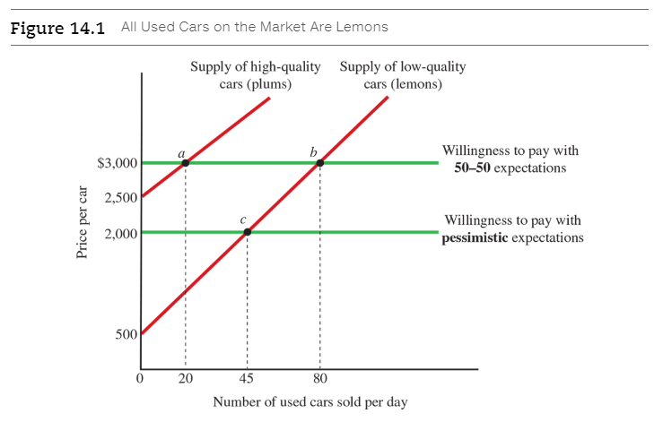
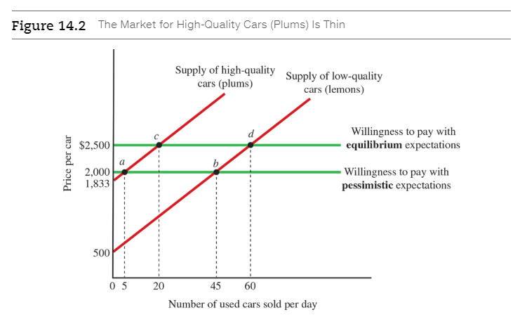
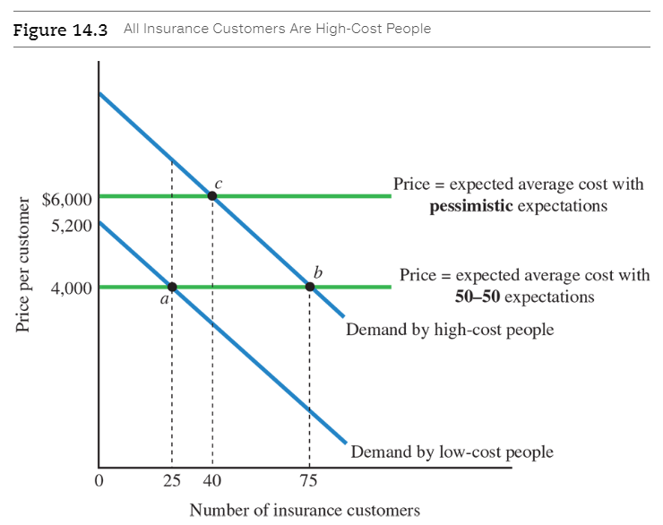

# Chapter 14: Imperfect Information: Adverse Selection and Moral Hazard

## 14.1 Adverse Selection for Buyers: The Lemons and Problem

<a name="asymmetric-information-term">**Asymmetric information**</a>

  - A situation in which one side of the market--either buyers or sellers--has
    better information than the other.

<a name="mixed-market-term">**Mixed market**</a>

  - A market in which goods of different qualities are sold for the same price.

### 14.1.1 Uninformed Buyers and Knowledgeable Sellers

To determine a consumer's willingness to pay in a mixed market with both lemons
(low-quality) and plums (hight quality), we must answer three questions:

  1. How much is the consumer willing to pay for a plum?
  2. How much is the consumer willing to pay for a lemon?
  3. What is the chance that a used car purchased in a mixed market will be of
     low quality?

In used car mixed markets, suppose the typical buyer is willing to pay $4,000
for a plum and $2,000 for a lemon. The buyer is willing to pay less for a lemon
because it is less reliable and has higher repair costs. For someone willing to
put up with the hassle and repair expense, a lemon is a reasonable car. That's
why the typical buyer is willing to pay $2,000, not $0, for a low-quality car we
tag with the label “lemon.” **Someone who pays $2,000 and gets a lemon is just as
happy as someone who pays $4,000 and gets a plum.**

A reasonable assumption is that a **buyer in the mixed market is willing to pay
the average value of the two types of cars, or $3,000.** In other words, a buyer
is willing to pay $3,000 for a 50–50 chance of getting either a plum or a lemon.

The current owner of a used car knows from everyday experience whether the car
is a lemon or a plum. Given the single market price for all used cars, lemons
and plums alike, the question for each owner is “Should I sell my car?” The
answers to this question are shown by the two supply curves in Figure 14.1, one
for lemons and one for plums:

  1. _Lemon supply_. As shown by the lower curve, the minimum supply price for
     lemons is $500: At any price less than $500, no lemons will be supplied.
     Lemons have a lower minimum price because they are worth less to their
     current owners. The number of lemons supplied increases with price. For
     example, 80 cars will be supplied at a price of $3,000 (point b).
  2. _Plum supply_. As shown by the upper curve, the minimum supply price for
     plums is $2,500: At any price less than $2,500, no plums will be supplied.
     Consistent with the law of supply, the higher the price of used cars, the
     larger the number of plums supplied. For example, 20 plums will be supplied
     at a price of $3,000 (point a).

> If buyers assume that there is a 50–50 chance of getting a lemon or a plum,
they are willing to pay $3,000 for a used car. At this price, 20 plums are
supplied (point a) along with 80 lemons (point b). **This is not an equilibrium
because consumers' expectations of a 50–50 split are not realized.** If
consumers become pessimistic and assume that all cars on the market will be
lemons, they are willing to pay $2,000 for a used car. At this price, only
lemons will be supplied (point c). Consumer expectations are realized, so the
equilibrium is shown by point c, with an equilibrium price of $2,000.

> A **market is in equilibrium** when consumers' **expectations are consistent
with their actual experiences**.

### 14.1.2 Equilibrium with All Low-Quality Goods

**Table 14.1** Equilibrium with All Low-Quality Goods

| Demand side of Market                                           | Buyers Initially Have 50 50 Expectations | Equilibrium: Pessimistic Expectations |
|-----------------------------------------------------------------|------------------------------------------|---------------------------------------|
| Amount buyer is willing to pay for a lemon                      | $2,000                                   | $2,000                                |
| Amount buyer is willing to pay for a plum                       | $4,000                                   | $4,000                                |
| Assumed chance of getting a lemon                               | 50%                                      | 100%                                  |
| Assumed chance of getting a plum                                | 50%                                      | 0%                                    |
| Amount buyer is willing to pay for a used car in a mixed market | $3,000                                   | $2,000                                |
| **Supply Side of Market**                                       |                                          |                                       |
| Number of lemons supplied                                       | 80                                       | 45                                    |
| Number of plums supplied                                        | 20                                       | 0                                     |
| Total number of used cars supplied                              | 100                                      | 45                                    |
| Actual change of getting a lemon                                | 80%                                      | 100%                                  |

The experiences of these 100 consumers show that the actual chance of getting a
lemon is 80 percent, not 50 percent as initially assumed. Once future buyers
realize this, they will of course become more pessimistic about the used-car
market. Suppose they assume that all the used cars on the market will be lemons.
Under this assumption, the typical buyer will be willing to pay only $2,000 (the
value of a lemon) for a used car. As shown in Figure 14.1, this price is less
than the $2,500 minimum price for supplying plums, so plums will disappear from
the used-car market. At a price of $2,000, the quantity of plums supplied is
zero, but the quantity of lemons supplied is 45 (point c). In other words, all
the used cars will be lemons, so consumers' pessimism is justified. Because
consumers' **expectations are consistent with their actual experiences in the
market**, the **equilibrium price of used cars is $2,000**. The equilibrium in
the used-car market is shown in the second column of Table 14.1.

  1. The presence of low-quality goods on the market pulls down the price
     consumers are willing to pay.
  2. The decrease in price decreases the number of high-quality goods supplied,
     decreasing the average quality of goods on the market.
  3. This decrease in the average quality of goods on the market pulls down the
     price consumers are willing to pay again.

**In this equilibrium, no plums are bought or sold, so every buyer will get a
lemon.**

<a name="adverse-selection-problem-term">**Adverse selection problem**</a>

  - A situation in which the uniformed side of the market must choose from an
    undesirable or adverse selection of goods.

### 14.1.3 A Thin Market: Equilibrium with Some High-Quality Goods

<a name="thin-market-term">**Thin market**</a>

  - A market in which some high-quality goods are sold but fewer than would be
    sold in a market with perfect information.

Figure 14.2 shows the situation that leads to a thin market. The minimum supply
price for plums is $1,833, and the quantity of plums supplied increases with the
price of used cars. Suppose consumers are initially pessimistic, assuming all
cars for sale will be lemons. This means consumers are willing to pay only
$2,000 for a used car. Because the minimum supply price for plums ($1,833) is
now less than the willingness to pay for a lemon, some plums will be supplied at
a price of $2,000. In Figure 14.2, 5 plums and 45 lemons are supplied at this
price, so 1 of every 10 buyers will get a plum. In this case, pessimism is not
an equilibrium because some buyers will get plums when they expect lemons. This
is also shown in the first column of Table 14.2.

> If buyers are pessimistic and assume that only lemons will be sold, they are
willing to pay $2,000 for a used car. At this price, 5 plums are supplied (point
a), along with 45 lemons (point b). This is not an equilibrium because 10
percent of consumers get plums, contrary to their expectations. If consumers
assume that there is a 25 percent chance of getting a plum, they are willing to
pay $2,500 for a used car. At this price, 20 plums are supplied (point c), along
with 60 lemons (point d). This is an equilibrium because 25 percent of consumers
get plums, consistent with their expectations. Consumer expectations are
realized, so the equilibrium is shown by points c and d.

**Table 14.2** A Thin Market for High-Quality Goods

| Demand side of Market                                           | Initial Pessimistic Expectations | Equilibrium 75 25 Expectations |
|-----------------------------------------------------------------|----------------------------------|--------------------------------|
| Amount buyer is willing to pay for a lemon                      | $2,000                           | $2,000                         |
| Amount buyer is willing to pay for a plum                       | $4,000                           | $4,000                         |
| Assumed chance of getting a lemon                               | 100%                             | 75%                            |
| Assumed chance of getting a plum                                | 0%                               | 25%                            |
| Amount buyer is willing to pay for a used car in a mixed market | $2,000                           | $2,500                         |
| **Supply Side of Market**                                       |                                  |                                |
| Number of lemons supplied                                       | 45                               | 60                             |
| Number of plums supplied                                        | 5                                | 20                             |
| Total number of used cars supplied                              | 50                               | 80                             |
| Actual change of getting a lemon                                | 90%                              | 75%                            |

## 14.2 Responding to the Lemons Problem

In a market with asymmetric information, there are strong incentives for buyers
and sellers to solve the lemons problem.

The challenge is to identify a high-quality car in the mixed market.

### 14.2.1 Buyers Invest in Information

The more information a buyer has, the greater the chance of picking a plum from
the cars in the mixed market.

By consulting information sources, like Carfax.com or a local car mechanic, a
buyer improves the chances of getting a high-quality car.

### 14.2.2 Consumer Satisfaction Scores from Angie‘s List and eBay

Some organizations provide information about firms that provide consumers
services such as landscaping, auto repair, and home improvement.

The members of Angie's list use grades of A to F to rate companies, with grades
based on price, the quality of service, and the punctuality and responsiveness
of workers.

Buyers help other purchasers distinguish “good” from “bad” sellers on eBay by
rating them online with “stars,” indicating their satisfaction with their
transactions.

### 14.2.3 Guarantees and Lemons Laws

Used-car sellers also have an incentive to solve the lemons problem. Sellers can
identify a car as a plum in a sea of lemons by offering one of the
following guarantees:

  - _Money-back guarantees_. The seller could promise to refund the $4,000 price
    if the car turns out to be a lemon. Because the car is in fact a plum--a fact
    known by the seller--the buyer will not ask for a refund, so both the buyer
    and the seller will be happy with the transaction.
  - _Warranties and repair guarantees_. The seller could promise to cover any
    extraordinary repair costs for 1 year. Because the car is a plum, there
    won't be any extraordinary costs, so both the buyer and the seller will be
    happy with the transaction.

California's Song-Beverly Consumer Warranty Act, also known as the "Lemons Law,"
auto dealers are required to repurchase vehicles that have been brought back for
repair at least four times for the same problem or have been in the mechanic's
shop for at least 30 calendar days in the first year following purchase.

## 14.3 Adverse Selection for Sellers: Insurance

The same sorts of problems occur when buyers are more knowledgeable than
sellers. The best example of superior knowledge on the demand side of the market
is insurance. A person who buys an insurance policy knows much more about his or
her risks and needs for insurance than the insurance company knows.

### 14.3.1 Health Insurance

The insurance company cannot distinguish between high-cost and low-cost people,
but it still must pick a price for its coverage.

To simplify matters, let's assume the insurance company sets the price equal to
its average cost per customer, equal to the total medical bills paid by the
insurance company divided by the number of customers.

What is the insurance company's average cost per customer? To determine the
average cost in a mixed market, we must answer three questions:

  - What is the cost of providing medical care to a high-cost person?
  - What is the cost of providing medical care to a low-cost person?
  - What fraction of the customers are low-cost people?

Suppose that half the population is high cost and the other half is low cost.
Let's assume the insurance company is somewhat naive and initially assumes that
he mix of insurance buyers will be the same as the population mix.

There is asymmetric information in the insurance market because **potential
buyers know from everyday experience and family histories what type of customer
they are, either low cost or high cost.** For each person, the question is
“Given the single market price for all insurance, for low-cost and high-cost
people alike, should I buy insurance?” The answers to this question are shown in
two demand curves in Figure 14.3. The demand curve for the high-cost people is
higher than the curve for the low-cost people, reflecting their larger benefits
from having medical insurance.

> If insurance companies assume there will be a 50–50 split between high-cost
and low-cost customers, the average cost of insurance and its price is $4,000.
At this price, there are 25 low-cost customers (point a) and 75 high-cost
customers (point b). This is not an equilibrium because 75 percent of insurance
buyers are high-cost customers, contrary to the expectations of a 50–50 split.
If insurance companies become pessimistic and assume that all buyers will be
high-cost consumers, the average cost and price is $6,000. The insurance
company's expectations are realized, so the equilibrium is shown by point c.

### 14.3.2 Equilibrium with All High-Cost Consumers

Table 14.3 shows two scenarios for our hypothetical insurance market, with
numbers based on the demand curves shown in Figure 14.3. In the first column,
firms initially assume a 50–50 mix of customers.

From the demand curves in Figure 14.3, we know that at this price 25 low-cost
people will buy insurance (point a), along with 75 high-cost people (point b).
In this case, insurance companies are too optimistic and underestimate the
fraction of customers with large medical bills. **The actual fraction of
high-cost customers is 75 percent, and the actual average cost is $5,000 (equal
to 0.25 times $2,000, plus 0.75 times $6,000). The company's average cost of
$5,000 exceeds its price of $4,000, so the firm will lose money.**

**Table 14.3** Equilibrium with All Heigh-Cost Customers

| Supply side of market                      | 50 50 Expectations | Equilibrium: Pessimistic Expectation |
|--------------------------------------------|--------------------|--------------------------------------|
| Cost of serving a high-cost customer       | $6,000             | $6,000                               |
| Cost of serving a low-cost customer        | $2,000             | $2,000                               |
| Assumed fraction of high-cost customers    | 50%                | 100%                                 |
| Assumed chance of low-cost customers       | 50%                | 0%                                   |
| Expected average cost per customer (price) | $4,000             | $6,000                               |
| **Demand Side of Market**                  |                    |                                      |
| Number of high-cost customers              | 75                 | 40                                   |
| Number of low-cost customers               | 25                 | 0                                    |
| Total number of customers                  | 100                | 40                                   |
| Actual fraction of high-cost customer so   | 75%                | 100%                                 |
| Actual average cost per customer           | $5,000             | $6,000                               |

**They assume that all their customers will be high-cost people.** Under this
assumption, the average cost per customer is $6,000, the average cost per
high-cost customer, and that's the pessimistic price. As shown in Figure 14.3,
this price exceeds the maximum that low-cost people are willing to pay for
insurance ($5,200), **so none of the low-cost consumers will buy insurance at
this price.** But a total of 40 high-cost consumers will buy insurance at this
price (point c).

The domination of the insurance market by high-cost people is another example of
the adverse-selection problem. The uninformed side of the market (sellers in
this case) must choose from an undesirable or adverse selection of consumers.
The asymmetric information in the market generates an upward spiral of price and
average cost of service:

  - The presence of high-cost consumers in the market pulls up the average cost
    of service, pulling up the price.
  - The increase in price decreases the number of low-cost consumers who
    purchase insurance.
  - This decrease in the number of low-cost consumers pulls up the average cost
    of insurance.
  - In the extreme case, the upward spiral continues until all insurance
    customers are high-cost people.

Our example of health insurance indicates that only high-cost people buy
insurance. A more realistic outcome is a thin market, with a relatively small
number of low-cost people buying insurance. **The adverse-selection problem
could be less severe, but it will still be present as long as insurance
companies cannot distinguish perfectly between low-cost and high-cost people.**

### 14.3.3 Responding to Adverse Selection in Insurance: Group Insurance

**Insurance companies use group insurance plans to diminish the
adverse-selection problem.** By enrolling all the employees of an organization
in one or two insurance plans, they ensure that all workers, not just high-cost
people, join the pool of consumers.

Most insurance companies use experience rating to set their prices for group
insurance.

<a name="experience-rating-term">**Experience rating**</a>

  - A situation in which insurance companies charge different prices for medical
    insurance to different firms depending on the past medical bills of a firm's
    employees.

A firm whose employees have low medical bills pays a low price for its
employees' health insurance. **Experience rating gives firms an incentive to
decrease the health costs of their workers by investing in safety and health
programs for them.** Firms also have an incentive to avoid hiring applicants
with health problems.

### 14.3.4 The Uninsured

One implication of asymmetrical information in insurance markets is that many
people will not voluntarily carry insurance.

<a name="the-affordable-care-act-term">**The Affordable Care Act (ACA)**</a>

  - Includes a provision commonly known as the individual mandate that requires
    most residents of the U.S. to have health insurance that meets specified
    standards for coverage.
  - The provision imposes penalties on people who do not have health insurance.

The individual mandate reduced the problem of the uninsured by increasing the
number of people with health insurance.

## 14.4 Insurance and Moral Hazard

Does insurance affect people's risk-taking behavior? The answer is yes.
Insurance causes people to take greater risks because they know part of the cost
of an undesirable outcome will be borne by their insurance companies. The risky
behavior triggered by insurance is an example of the moral-hazard problem.

<a name="moral-hazard-term">**Moral hazard**</a>

  - A situation in which one side of an economic relationship takes undesirable
    or costly actions that the other side of the relationship cannot observe.

Just as collision insurance encourages risky driving, life insurance encourages
risky activities such as flying small airplanes, parachuting, and bungee
jumping. Similarly, health insurance encourages risky behavior such as smoking,
drinking, and unhealthy diets.

### 14.4.1 Insurance Companies and Moral Hazard

Insurance companies use various measures to decrease the moral-hazard problem.
Many insurance policies have a deductible--a dollar amount that a policyholder
must pay before getting compensation from the insurance company.

Savvy insurance companies anticipate moral hazard and set its price accordingly.

## Chapter Summary

In this chapter, we've seen what happens when one of the assumptions underlying
most supply and demand analysis--that people make informed decisions--is violated.
If either buyers or sellers don't have reliable information about a particular
good or service, the market will suffer from the adverse-selection problem. The
uninformed side picks from an adverse selection of goods or customers. Here are
the main points of the chapter:

  1. The _adverse-selection problem_ occurs when one side of the market cannot
     distinguish between high-quality and low-quality goods. The presence of
     low-quality goods pulls down the price that buyers are willing to pay,
     which decreases the quantity of high-quality goods supplied, which further
     decreases the average quality and the price. In the extreme case, only
     low-quality goods are sold.
  2. A _thin market_ occurs when the sellers of high-quality goods have a
     relatively low minimum supply price, so some high-quality goods are sold.
  3. In a market subject to _asymmetric information_, buyers have an incentive
     to invest in information to help make better choices and sellers have an
     incentive to provide quality guarantees.
  4. Insurance markets suffer from adverse selection because compared to
     insurance sellers, buyers have better information about the risks they
     face.
  5. Insurance encourages risky behavior because part of the cost of an
     unfavorable outcome will be paid by an insurance company.
  6. A market is in _equilibrium_ when consumers' expectations are consistent
     with their actual experiences.
     - **Price will drop** when the market is **too optimistic with lemons**.
     - **Price will stay the same** when the market is in **equilibrium**.
     - **Price will rise** when the market is **too pessimistic with lemons**.

 

# References

Text Books

  - Microeconomics: _Principles, Applications, and Tools_ 10th ed (eText).
    * Authors: O'Sullivan/Sheffrin/Perez

