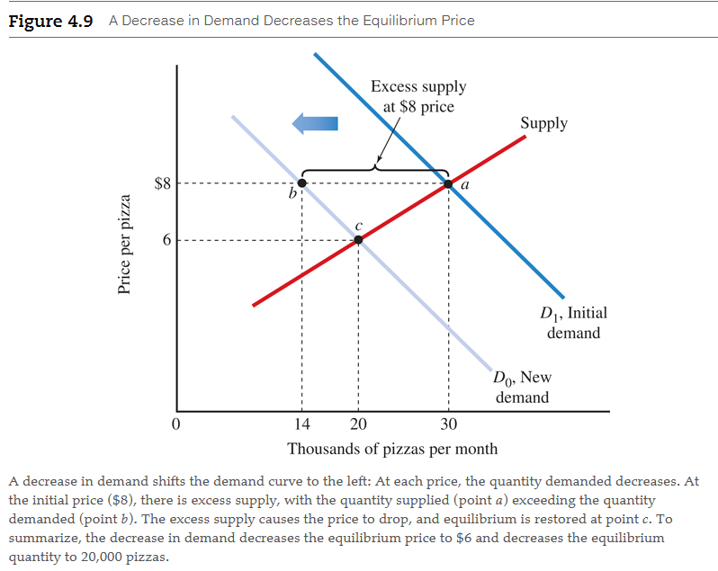

# Chapter 4: Demand, Supply, and Market Equilibrium

**Perfectly competitive market**

- A market with many sellers and buyers of a homogeneous product and no barriers
  to entry
- No single buyer or seller can affect the market price.

## 4.1 The Demand Curve

<a name="law-of-demand-term">**Law of demand**</a>

- The higher the price, the smaller the quantity demanded, everything else being
  equal.
- There is a negative relationship between price and quantity demanded, _ceteris
  paribus_.

**Quantity demanded**

- The amount of a product that consumers are willing and able to buy.

**Demand schedule**

- A table that shows the relationship between the price of a product and the
  quantity demanded, _ceteris paribus (everything else held fixed)_.

**Individual demand curve**

- A curve that shows the relationship between the price of a good and quantity
  demanded by an individual consumer, _ceteris paribus_.

| Point | Price | Quantity of Pizzas per Month |
|-------|-------|------------------------------|
| a     | $10   | 1                            |
| b     | 8     | 4                            |
| c     | 6     | 7                            |
| d     | 4     | 10                           |
| e     | 2     | 13                           |

**QUANTITY OF PIZZA DEMANDED**

| Price | Al + | Bea = | Market Demand |
|-------|------|-------|---------------|
| $8    | 4    | 2     | 6             |
| 6     | 7    | 4     | 11            |
| 4     | 10   | 6     | 16            |
| 2     | 13   | 8     | 21            |

**Change in quantity demanded**

- A change in the quantity consumers are willing and able to buy when the price
  changes; represented graphically by movement along the demand curve.

**Market demand curve**

- A curve showing the relationship between price and quantity demanded by _all_
  consumers, _ceteris paribus_.
- Sum of everyone's individual demand curve

## 4.2 The Supply Curve

<a name="law-of-supply">**Law of supply**</a>

- There is a positive relationship between price and quantity supplied,
  ceteris paribus.

**Quantity supplied**

- The amount of a product that firms are willing and able to sell.

**Supply schedule**

- A table that shows the relationship between the price of a product and
  quantity supplied, _ceteris paribus_.
- Remember that in a supply schedule, a change in quantity results from a
  change in price alone.

**INDIVIDUAL SUPPLY SCHEDULE FOR PIZZA**

| Point | Price | Quantity of Pizzas per Month |
|-------|-------|------------------------------|
| a     | $2    | 0                            |
| b     | 4     | 100                          |
| c     | 6     | 200                          |
| d     | 8     | 300                          |
| e     | 10    | 400                          |

**Individual supply curve**

- A curve showing the relationship between price and a quantity supplied by a
  single firm, ceteris paribus.

**Change in quantity supplied**

- A change in the quantity firms are willing and able to sell when the price
  changes.

**Minimum supply price**

- The lowest price at which a product will be supplied.

### 4.2.2 Why Is the Individual Supply Curve Positively Sloped?

A higher price encourages a firm to increase its output by purchasing more
materials and hiring more workers. To increase her workforce, Lola might be
forced to pay overtime or hire workers who are more costly or less productive
than the original workers. But the higher price of pizza makes it worthwhile to
incur these higher costs.

The supply curve shows the marginal cost of production for different quantities
produced. We can use the marginal principle to explain this.

- [⚓ Marginal Principle](ch-2#the-marginal-principle)

### 4.2.3 From Individual Supply To Market Supply

**Market supply curve**

- A curve showing the relationship between the market price and quantity
  supplied by all firms, ceteris paribus.

**QUANTITY OF PIZZA SUPPLIED**

| Price | Lola + | Hiram = | Market Supply |
|-------|--------|---------|---------------|
| 2     | 0      | 0       | 0             |
| 4     | 100    | 0       | 100           |
| 6     | 200    | 0       | 200           |
| 8     | 300    | 100     | 400           |
| 10    | 400    | 200     | 600           |

### 4.2.4 Why Is the Market Supply Curve Positively Sloped?

- **Individual firm.** A higher price encourages a firm to increase its output
  by purchasing more materials and hiring more workers.
- **New firms.** In the long run, new firms can enter the market and existing
  firms can expand their production facilities to produce more output. The new
  firms may have higher production costs than the original firms, but the
  higher output price makes it worthwhile to enter the market, even with
  higher costs.

## 4.3 Market Equilibrium: Bringing Demand and Supply Together

**Market equilibrium**

- A situation in which the quantity demanded equals the quantity supplied at the
  prevailing market price.
- When a market reaches an equilibrium, there is no pressure to change the
  price.

### 4.3.1 Excess Demand Causes the Price to Rise

**Excess demand**

- A situation in which, at the prevailing price, the quantity demanded exceeds
  the quantity supplied.
- Sometimes called a _shortage_.

An increase in price eliminates excess demand by changing both the quantity
demanded and the quantity supplied. As the price increases, the excess demand
shrinks for two reasons:

- The market moves upward along the demand curve (from point c toward point a),
  decreasing the quantity demanded.
- The market moves upward along the supply curve (from point b toward point a),
  increasing the quantity supplied.

### 4.3.2 Excess Supply Causes the Price to Drop

**Excess supply**

- A situation in which the quantity supplied exceeds the quantity demanded at
  the prevailing price.
- some times called _surplus_.

In Figure 4.6, at a price of $12, the excess supply is 32,000 pizzas: Producers
are willing to sell 50,000 pizzas (point e), but consumers are willing to buy
only 18,000 (point d). This mismatch will cause the price of pizzas to fall as
firms cut the price to sell them. As the price drops, the excess supply will
shrink for two reasons:

- The market moves downward along the demand curve from point d toward point a,
  increasing the quantity demanded.
- The market moves downward along the supply curve from point e toward point a,
  decreasing the quantity supplied.

**Price ceiling**

- Maximum price less than the equilibrium price set for a good to create an
  excess demand.

**Price floor**

- Minimum price greater than the equilibrium price set for a good to create an
  excess supply.

## 4.4 Market Effects Of Changes in Demand

### 4.4.1 Change in Quantity Demanded versus Change in Demand

**Change in demand**

- A shift of the demand curve caused by a change in a variable other than the
  price of the product.

### 4.4.2 Increases in Demand Shift the Demand Curve

What types of changes will increase the demand and shift the demand curve to the
right, as shown in Figure 4.7? An increase in demand like the one represented in
Figure 4.7 can occur for several reasons, listed in Table 4.1.

**Normal good**

- A good for which an increase in income increases demand.

**Inferior good**

- A good for which an increase in income decreases demand.

**Substitutes**

- Two goods for which an increase in the price of one good increases the demand
  for the other good.

**Complements**

- Two goods for which a decrease in the price of one good increases the demand
  for the other good.

Increase in demand can occur for several reasons:

- **Increase in income**. Consumers use their income to buy products, and the
  more money they have, the more money they spend. For a _normal good_, there is
  a positive relationship between consumer income and the quantity consumed.
  When income increases, a consumer buys a larger quantity of a normal good.
  Most goods fall into this category--including new clothes, movies, and pizza.
- **Decrease in income**. An _inferior good_ is the opposite of a normal good.
  Consumers buy larger quantities of inferior goods when their income decreases.
  For example, if you lose your job you might make your own coffee instead of
  buying it in a coffee shop, rent DVDs instead of going to the theater, and eat
  more macaroni and cheese. In this case, homemade coffee, DVDs, and macaroni
  and cheese are examples of inferior goods.
- **Increase in price of a substitute good**. When two goods are _substitutes_,
  an increase in the price of the first good causes some consumers to switch to
  the second good. Tacos and pizza are substitutes, so an increase in the price
  of tacos increases the demand for pizza as some consumers substitute pizza for
  tacos, which are now more expensive relative to pizza.
- **Decrease in price of a complementary good**. When two goods are complements,
  they are consumed together as a package, and a decrease in the price of one
  good decreases the cost of the entire package. As a result, consumers buy more
  of both goods. Pizza and lemonade are complementary goods, so a decrease in
  the price of lemonade decreases the total cost of a lemonade-and-pizza meal,
  increasing the demand for pizza.
- **Increase in population**. An increase in the number of people means there
  are more potential pizza consumers--more individual demand curves to add up to
  get the market demand curve--so market demand increases.
- **Shift in consumer preferences**. Consumers' preferences or tastes can change
  over time. If consumers' preferences shift in favor of pizza, the demand for
  pizza increases. One purpose of advertising is to change consumers'
  preferences, and a successful pizza advertising campaign will increase demand.
- **Expectations of higher future prices**. If consumers think next month's
  pizza price will be higher than they had initially expected, they may buy a
  larger quantity today and a smaller quantity next month. That means the demand
  for pizza today will increase.

### 4.4.3 Decreases in Demand Shift the Demand Curve

- **Decrease in income**. A decrease in income means that consumers have less to
  spend, so they buy a smaller quantity of each normal good.
- **Increase in income**. Consumers buy smaller quantities of an inferior good
  when their income increases.
- **Decrease in the price of a substitute good**. A decrease in the price of a
  substitute good such as tacos makes pizza more expensive relative to tacos,
  causing consumers to demand less pizza.
- **Increase in the price of a complementary good**. An increase in the price of
  a complementary good such as lemonade increases the cost of a
  lemonade-and-pizza meal, decreasing the demand for pizza.
- **Decrease in population**. A decrease in the number of people means that
  there are fewer pizza consumers, so the market demand for pizza decreases.
- **Shift in consumer tastes**. When consumers' preferences shift away from
  pizza in favor of other products, the demand for pizza decreases.
- **Expectations of lower future prices**. If consumers think next month's pizza
  price will be lower than they had initially expected, they may buy a smaller
  quantity today, meaning the demand for pizza today will decrease.

### 4.4.4 A Decrease in Demand Decreases the Equilibrium Price

We can use Figure 4.9 to show how a decrease in demand affects the equilibrium
price and equilibrium quantity.

## 4.5 Market Effects of Changes in Supply

### 4.5.1 Change in Quantity Supplied versus Change in Supply

**Change in quantity supplied**

- A change in price causes a change in quantity supplied, a movement along a
  single supply curve.

**Change in supply**

- A shift of the supply curve caused by a change in a variable other than the
  price of the product.

### 4.5.2 Increases in Supply Shift the Supply Curve

- **Downward shift**. When the cost of production decreases, the price required
  to generate any given quantity of pizza will decrease. In general, a lower
  wage means a lower marginal cost of production, so each firm needs a lower
  price to cover its production cost. In other words, the supply curve shifts
  downward.
- **Rightward shift**. The decrease in production costs makes pizza production
  more profitable at a given price, so producers will supply more at each price.
  In other words, the supply curve shifts to the right.

The supply curve shift downward and rightward (production cost have gotten
cheaper) when these variables:

### 4.5.3 An Increase in Supply Decreases the Equilibrium Price

### 4.5.4 Decreases in Supply Shift the Supply Curve

The supply curve shift upward and leftward (production cost have gotten more
expensive) when these variables:

### 4.5.5 A Decrease in Supply Increases the Equilibrium Price

### 4.5.6 Simultaneous Changes in Demand and Supply

## 4.6 Predicting and Explaining Market Changes

Market effects of changes in demand or supply

| Change in Demand or Supply | How does the equilibrium price change? | How does the equilibrium quantity change? |
|:--------------------------:|:--------------------------------------:|:-----------------------------------------:|
| Increase in demand         | Increase                               | Increase                                  |
| Decrease in demand         | Decrease                               | Decrease                                  |
| Increase in supply         | Decrease                               | Increase                                  |
| Decrease in supply         | Increase                               | Decreases                                 |

 

# Resources

- [⚓ Marginal Principle](ch-2#the-marginal-principle)

Text Books

- Microeconomics: _Principles, Applications, and Tools_ 10th ed (eText).
  - Authors: O'Sullivan/Sheffrin/Perez

