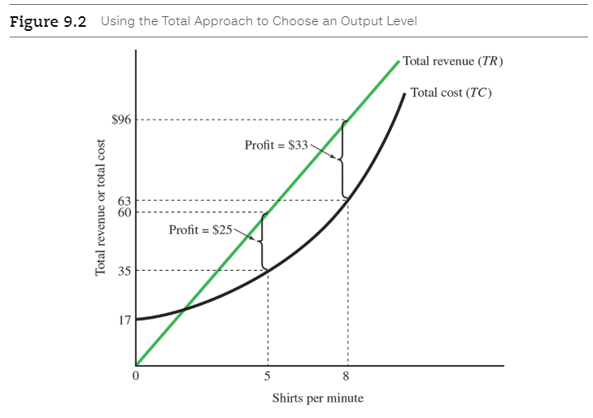
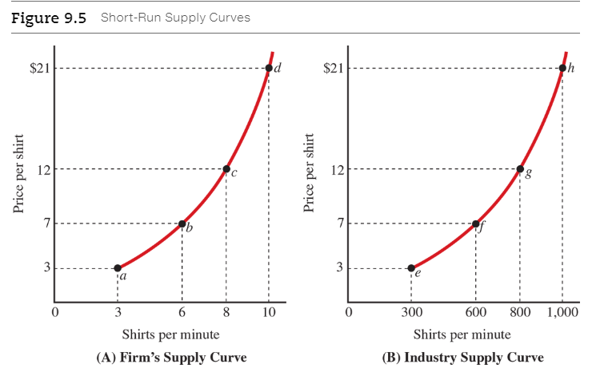
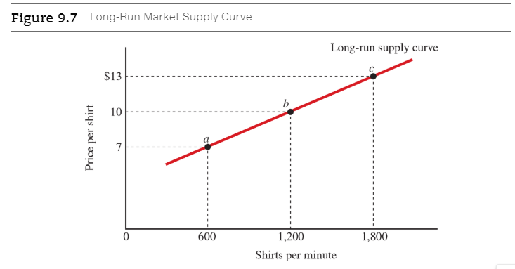
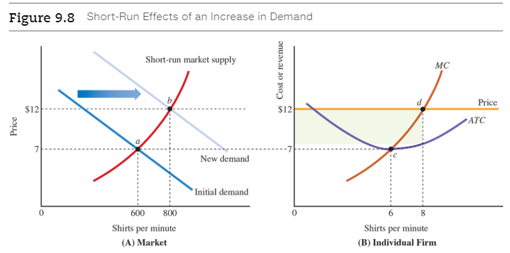
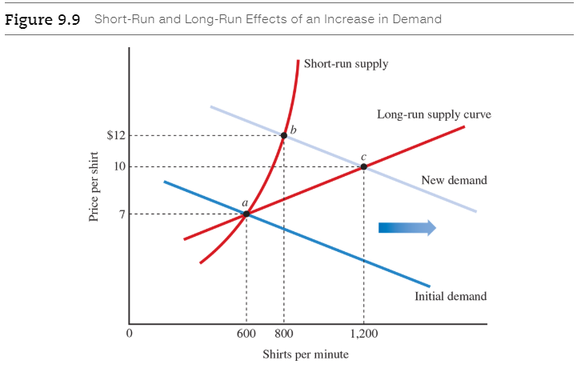

# Chapter 9: Perfect Competition

<a name="perfectly-competitive-market">**Perfectly competitive market**</a>

  - A market with many sellers and buyers of a homogeneous product and no
    barriers to entry.
  - Five features of a competitive market
    1. There are many sellers.
    2. There are many buyers.
    3. The product is homogeneous.
    4. There are no barriers to market entry.
    5. Both buyers and sellers are price takers.

<a name="price-taker">**Price taker**</a>

  - A buyer or seller that takes the market price as given.
    * For example, each soybean farmer takes the market price as given. There is
      no reason to cut the price to sell more soybeans, because the farmer can
      sell as much as he wants at the market price. There is no reason to
      increase the price because the farmer would lose all his customers to
      other farmers selling at the market price.

## 9.1 Previous of the Four Market Structures

<a name="firm-specific-demand-curve">**Firm-specific demand curve**</a>

  - A curve showing the relationship between the price charged by a specific
    firm and the quantity the firm can sell.
  - In a _monopoly_, a single firm serves the entire market, so the
    firm-specific demand curve is the same as the market demand curve.
  - A _perfectly competitive firm_ can sell as much as it wants at the market
    price, but if it raises its price even a penny, it will sell nothing.
    [Perfectly elastic](ch-5#perfectly-elastic-demand).

> In Panel A, the demand curve facing a monopolist is the market demand curve.
In Panel B, a perfectly competitive firm takes the market price as given, so the
firm-specific demand curve is horizontal. The firm can sell all it wants at the
market price, but would sell nothing if it charged a higher price.

<a name="monopoly">**Monopoly**</a>

  - A single firm serves the entire market. A monopoly occurs when the barriers
    to market entry are very large. This can result from very large
    [economies of scale](ch-8#economies-of-scale) or a government policy that limits the number of firms.
    Some examples of monopolies that result from large economies of scale are
    local phone service, cable TV, and electric power transmission. Some
    examples of monopolies established by government policy are drugs covered by
    patents, the selling of firewood in national parks, and the U.S. Postal
    Service.

<a name="monopolistic-competition">**Monopolistic competition**</a>

  - There are no barriers to entering the market, so there are many firms, and
    each firm sells a slightly different product. For example, coffee shops in
    your city provide slightly different goods and compete for customers. Your
    local grocery store sells many brands of toothbrushes, with slight
    differences in size, shape, color, and style.

<a name="oligopoly">**Oligopoly**</a>

  - The market consists of just a few firms because [economies of scale](ch-8#economies-of-scale) or
    government policies limit the number of firms. Some product examples are
    automobiles, computer processor chips, airline travel, and breakfast
    cereals. The large economies of scale in automobile production result from
    the large startup costs, with billions of dollars required to build a
    factory or assembly plant. Similarly, a fabrication plant for computer
    processor chips costs several billion dollars.

**Table 9.1** Characteristics of the Four Market Structures

| Characteristic             | Perfect Competition         | Monopolistic Competition                    | Oligopoly                                                                   | Monopoly                                                      |
|----------------------------|-----------------------------|---------------------------------------------|-----------------------------------------------------------------------------|---------------------------------------------------------------|
| Number of firms            | Many                        | Many                                        | Few                                                                         | One                                                           |
| Type of product            | Homogeneous                 | Differentiated                              | Homogeneous or differentiated                                               | Unique                                                        |
| Firm-specific demand curve | Demand is perfectly elastic | Demand is elastic but not perfectly elastic | Demand is less elastic than demand facing monopolistically competitive firm | Firm faces market demand curve                                |
| Entry conditions           | No barriers                 | No barriers                                 | Large barriers from economies of scale or government policies               | Large barriers from economies of scale or government policies |
| Examples                   | Corn, plain T-shirts        | Toothbrushes, music stores, groceries       | Air travel, automobiles, beverages, cigarettes, mobile phone service        | Local phone service, patented drugs                           |

## 9.2 The Firm's Short-Run Output Decision

### 9.2.1 The Total Approach: Computing Total Revenue and Total Cost

> Economic profit is shown by the vertical distance between the total-revenue
curve and the total-cost curve. To maximize profit, the firm chooses the
quantity of output that generates the largest vertical difference between the
two curves.

### 9.2.2 The Marginal Approach

The other way for a firm to decide how much output to produce relies on the
[marginal principle](ch-2#the-marginal-principle), the general decision-making rule that is one of the key
principles of economics.

<a name="marginal-revenue">**Marginal revenue**</a>

  - The change in total revenue from selling one more unit of output.

A perfectly competitive firm takes the market price as given, so the marginal
revenue--the change in total revenue from one more shirt--is simply the price:

$$
\text{marginal revenue} = \text{price}
$$

The marginal principle tells us that the firm will maximize its profit by
choosing the quantity at which price equals marginal cost:

$$
\text{To maximize profit, produce the quantity where price} = \text{marginal
cost}
$$

> A perfectly competitive firm takes the market price as given, so the marginal
benefit, or marginal revenue, equals the price. Using the marginal principle,
the typical firm will maximize profit at point $a$, where the $12 market price
equals the marginal cost. Economic profit equals the difference between the
price and the average cost ($4.125=$12−$7.875) times the quantity produced
(eight shirts per minute), or $33 per minute.

### 9.2.3 Economic Profit and the Break-Even Price

We've seen that the perfectly competitive firm maximizes its profit by producing
the quantity at which its marginal revenue (price) equals its marginal cost. How
much profit does the firm earn? The firm's economic profit equals its total
revenue minus its total cost. One way to compute a firm's total economic profit
is to multiply the average profit per unit produced--the gap between the price
and the average cost--by the quantity produced:

$$
\text{economic profit} = (\text{price} - \text{average cost}) \times
\text{quantity produced}
$$

How would a decrease in price affect the firm's output decision? A decrease in
price shifts the marginal-revenue (price) line downward, so it will intersect
the marginal-cost curve at a smaller quantity.

This is the [law of supply](ch-4#law-of-supply) in action: The lower the price, the smaller the
quantity supplied.

<a name="break-even-price">**Break-even price**</a>

  - The price at which economic profit is zero; price equals average total cost.

## 9.3 The Firm's Shut-Down Decision

Consider next the decisions faced by a firm that is losing money. Suppose the
price of shirts drops to $4, which is so low that the firm's total revenue is
less than its total cost. In Table 9.3, the marginal principle tells the firm to
produce four shirts at this price, but the firm's total cost of $30 exceeds its
total revenue of $16, so the firm will lose $14 per minute. Should the firm
continue to operate at a loss or shut down?

**Table 9.3** Deciding How Much to Produce When the Price is $4

| 1 Output: Shirts per Minute (Q) | Fixed Cost (FC) | Variable Cost (VC) | Total Cost (TC) | Total Revenue (TR) | Profit = TR - TC | Marginal Revenue = Price | Marginal Cost (MC) |
|---------------------------------|-----------------|--------------------|-----------------|--------------------|------------------|--------------------------|--------------------|
| 0                               | $17             | $0                 | $17             | $0                 | -$17             |                          |                    |
| 1                               | 17              | 5                  | 22              | 4                  | -18              | $4                       | $5                 |
| 2                               | 17              | 6                  | 23              | 8                  | -15              | 4                        | 1                  |
| 3                               | 17              | 9                  | 26              | 12                 | -14              | 4                        | 3                  |
| 4                               | 17              | 13                 | 30              | 16                 | -14              | 4                        | 4                  |
| 5                               | 17              | 18                 | 35              | 20                 | -15              | 4                        | 5                  |
| 6                               | 17              | 25                 | 42              | 24                 | -18              | 4                        | 7                  |

### 9.3.1 Total Revenue, Variable Cost, and the Shut-Down Decision

The decision to operate or shut down is a short-run decision, a day-to-day
decision to temporarily halt production in response to market conditions.
Suppose our shirt factory hires workers by the day, so it makes the decision at
the beginning of each day. The decision-making rule is

$$
\text{operate if total revenue} > \text{variable cost} \\
\text{shut down if total revenue} < \text{variable cost}
$$

> When the price is $4, marginal revenue equals marginal cost at four shirts
(point $a$). At this quantity, average cost is $7.50, so the firm loses $3.50 on
each shirt, for a total loss of $14. Total revenue is $16 and the variable cost
is only $13, so the firm is better off operating at a loss rather than shutting
down and losing its fixed cost of $17. The shut-down price, shown by the minimum
point of the _AVC_ curve, is $3.00.

### 9.3.2 The Shut-Down Price

There is a shortcut for determining whether it is sensible to continue to
operate: compare the price to the average variable cost. Total revenue equals
the price times the quantity produced, and the variable cost equals the average
variable cost times the quantity produced. Therefore, total revenue will exceed
variable cost if the price exceeds the average variable cost. If that happens,
the firm should continue to operate. Otherwise, the firm should shut down.

$$
\text{operate if price} > \text{average variable cost} \\
\text{shut down if price} < \text{average variable cost}
$$

In Figure 9.4, with a price of $4, the marginal principle is satisfied at point
a, and the average variable cost of producing four shirts is $3.25 (point $c$).
The price exceeds the average variable cost, so it is sensible to continue
operating, even at a loss.

<a name="shut-down-price">**Shut-down price**</a>

  - The price at which the firm is indifferent between operating and shutting
    down; equal to the minimum average variable cost.

To find the shut-down price, we find the minimum point on the AVC curve. In
Figure 9.4, AVC reaches its minimum of $3 at a quantity of three shirts per
minute, so the shut-down price is $3 (shown by point d). The average
variable cost never drops below $3, so if the price drops below $3 it would
be impossible to generate enough revenue to cover the firm’s variable cost.
When the price equals the shut-down price, the firm is generating just
enough revenue to cover its variable costs, so it is just as well off
operating as shutting down.

### 9.3.3 Fixed Costs and Sunk Costs

<a name="sunk-cost">**Sunk cost**</a>

  - A cost that a firm has already paid or committed to pay, so it cannot be
    recovered.

    Rent is just one example of an irrelevant sunk cost. The marginal principle
    tells us that decisions are based on the costs that depend on what we do,
    not on costs that we can do nothing about.

## 9.4 Short-Run Supply Curves

### 9.4.1 The Firm's Short-Run Supply Curve

<a name="short-run-supply-curve">**Short-run supply curve**</a>

  - A curve showing the relationship between the market price of a product and
    the quantity of output supplied by a firm in the short run.

> In Panel A, the firm's short-run supply curve is the part of the marginal-cost
curve above the shut-down price. In Panel B, there are 100 firms in the market,
so the market supply at a given price is 100 times the quantity supplied by the
typical firm. At a price of $7, each firm supplies six shirts per minute (point
$b$), so the market supply is 600 shirts per minute (point $f$).

### 9.4.2 The Short-Run Market Supply Curve

<a name="short-run-market-supply-curve">**Short-run market supply curve**</a>

  - A curve showing the relationship between the market price and the quantity
    supplied in the short run.

Panel B of Figure 9.5 shows the short-run market supply curve when there are 100
identical shirt firms. For each price, we get the quantity supplied for the
entire market by multiplying the quantity supplied by the typical firm (from the
individual supply curve) by 100. At a price of $7, each firm produces six shirts
(point $b$ in Panel A), so the market supply is 600 shirts (point $f$ in Panel
B). If the price increases to $12, each firm increases production to eight
shirts (point $c$ in Panel A), so the market supply is 800 shirts (point $g$ in
Panel B).

### 9.4.3 Market Equilibrium

Figure 9.6 shows a perfectly competitive market in equilibrium. For a short-run
equilibrium, two conditions are satisfied:

  1. At the market level, the quantity of the product supplied equals the
     quantity demanded. The demand curve intersects the short-run market supply
     curve at a price of $7 and a quantity of 600 shirts per minute (Panel A).
  2. The typical firm in the market maximizes its profit, given the market
     price. At a market price of $7, each of the 100 firms maximizes profit by
     producing six shirts per minute (Panel B).

In Panel A, the market demand curve intersects the short-run market supply curve
at a price of $7. In Panel B, given the market price of $7, the typical firm
satisfies the marginal principle at point $b$, producing six shirts per minute.
The $7 price equals the average cost at the equilibrium quantity, so economic
profit is zero, and no other firms will enter the market.

## 9.5 The Long-Run Supply Curve for an Increasing-Cost Industry

<a name="long-run-market-supply-curve">**Long-run market supply curve**</a>

  - A curve showing the relationship between the market price and quantity
    supplied in the long run.

<a name="increasing-cost-industry">**Increasing-cost industry**</a>

  - An industry in which the average cost of production increases as the total
    output of the industry increases; the long-run supply curve is positively
    sloped.

Average cost of production increases as the total output increases, for two
reasons:

  - **Increasing input price**. As an industry grows, it competes with other
    industries for limited amounts of various inputs, and this competition
    drives up the prices of these inputs. For example, suppose the shirt
    industry competes against other industries for a limited amount of cotton.
    To get more cotton to produce more shirts, firms in the shirt industry must
    outbid other industries for the limited amount available, and this drives up
    the price of cotton.

  - **Less productive inputs**. A small industry will use only the most
    productive inputs, but as the industry grows, firms may be forced to use
    less productive inputs. For example, a small shirt industry will use only
    the most skillful workers, but as the industry grows, it will hire workers
    with lower skills. As the average skill level of the industry's workforce
    decreases, the average cost of production increases: A firm will require
    more labor time--and pay more in labor costs--to produce each shirt.

### 9.5.1 Production Cost and Industry Size

**Table 9.4** Industry Output and Average Production Cost

| Number of firms | Industry output | Shirts per firm | Total cost for typical firm | Average cost per shirt |
|-----------------|-----------------|-----------------|-----------------------------|------------------------|
| 100             | 600             | 6               | $42                         | $7                     |
| 200             | 1,200           | 6               | 60                          | 10                     |
| 300             | 1,800           | 6               | 78                          | 13                     |

### 9.5.2 Drawing the Long-Run Market Supply Curve

The long-run supply curve tells us how much output will be produced at each
price in the long run, when the number of firms in the market can change.

> The long-run market supply curve shows the relationship between the price and
quantity supplied in the long run, when firms can enter or leave the industry.
At each point on the supply curve, the market price equals the long-run average
cost of production. Because this is an increasing-cost industry, the long-run
market supply curve is positively sloped.

The long-run supply curve in Figure 9.7 is positively sloped, as it will be for
any increasing-cost industry. This is another example of the law of supply. An
increase in the price of shirts initially makes shirt production profitable, so
firms enter the market and produce more shirts. As industry-wide output
increases, the greater demand for cotton and labor increases input prices, which
in turn increases the average cost of producing shirts. Firms will continue to
enter the market until the average cost rises to the point where it equals the
price of shirts. The positively sloped supply curve tells us the market won't
produce a larger quantity of shirts unless the price rises to cover the higher
average cost associated with the larger industry.

## 9.6 Short-Run and Long-Run Effects of Changes in Demand

### 9.6.1 The Short-Run Response to an Increase in Demand

> An increase in demand for shirts increases the market price to $12, causing the
typical firm to produce eight shirts instead of six. Price exceeds the average
total cost at the eight-shirt quantity, so economic profit is positive. Firms
will enter the profitable market.

### 9.6.2 The Long-Run Response to an Increase in Demand

> The short-run supply curve is steeper than the long-run supply curve because
of diminishing returns in the short run. In the short run, an increase in demand
increases the price from $7 (point $a$) to $12 (point $b$). But in the long run,
firms can enter the industry and build more production facilities, so the price
eventually drops to $10 (point $c$). The large upward jump in price after the
increase in demand is followed by a downward slide to the new long-run
equilibrium price.

## 9.7 Long-Run Supply for a Constant-Cost Industry

<a name="constant-cost-industry">**Constant-cost industry**</a>

  - An industry in which the average cost of production is constant; the
    long-run supply curve is horizontal.

### 9.7.1 Long-Run Supply Curve for a Constant-Cost Industry

> In a constant-cost industry, input prices do not change as the industry grows.
Therefore, the average production cost is constant and the long-run supply curve
is horizontal. For the candle industry, the cost per candle is constant at
$0.05, so the supply curve is horizontal at $0.05 per candle.

### 9.7.2 Hurricane Andrew and the Price of Ice

For an example of the effects of an increase in demand in a constant-cost
industry, let's look at the short-run and long-run effects of a hurricane. In
1992, Hurricane Andrew struck the southeastern United States, leaving millions
of people without electricity for several days. Figure 9.11 shows the short-run
and long-run effects of the hurricane on the price of ice, which was used to
cool and preserve food in areas without electricity. Before the hurricane, the
market was at point a, with a price of $1 per bag of ice. The long-run supply
curve is horizontal, indicating that the ice industry is a constant-cost
industry.

> A hurricane increases the demand for ice, shifting the demand curve to the
right. In the short run, the supply curve is relatively steep, so the price
rises by a large amount--from $1 to $5. In the long run, firms enter the
industry, pulling the price back down. Because ice production is a constant-cost
industry, the supply is horizontal, and the large upward jump in price is
followed by a downward slide back to the original price.

## Chapter Summary

In this chapter, we explored the decisions made by perfectly competitive firms
and the implications of these decisions for the supply side of the market. In
the short run, a firm uses the marginal principle to decide how much output to
produce. In the long run, a firm will enter a market if the price exceeds the
average cost of production. Here are the main points of this chapter:

  1. A _price-taking_ firm should produce the quantity of output at which the
     marginal revenue (the price) equals the marginal cost of production.
  2. An unprofitable firm should continue to operate if its total revenue
     exceeds its total variable cost.
  3. The long-run supply curve will be positively sloped if the average cost of
     production increases as the industry grows.
  4. The long-run supply curve is flatter than the short-run supply curve
     because there are diminishing returns in the short run, but not in the long
     run.
  5. An increase in demand causes a large upward jump in price, followed by a
     downward slide to the new long-run equilibrium price.

 

# References

Text Books

  - Microeconomics: _Principles, Applications, and Tools_ 10th ed (eText).
    * Authors: O'Sullivan/Sheffrin/Perez

