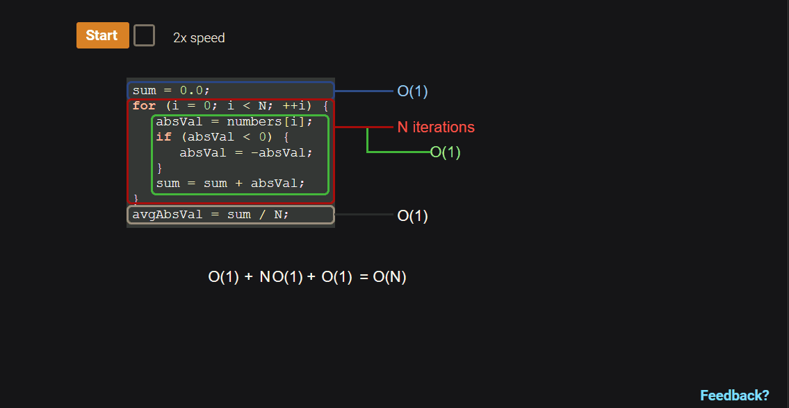

# Big O Notation

  - [+Big O Performance of Some Common Functions of Java Collections](big_o_notation_java_collections.md)
  - [VIDEO: Big-O Notation in 5 Minutes](https://www.youtube.com/watch?v=__vX2sjlpXU)


Big O notation is a mathematical way of describing how a function (running time
of an algorithm) generally behaves in relation to the input size. In Big O
notation, all functions that have the same growth rate (as determined by the
highest order term of the function) are characterized using the same Big O
notation. In essence, all functions that have the same growth rate are
considered equivalent in Big O notation.

Given a function that describes the running time of an algorithm, the Big O
notation for that function can be determined using the following rules:

  1. If $f(x)$ is a sum of several terms, the highest order term (the one with
     the fastest growth rate) is kept and others are discarded.
  2. If $f(x)$ has a term that is a product of several factors, all constants
     (those that are not in terms of x) are omitted.


Rules for determining Big O notation of composite functions.

| Composite function   | Big O notation          |
|----------------------|-------------------------|
| $c \cdot O(f(x))$    | $O(f(x))$               |
| $c + O(f(x))$        | $O(f(x))$               |
| $g(x) \cdot O(f(x))$ | $O(g(x) \cdot O(f(x)))$ |
| $g(x) + O(f(x))$     | $O(g(x) + O(f(x)))$     |


Sample 1:

$$
\text{Algorithm steps: } 5 + 13 \cdot N + 7 \cdot N^{2}
$$

$$
\begin{aligned}
\text{Big O notation: } O(5 + 13 \cdot N + 7 \cdot N^{2}) &= O(7 \cdot N^{2}) \\
 &= O(N^{2})
\end{aligned}
$$

Sample 2:

$$
\text{Algorithm steps: } 10 \cdot O(N^{2})
$$

$$
\text{Big O notation: } 10 \cdot O(N^{2}) = O(10 \cdot N^{2}) = O(N^{2})
$$

Sample 3:

$$
\text{Algorithm steps: } 3 \cdot N \cdot O(N^{2})
$$

$$
\begin{aligned}
\text{Big O notation: } &= 3 \cdot N \cdot O(N^{2}) \\
 &= O(3 \cdot N \cdot N^{2}) \\
 &= O(3 \cdot N^{3}) = O(N^{3})
\end{aligned}
$$

Sample 4:

$$
\text{Algorithm steps: } 2 \cdot N^{3} + O(N^{2})
$$

$$
\begin{aligned}
\text{Big O notation: } &= 2 \cdot N^{3} + O(N^{2}) \\
 &= O(2 \cdot N^{3} + N^{2}) \\
 &= O(N^{3})
\end{aligned}
$$

## Growth Rates for Different Input Sizes

One consideration in evaluating algorithms is that the efficiency of the
algorithm is most critical for large input sizes. Small inputs are likely to
result in fast running times because $N$ is small, so efficiency is less of a
concern. The table below shows the runtime to perform $f(N)$ instructions for
different functions $f$ and different values of $N$. For large $N$, the
difference in computation time varies greatly with the rate of growth of the
function $f$.  The data assumes that a single instruction takes $1 \mu s$ to
execute.

| Function  | N = 10      | N = 100              | N = 1000    | N = 10000          | N = 100000           |                      |
|-----------|-------------|----------------------|-------------|--------------------|----------------------|----------------------|
| $log N$   | $3.3 \mu s$ | $5.65 \mu s$         | $6.6 \mu s$ | $9.9 \mu s$        | $13.3 \mu s$         | $16.6 \mu s$         |
| $N$       | $10 \mu s$  | $50 \mu s$           | $100 \mu s$ | $1000 \mu s$       | $10 ms$              | $0.1 s$              |
| $N log N$ | $.03 ms$    | $.28 ms$             | $.66 ms$    | $.099 s$           | $.132 s$             | $1.66 s$             |
| $N^{2}$   | $.1 ms$     | $2.5 ms$             | $10 ms$     | $1 s$              | $100 s$              | $2.7 \text{ hours}$  |
| $N^{3}$   | $1 ms$      | $.125 s$             | $1 s$       | $16.7 \text{ min}$ | $11.57 \text{ days}$ | $31.7 \text{ years}$ |
| $2^{N}$   | $.001 s$    | $35.7 \text{ years}$ | $*$         | $*$                | $*$                  | $*$                  |

## Runtime Complexities For Various Pseudocode Examples.

$O(1)$ **Constant:**

```java
FindMin(x, y) {
   if (x < y) {
      return x
   }
   else {
      return y
   }
}
```

$O(\log N)$ **Logarithmic**

```java
BinarySearch(numbers, N, key) {
    mid = 0;
   low = 0;
   high = 0;

   high = N - 1;

   while (high >= low) {
      mid = (high + low) / 2
      if (numbers[mid] < key) {
         low = mid + 1
      }
      else if (numbers[mid] > key) {
         high = mid - 1
      }
      else {
         return mid
      }
   }

   return -1   // not found
}
```

$O(N)$ **Linear**

```java
LinearSearch(numbers, N, key) {
  for (i = 0; i < N; ++i) {
      if (numbers[i] == key) {
         return i
      }
   }

   return -1 // not found
}
```

$O(N \log N)$ **Log-linear**

```java
MergeSort(numbers, i, k) {
   j = 0
   if (i < k) {
      j = (i + k) / 2              // Find midpoint

      MergeSort(numbers, i, j)     // Sort left part
      MergeSort(numbers, j + 1, k) // Sort right part
      Merge(numbers, i, j, k)      // Merge parts
   }
}
```

$O(N^{2})$ $Quadratic$

```java
SelectionSort(number, N) {
   for (i = 0; i < N; ++i) {
      indexSmallest = i
      for (j = i + 1; j < N; ++j) {
         if (numbers[j] < numbers[indexSmallest]) {
            indexSmallest = j
         }
      }

      temp = numbers[i]
      numbers[i] = numbers[indexSmallest]
      numbers[indexSmallest] = temp
}
```

$O(c^{N})$ **Exponential**

```java
Fibonacci(N) {
  if ((1 == N) || (2 == N)) {
    return 1
  }
  return Fibonacci(N-1) + Fibonacci(N-2)
}
```

## Worst-Case Algorithm Analysis

Worst-case algorithm analysis

To analyze how runtime of an algorithm scales as the input size increases, we
first determine how many operations the algorithm executes for a specific input
size, N. Then, the big-O notation for that function is determined. Algorithm
runtime analysis often focuses on the worst-case runtime complexity. The
**worst-case runtime** of an algorithm is the runtime complexity for an input
that results in the longest execution. Other runtime analyses include best-case
runtime and average-case runtime. Determining the average-case runtime requires
knowledge of the statistical properties of the expected data inputs.

> 17.4.1: Runtime analysis: Finding the max value.


> from zyBooks.com

## Counting constant time operations

For algorithm analysis, the definition of a single operation does not need to be
precise. An operation can be any statement (or constant number of statements)
that has a constant runtime complexity, O(1). Since constants are omitted in
big-O notation, any constant number of constant time operations is O(1). So,
precisely counting the number of constant time operations in a finite sequence
is not needed. Ex: An algorithm with a single loop that execute 5 operations
before the loop, 3 operations each loop iteration, and 6 operations after the
loop would have a runtime of f(N) = 5 + 3N + 6, which can be written as O(1) +
O(N) + O(1) = O(N). If the number of operations before the loop was 100, the
big-O notation for those operation is still O(1).

> 17.4.3: Simplified runtime analysis: A constant number of constant time
operations is O(1).



> from zyBooks.com

## Runtime Analysis of Nested Loop: Selection Sort Algorithm

Runtime analysis for nested loops requires summing the runtime of the inner loop
over each outer loop iteration. The resulting summation can be simplified to
determine the big-O notation.

> 17.4.5: Runtime analysis of nested loop: Selection sort algorithm.


> from zyBooks.com

Common summation: Summation of consecutive numbers:

$$
(N - 1) + (N - 2) + \ldots + 2 + 1 = \dfrac{N(N - 1)}{2} = O(N^{2})
$$


## Common Data Structure Operations

| Data Structure     | <<<               | <<<               | <<<               | Time Complexity   | >>>         | >>>         | >>>           | >>>          | Space Complexity |
|--------------------|-------------------|-------------------|-------------------|-------------------|-------------|-------------|---------------|--------------|------------------|
|                    | **<<<**           | **Average**       | **>>>**           | **>>>**           | **<<<**     | **Worst**   | **>>>**       | **>>>**      | **Worst**        |
|                    | **Access**        | **Search**        | **Insertion**     | **Deletion**      | **Access**  | **Search**  | **Insertion** | **Deletion** |                  |
| Array              | $\theta (1)$      | $\theta (n)$      | $\theta (n)$      | $\theta (n)$      | $O(1)$      | $O(n)$      | $O(n)$        | $O(n)$       | $O(n)$           |
| Stack              | $\theta (n)$      | $\theta (n)$      | $\theta (1)$      | $\theta (1)$      | $O(n)$      | $O(n)$      | $O(1)$        | $O(1)$       | $O(n)$           |
| Queue              | $\theta (n)$      | $\theta (n)$      | $\theta (1)$      | $\theta (1)$      | $O(n)$      | $O(n)$      | $O(1)$        | $O(1)$       | $O(n)$           |
| Singly-Linked List | $\theta (n)$      | $\theta (n)$      | $\theta (1)$      | $\theta (1)$      | $O(n)$      | $O(n)$      | $O(1)$        | $O(1)$       | $O(n)$           |
| Doubly-Linked List | $\theta (n)$      | $\theta (n)$      | $\theta (1)$      | $\theta (1)$      | $O(n)$      | $O(n)$      | $O(1)$        | $O(1)$       | $O(n)$           |
| Skip List          | $\theta (log(n))$ | $\theta (log(n))$ | $\theta (log(n))$ | $\theta (log(n))$ | $O(n)$      | $O(n)$      | $O(n)$        | $O(n)$       | $O(n log(n))$    |
| Hash Table         | $N/A$             | $\theta (1)$      | $\theta (1)$      | $\theta (1)$      | $N/A$       | $O(n)$      | $O(n)$        | $O(n)$       | $O(n)$           |
| Binary Search Tree | $\theta (log(n))$ | $\theta (log(n))$ | $\theta (log(n))$ | $\theta (log(n))$ | $O(n)$      | $O(n)$      | $O(n)$        | $O(n)$       | $O(n)$           |
| Cartesian Tree     | $N/A$             | $\theta (log(n))$ | $\theta (log(n))$ | $\theta (log(n))$ | $N/A$       | $O(n)$      | $O(n)$        | $O(n)$       | $O(n)$           |
| B-Tree             | $\theta (log(n))$ | $\theta (log(n))$ | $\theta (log(n))$ | $\theta (log(n))$ | $O(log(n))$ | $O(log(n))$ | $O(log(n))$   | $O(log(n))$  | $O(n)$           |
| Red-Black Tree     | $\theta (log(n))$ | $\theta (log(n))$ | $\theta (log(n))$ | $\theta (log(n))$ | $O(log(n))$ | $O(log(n))$ | $O(log(n))$   | $O(log(n))$  | $O(n)$           |
| Splay Tree         | $N/A$             | $\theta (log(n))$ | $\theta (log(n))$ | $\theta (log(n))$ | $N/A$       | $O(log(n))$ | $O(log(n))$   | $O(log(n))$  | $O(n)$           |
| AVL Tree           | $\theta (log(n))$ | $\theta (log(n))$ | $\theta (log(n))$ | $\theta (log(n))$ | $O(log(n))$ | $O(log(n))$ | $O(log(n))$   | $O(log(n))$  | $O(n)$           |
| KD Tree            | $\theta (log(n))$ | $\theta (log(n))$ | $\theta (log(n))$ | $\theta (log(n))$ | $O(n)$      | $O(n)$      | $O(n)$        | $O(n)$       | $O(n)$           |


## Array Sorting Algorithms

| Algorithm      | <<<                 | Time Complexity        | >>>              | Space Complexity |
|----------------|---------------------|------------------------|------------------|------------------|
|                | **Best**            | **Average**            | **Worst**        | **Worst**        |
| Quicksort      | $\Omega (n log(n))$ | $\theta (n log(n))$    | $O(n^2)$         | $O(log(n))$      |
| Mergesort      | $\Omega (n log(n))$ | $\theta (n log(n))$    | $O(n log(n))$    | $O(n)$           |
| Timsort        | $\Omega (n)$        | $\theta (n log(n))$    | $O(n log(n))$    | $O(n)$           |
| Heapsort       | $\Omega (n log(n))$ | $\theta (n log(n))$    | $O(n log(n))$    | $O(1)$           |
| Bubble Sort    | $\Omega (n)$        | $\theta (n^2)$         | $O(n^2)$         | $O(1)$           |
| Insertion Sort | $\Omega (n)$        | $\theta (n^2)$         | $O(n^2)$         | $O(1)$           |
| Selection Sort | $\Omega (n^2)$      | $\theta (n^2)$         | $O(n^2)$         | $O(1)$           |
| Tree Sort      | $\Omega (n log(n))$ | $\theta (n log(n))$    | $O(n^2)$         | $O(n)$           |
| Shell Sort     | $\Omega (n log(n))$ | $\theta (n(log(n))^2)$ | $O(n(log(n))^2)$ | $O(1)$           |
| Bucket Sort    | $\Omega (n+k)$      | $\theta (n+k)$         | $O(n^2)$         | $O(n)$           |
| Radix Sort     | $\Omega (nk)$       | $\theta (nk)$          | $O(nk)$          | $O(n+k)$         |
| Counting Sort  | $\Omega (n+k)$      | $\theta (n+k)$         | $O(n+k)$         | $O(k)$           |
| Cubesort       | $\Omega (n)$        | $\theta (n log(n))$    | $O(n log(n))$    | $O(n)$           |

> Best case scenario is denoted by $\Omega$ sign, average case by $\theta$ sign
and $O$ for the worst case scenario.


<br>

# Resources

  - [VIDEO: Big-O Notation in 5 Minutes](https://www.youtube.com/watch?v=__vX2sjlpXU)

Textbook

  * [Andrew Huang CISC 191: Intermediate Java Programming - zyBooks](https://www.zybooks.com/)
    - Chapter 17 Searching and algorithms

