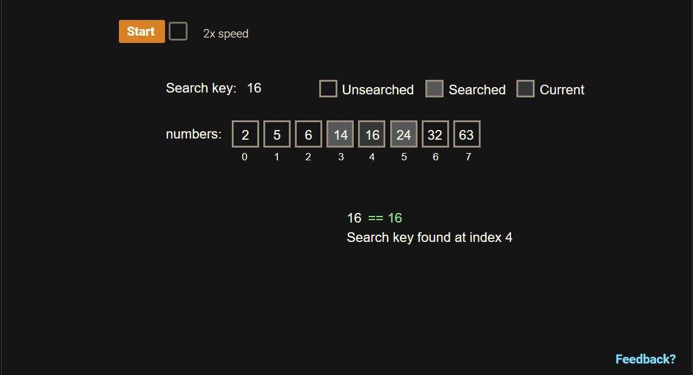
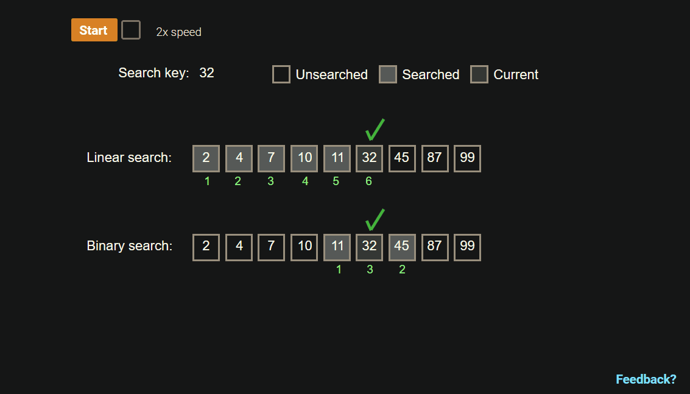

# Search Algorithms

- [↪ Search Algorithms Java Sample Codes](search_algorithms_sample_codes)

An **algorithm** is a sequence of steps for accomplishing a task. **Linear
search** is a search algorithm that starts from the beginning of a list, and
checks each element until the search key is found or the end of the list is
reached.

An algorithm's **runtime** is the time the algorithm takes to execute. If each
comparison takes 1 µs (1 microsecond), a linear search algorithm's runtime is up
to 1 s to search a list with 1,000,000 elements, 10 s for 10,000,000 elements,
and so on. Ex: Searching Amazon's online store, which has more than 200 million
items, could require more than 3 minutes.

### Binary Search Algorithm

- [⬇ Binary Search Trees](file:../../../../../../../files/summer-2020/CISC-191/week-3/binary-search.ppt)
- [🎬 Java Binary Search Tree](https://www.youtube.com/watch?v=M6lYob8STMI)
- [🎬 Java Binary Search Tree 2](https://www.youtube.com/watch?v=UcOxGmj45AA)

> 17.2.3: Binary search efficiently searches sorted list by reducing the search
space by half each iteration.

> from zyBooks.com

Pros:

  - One of the quickest search algorithm

Cons

  - Array needs to be sorted
  - Duplicates will cause search inaccuracy

Binary search is incredibly efficient in finding an element within a sorted
list. During each iteration or step of the algorithm, binary search reduces the
search space (i.e., the remaining elements to search within) by half. The search
terminates when the element is found or the search space is empty (element not
found). For a 32 element list, if the search key is not found, the search space
is halved to have 16 elements, then 8, 4, 2, 1, and finally none, requiring only
6 steps. For an N element list, the maximum number of steps required to reduce
the search space to an empty sublist is $[\ \log_{2} N\ ] + 1$

$$
\text{Ex. }[\ \log_{2} N\ ] + 1 = 6
$$

> 17.2.5: Speed of linear search versus binary search to find a number within a
sorted list.

> from zyBooks.com

 

# Resources

- [⬇ Binary Search Trees](file:../../../../../../../files/summer-2020/CISC-191/week-3/binary-search.ppt)
- [🎬 Java Binary Search Tree](https://www.youtube.com/watch?v=M6lYob8STMI)
- [🎬 Java Binary Search Tree 2](https://www.youtube.com/watch?v=UcOxGmj45AA)

Textbook

+ [🌎 Andrew Huang CISC 191: Intermediate Java Programming - zyBooks](https://www.zybooks.com/)
    - Chapter 17 Searching and Sorting Algorithms

