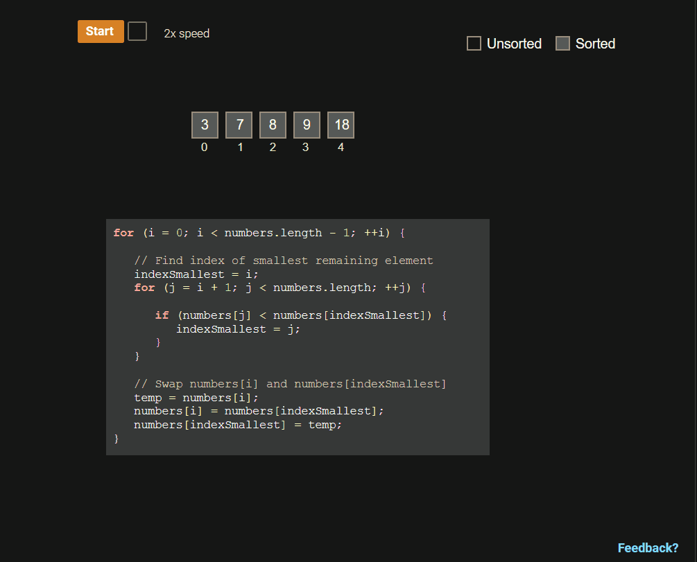
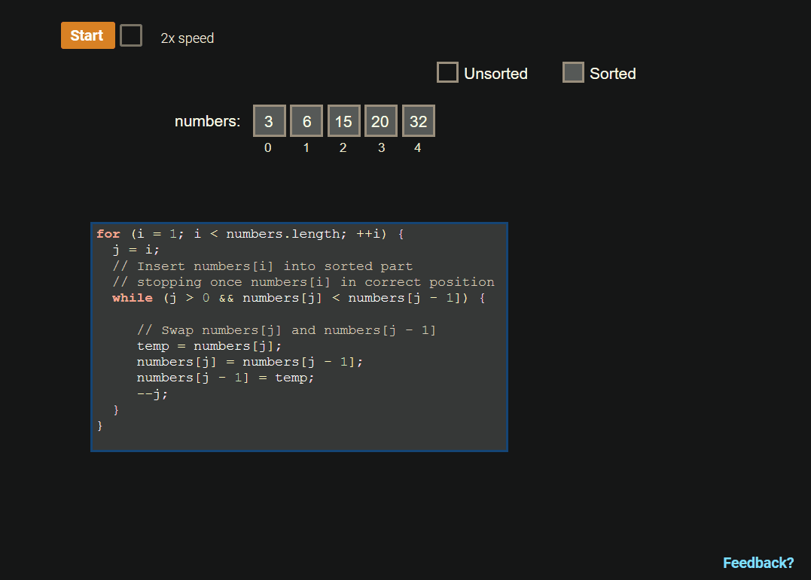
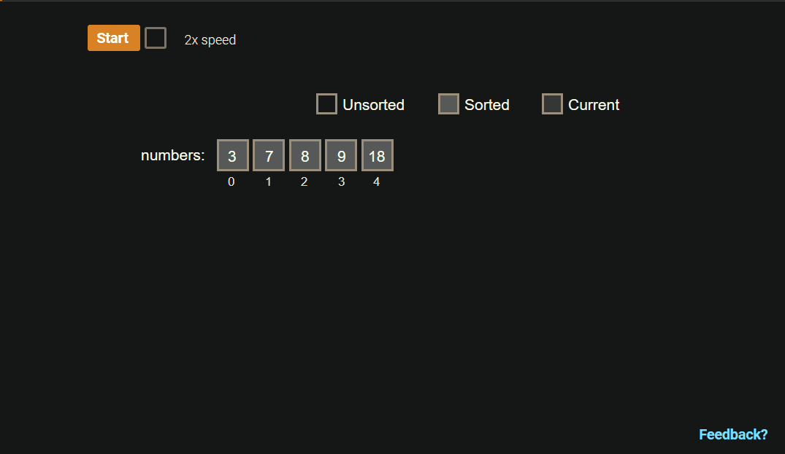
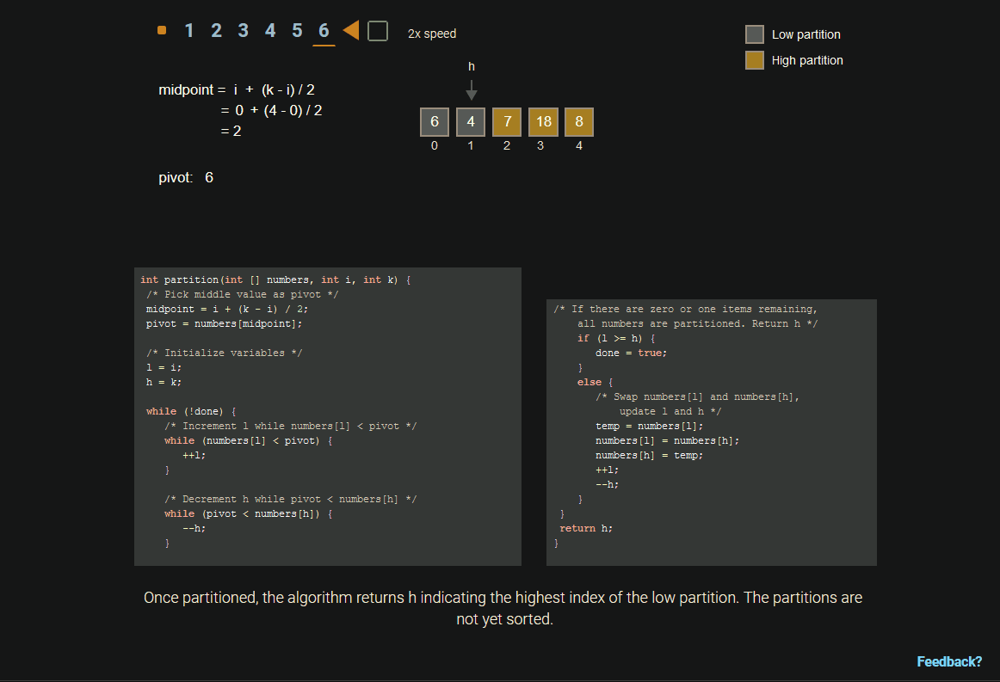
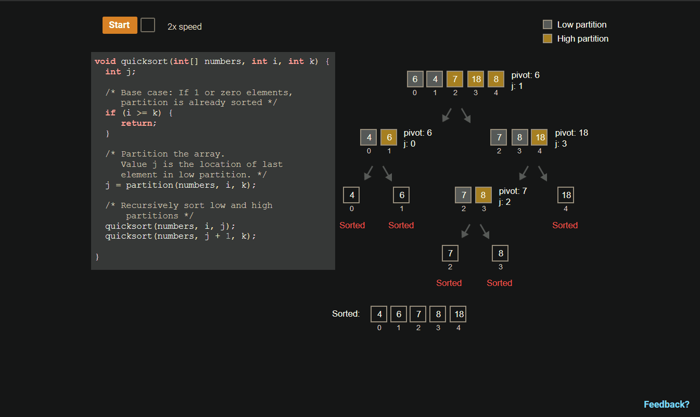
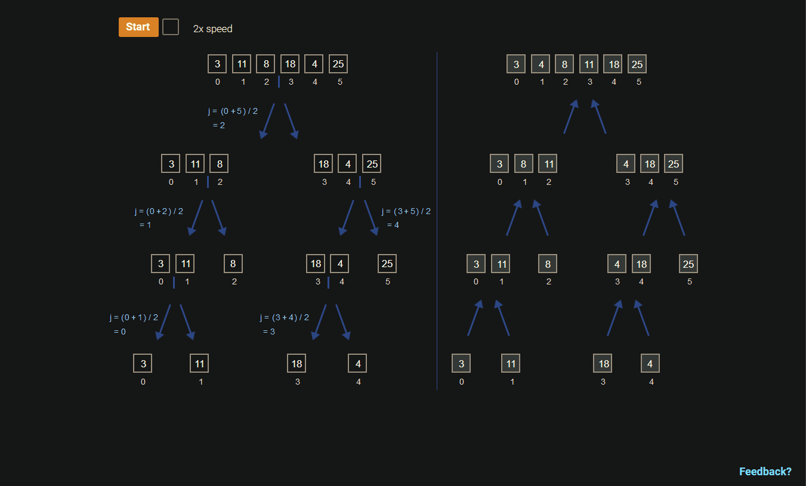
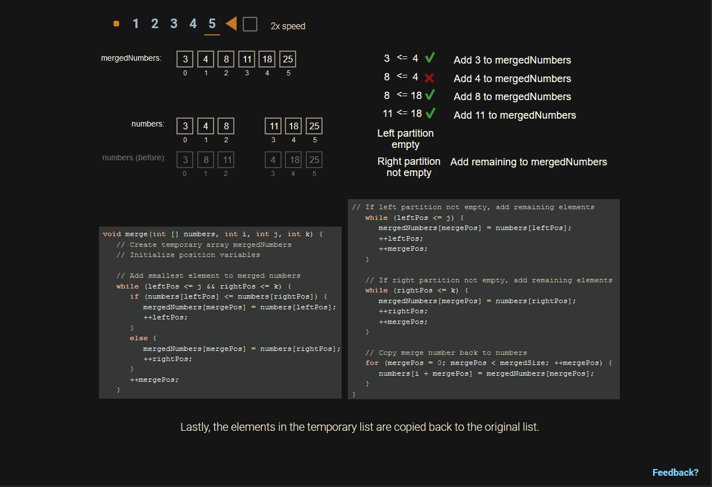

# Sorting Algorithms

  - [`Java Sort Algorithm](https://www.youtube.com/watch?v=JUOyKSZScW0)
  - [+Sorting Algorithms Java Sample Codes](sorting_algorithms_sample_codes)

## Selection Sort

<a name="selection-sort-term">**Selection sort**</a>

  - is a sorting algorithm that treats the input as two parts, a sorted part and
    an unsorted part, and repeatedly selects the proper next value to move from
    the unsorted part to the end of the sorted part.


> 17.6.1: Selection sort.



> from zyBooks.com

Selection sort may require a large number of comparisons. The selection sort
algorithm runtime is $O(N^{2})$. If a list has N elements, the outer loop
executes $N - 1$ times. For each of those $N - 1$ outer loop executions, the
inner loop executes an average of $\frac{N}{2}$ times. So the total number of
comparisons is proportional to $(N - 1) \cdot \frac{N}{2}$, or $O(N^{2})$. Other
sorting algorithms involve more complex algorithms but have faster execution
times.

### Selection sort runtime

**Q: When sorting a list with 50 elements, indexSmallest will be assigned to a
minimum of _____ times.**

A: 49

The outer loop always assigns to indexSmallest at the beginning of each
iteration. The inner loop never assigns to indexSmallest if the list is already
sorted. A list of 50 elements causes 49 outer loop iterations, and thus a
minimum of 49 assignments to indexSmallest.

**Q: How many times longer will sorting a list of 20 elements take compared to
sorting a list of 10 elements?**

A: $20^{2} / 10^{2} = 400 / 100 = \boldsymbol{4}$

A list with twice as many elements requires 4 times as many comparisons.

**Q: How many times longer will sorting a list of 500 elements take compared to
a list of 50 elements?**

A: 100

$500^{2} / 50^{2} = 250000 / 2500 = 100$. Selection sort's runtime grows
quadratically with the input size. If the input increases in size by $X$ times,
the runtime increases $X^{2}$ times.


## Insertion Sort

<a name="insertion-sort-term">**Insertion sort**</a>

  - is a sorting algorithm that treats the input as two parts, a sorted part and
    an unsorted part, and repeatedly inserts the next value from the unsorted
    part into the correct location in the sorted part.


> 17.7.1: Insertion sort.



> from zyBooks.com

Insertion sort's typical runtime is $O(N^{2})$. If a list has $N$ elements, the
outer loop executes $N - 1$ times. For each outer loop execution, the inner loop
may need to examine all elements in the sorted part. Thus, the inner loop
executes on average $\frac{N}{2}$ times. So the total number of comparisons is
proportional to $(N - 1) \cdot (\frac{N}{2})$, or $O(N^{2})$. Other sorting
algorithms involve more complex algorithms but faster execution.

### Insertion Sort Runtime

**Q: In the worst case, assuming each comparison takes 1 µs, how long will
insertion sort algorithm take to sort a list of 10 elements?**

A: $(1 + 2 + 3 + 4 + 5 + 6 + 7 + 8 + 9) \cdot 1 \mu s = \boldsymbol{45 \mu s}$


**Q: Using the Big O runtime complexity, how many times longer will sorting a list
of 20 elements take compared to sorting a list of 10 elements?**

A: $20^{2} / 10^{2} = 400 /100 = \boldsymbol{4}$


For sorted or nearly sorted inputs, insertion sort's runtime is $O(N)$. A
**nearly sorted** list only contains a few elements not in sorted order. Ex: {4,
5, 17, 25, 89, 14} is nearly sorted having only one element not in sorted
position.

For each outer loop execution, if the element is already in sorted position,
only a single comparison is made. Each element not in sorted position requires
at most N comparisons. If there are a constant number, C, of unsorted elements,
sorting the N - C sorted elements requires one comparison each, and sorting the
C unsorted elements requires at most N comparisons each. The runtime for nearly
sorted inputs is $O((N - C) * 1 + C * N) = \boldsymbol{O(N)}$

> 17.7.5: Using insertion sort for nearly sorted list.




## Quicksort

<a name="quicksort-term">**Quicksort**</a>

  - is a sorting algorithm that repeatedly partitions the input into low and
    high parts (each part unsorted), and then recursively sorts each of those
    parts. To partition the input, quicksort chooses a pivot to divide the data
    into low and high parts.
  - The **pivot** can be any value within the array being sorted, commonly the
    value of the middle array element. Ex: For the list {4 34 10 25 1}, the
    middle element is located at index 2 (the middle of indices 0..4) and has a
    value of 10.


17.8.1: Quicksort partitions data into a low part with data less than/equal to a
pivot value and a high part with data greater than/equal to a pivot value



> from zyBooks.com

To partition the input, the quicksort algorithm divides the array into two
parts, referred to as the low partition and the high partition. All values in
the low partition are less than or equal to the pivot value. All values in the
high partition are greater than or equal to the pivot value. The values in each
partition are not necessarily sorted. Ex: Partitioning {4 34 10 25 1} with a
pivot value of 10 results in a low partition of {4 10 1} and a high partition of
{34 25}. Values equal to the pivot may appear in either or both of the
9partitions.

The quicksort algorithm's runtime is typically $O(N \log N)$. Quicksort has
several partitioning levels , the first level dividing the input into 2 parts,
the second into 4 parts, the third into 8 parts, etc. At each level, the
algorithm does at most $N$ comparisons moving the `l` and `h` indices. If the
pivot yields two equal-sized parts, then there will be $\log N$ levels,
requiring the $N \cdot \log N$ comparisons.



### Quicksort runtime

> Assume quicksort always chooses a pivot that divides the elements into two
equal parts.

**Q: How many partitioning levels are required for a list of 8 elements?**

A: 3

```
1st: {a b c d} {e f g h}
2nd: {a b} {c d} {e f} {g h}
3rd: {a} {b} {c} {d} {e} {f} {g} {h}
```

**Q: How many partitioning "levels" are required for a list of 1024 elements?**

A: 10

$\log_{2} 1024 = 10$. Assuming equal-size partitions, for $N$ elements, the
number of levels is $\log_{2} N$.

**Q: How many total comparisons are required to sort a list of 1024 elements?**

A: 10240

$\log_{2} 1024 \cdot 1024 = 10 \cdot 1024 = 10240$ comparisons.  There will be
$\log_{2} N$ partitioning levels, and each level requires $N$ comparisons.

For typical unsorted data, such equal partitioning occurs. However, partitioning
may yield unequal sized part in some cases. If the pivot selected for
partitioning is the smallest or largest element, one partition will have just 1
element, and the other partition will have all other elements. If this unequal
partitioning happens at every level, there will be $N - 1$ levels, yielding
$(N - 1) \cdot N$, which is $O(N^{2})$. So the worst case runtime for the
quicksort algorithm is $O(N^{2})$. Fortunately, this worst case runtime rarely
occurs.

### Worst Case Quicksort Runtime

> Assume quicksort always chooses the smallest element as the pivot.

**Q: Given numbers = {7 4 2 25 19}, i = 0, and k = 4, what is contents of the low
partition? Use curly braces in your answer.**

A: {2}

The low partition is {2}, and the high partition is {4 7 25 19}.

**Q: How many partitioning "levels" of are required for a list of 5 elements?**

A: 4

```
1st: {a} {b c d e}
2nd: {a} {b} {c d e}
3rd: {a} {b} {c} {d e}
4th: {a} {b} {c} {d} {e}
```

**Q: How many partitioning "levels" are required for a list of 1024 elements?**

A: 1023

In the worst case, for $N$ elements, there will be $N - 1$ levels.

**Q: How many total comparisons are required to sort a list of 1024 elements?**

A: 1047552

$(1024 - 1) \cdot 1024 = 1023 \cdot 1024 = 1047552$ comparisons.

## Merge Sort

<a name="merge-sort-term">**Merge sort**</a>

  - is a sorting algorithm that divides a list into two halves, recursively
    sorts each half, and then merges the sorted halves to produce a sorted list.
    The recursive partitioning continues until a list of 1 element is reached,
    as list of 1 element is already sorted.


> 17.9.1: Merge sort recursively divides the input into two halves, sorts each
half, and merges the lists together.



> from zyBooks.com

The merge sort algorithm uses three index variables to keep track of the
elements to sort for each recursive method call. The index variable i is the
index of first element in the list, and the index variable k is the index of the
last element. The index variable j is used to divide the list into two halves.
Elements from i to j are in the left half, and elements from j + 1 to k are in
the right half.

> 17.9.3: Merging partitions: Smallest element from left or right partition is
added one at a time to a temporary merged list. Once merged, temporary list is
copied back to the original list.



> from zyBooks.com

The merge sort algorithm's runtime is $O(N \log N)$. Merge sort divides the
input in half until a list of 1 element is reached, which requires $log N$
partitioning levels. At each level, the algorithm does about $N$ comparisons
selecting and copying elements from the left and right partitions, yielding
$N \cdot \log N$ comparisons.

Merge sort requires $O(N)$ additional memory elements for the temporary array of
merged elements. For the final merge operation, the temporary list has the same
number of elements as the input. Some sorting algorithms sort the list elements
in place and require no additional memory, but are more complex to write and
understand.

### Merge sort runtime and memory complexity.

**Q: How many recursive partitioning levels are required for a list of 8
elements?**

A: 3

```
1st: {a b c d} {e f g h}
2nd: {a b} {c d} {e f} {g h}
3rd: {a} {b} {c} {d} {e} {f} {g} {h}

For $N$ elements, the number of levels is $log N$. $log 8 = 3$.
```

**Q: How many recursive partitioning levels are required for a list of 2048
elements?**

A: 11

$\log_{2} 2048 = 11$

**Q: How many elements will the temporary merge list have for merging two
partitions with 250 elements each?**

A: 500

The temporary list must be large enough to merge all elements from the two
partitions.


<br>

# Resources

Textbook

  * [Andrew Huang CISC 191: Intermediate Java Programming - zyBooks](https://www.zybooks.com/)
    - Chapter 17 Searching and Sorting Algorithms
