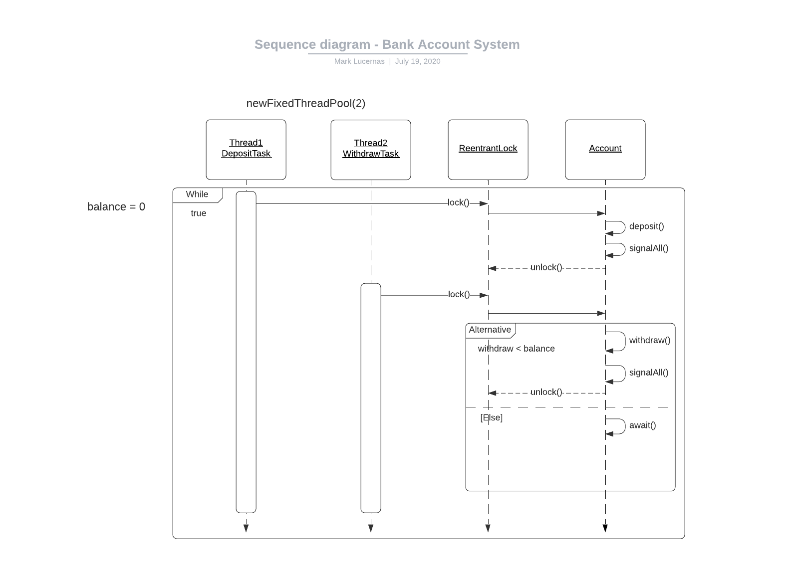

# Materials

  - [`How to Make UML Sequence Diagram](https://www.youtube.com/watch?v=pCK6prSq8aw)
  - [`UML Class Diagram Tutorial](https://www.youtube.com/watch?v=UI6lqHOVHic&list=PLUoebdZqEHTxNC7hWPPwLsBmWI0KEhZOd)
  - [Lucidchart.com](http://www.lucidchart.com)

# Week 5 Graded Discussion

Not so sure if this is the right way to chart a sequence diagram but basically
it is a Banking system (Account) in which the main functions are `deposit()` and
`withdraw()`. The Timeline starts of with zero account balance so it starts with
a DepositTask Thread that uses DepositTask class to deposit money into the
account. Once it uses the Account method `deposit()`, it will acquire the lock
from the ReentrantLock class and hold on to that lock until the `deposit()`
method unlocks the lock. Once the lock has been released, `withdraw()` method
can acquire the lock and proceed with interacting with the Account class by
withdrawing money on one condition: if the amount of money to be withdrawn is
less than the current balance, it will proceed on withdrawing from the Account
to prevent "Overdrafting", else, Thread2 (WithdrawTask) will wait for Thread1
(DepositTask) to make a `deposit()` in order for Thread2 to sufficiently
withdraw the right amount.

Repeat forever.

 

# Resources

  - [`How to Make UML Sequence Diagram](https://www.youtube.com/watch?v=pCK6prSq8aw)
  - [`UML Class Diagram Tutorial](https://www.youtube.com/watch?v=UI6lqHOVHic&list=PLUoebdZqEHTxNC7hWPPwLsBmWI0KEhZOd)
  - [Lucidchart.com](http://www.lucidchart.com)

