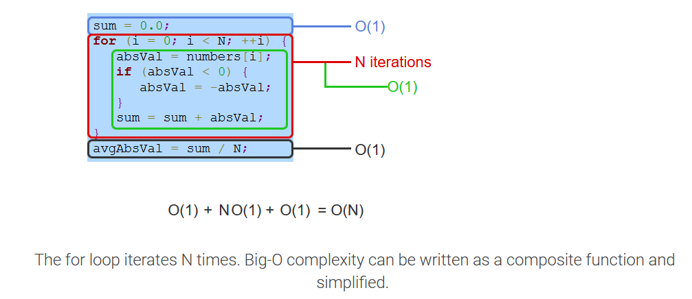
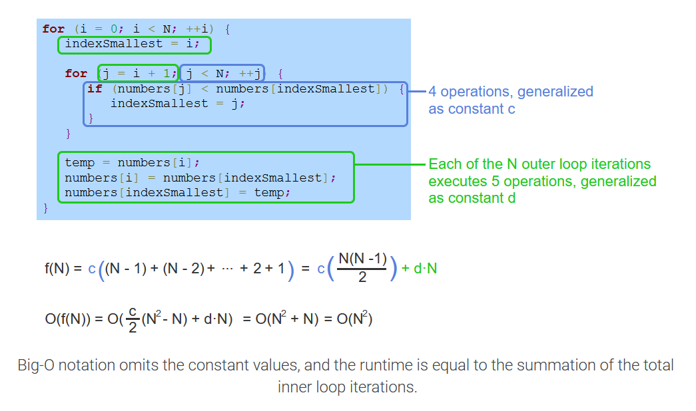

# Week 3: Linked Data Structures and Recursion

## Recursion

  - [FILE: Recursion](file:../../../../files/summer-2020/CISC-191/week-3/recursion.ppt)
  - [VIDEO: Java Recursion](https://www.youtube.com/watch?v=neuDuf_i8Sg)


### Recursion Java Sample Codes

  - [+Recursion Java Sample Codes](extras/recursion_sample_codes)


### Stack Overflow

Recursion enables an elegant solution to some problems. But, for large problems,
deep recursion can cause memory problems. Part of a program's memory is reserved
to support function calls. Each method call places a new **stack frame** on the
stack, for local parameters, local variables, and more method items. Upon
return, the frame is deleted.

Deep recursion could fill the stack region and cause a stack overflow, meaning a
stack frame extends beyond the memory region allocated for stack, **Stack
overflow** usually causes the program to crash and report an error like: stack
overflow error or stack overflow exception.


## List and Queues

  - [FILE: List and Queues](file:../../../../files/summer-2020/CISC-191/week-3/list-and-queues.ppt)
  - [VIDEO: Linked List in Java](https://www.youtube.com/watch?v=195KUinjBpU)


## Searching Algorithms

  - [+Search Algorithms Java Sample Codes](extras/search_algorithms_sample_codes)

An **algorithm** is a sequence of steps for accomplishing a task. **Linear
search** is a search algorithm that starts from the beginning of a list, and
checks each element until the search key is found or the end of the list is
reached.

An algorithm's **runtime** is the time the algorithm takes to execute. If each
comparison takes 1 µs (1 microsecond), a linear search algorithm's runtime is up
to 1 s to search a list with 1,000,000 elements, 10 s for 10,000,000 elements,
and so on. Ex: Searching Amazon's online store, which has more than 200 million
items, could require more than 3 minutes.


### Binary Search Algorithm

  - [FILE: Binary Search](file:../../../../files/summer-2020/CISC-191/week-3/binary-search.ppt)
  - [VIDEO: Java Binary Search Tree](https://www.youtube.com/watch?v=M6lYob8STMI)
  - [VIDEO: Java Binary Search Tree 2](https://www.youtube.com/watch?v=UcOxGmj45AA)


Pros:

  - One of the quickest search algorithm


Cons

  - Array needs to be sorted
  - Duplicates will cause search inaccuracy


Binary search is incredibly efficient in finding an element within a sorted
list. During each iteration or step of the algorithm, binary search reduces the
search space (i.e., the remaining elements to search within) by half. The search
terminates when the element is found or the search space is empty (element not
found). For a 32 element list, if the search key is not found, the search space
is halved to have 16 elements, then 8, 4, 2, 1, and finally none, requiring only
6 steps. For an N element list, the maximum number of steps required to reduce
the search space to an empty sublist is $[\ \log_{2} N\ ] + 1$

$$
\text{Ex. }[\ \log_{2} N\ ] + 1 = 6
$$


## Sorting Algorithms

  - [+Sorting Algorithms Java Sample Codes](extras/sorting_algorithms_sample_codes)

### Selection Sort

<a name="selection-sort-term">**Selection sort**</a>

  - is a sorting algorithm that treats the input as two parts, a sorted part and
    an unsorted part, and repeatedly selects the proper next value to move from
    the unsorted part to the end of the sorted part.

Selection sort may require a large number of comparisons. The selection sort
algorithm runtime is $O(N^{2})$. If a list has N elements, the outer loop
executes $N - 1$ times. For each of those $N - 1$ outer loop executions, the
inner loop executes an average of $\frac{N}{2}$ times. So the total number of
comparisons is proportional to $(N - 1) \cdot \frac{N}{2}$, or $O(N^{2})$. Other
sorting algorithms involve more complex algorithms but have faster execution
times.

How many times longer will sorting a list of 20 elements take compared to
sorting a list of 10 elements?

  - $20^{2} / 10^{2} = 400 / 100 = \boldsymbol{4}$


### Insertion Sort

<a name="insertion-sort-term">**Insertion sort**</a>

  - is a sorting algorithm that treats the input as two parts, a sorted part and
    an unsorted part, and repeatedly inserts the next value from the unsorted
    part into the correct location in the sorted part.


Insertion sort's typical runtime is $O(N^{2})$. If a list has $N$ elements, the
outer loop executes $N - 1$ times. For each outer loop execution, the inner loop
may need to examine all elements in the sorted part. Thus, the inner loop
executes on average $\frac{N}{2}$ times. So the total number of comparisons is
proportional to $(N - 1) \cdot (\frac{N}{2})$, or $O(N^{2})$. Other sorting
algorithms involve more complex algorithms but faster execution.

In the worst case, assuming each comparison takes 1 µs, how long will insertion
sort algorithm take to sort a list of 10 elements?

  - $(1 + 2 + 3 + 4 + 5 + 6 + 7 + 8 + 9) \cdot 1 \mu s = \boldsymbol{45 \mu s}$


Using the Big O runtime complexity, how many times longer will sorting a list of
20 elements take compared to sorting a list of 10 elements?

  - $20^{2} / 10^{2} = 400 /100 = \boldsymbol{4}$


For sorted or nearly sorted inputs, insertion sort's runtime is $O(N)$. A
**nearly sorted** list only contains a few elements not in sorted order. Ex: {4,
5, 17, 25, 89, 14} is nearly sorted having only one element not in sorted
position.

For each outer loop execution, if the element is already in sorted position,
only a single comparison is made. Each element not in sorted position requires
at most N comparisons. If there are a constant number, C, of unsorted elements,
sorting the N - C sorted elements requires one comparison each, and sorting the
C unsorted elements requires at most N comparisons each. The runtime for nearly
sorted inputs is $O((N - C) * 1 + C * N) = \boldsymbol{O(N)}$

### Quicksort

<a name="quicksort-term">**Quicksort**</a>

  - is a sorting algorithm that repeatedly partitions the input into low and
    high parts (each part unsorted), and then recursively sorts each of those
    parts. To partition the input, quicksort chooses a pivot to divide the data
    into low and high parts.
  - The **pivot** can be any value within the array being sorted, commonly the
    value of the middle array element. Ex: For the list {4 34 10 25 1}, the
    middle element is located at index 2 (the middle of indices 0..4) and has a
    value of 10.


To partition the input, the quicksort algorithm divides the array into two
parts, referred to as the low partition and the high partition. All values in
the low partition are less than or equal to the pivot value. All values in the
high partition are greater than or equal to the pivot value. The values in each
partition are not necessarily sorted. Ex: Partitioning {4 34 10 25 1} with a
pivot value of 10 results in a low partition of {4 10 1} and a high partition of
{34 25}. Values equal to the pivot may appear in either or both of the
partitions.


## AVL Trees

  - [FILE: AVL Trees](file:../../../../files/summer-2020/CISC-191/week-3/avl-trees.ppt)


## Big O Notation

  - [+Big O Performance of Some Common Functions of Java Collections](extras/big_o_java_collections.md)
  - [VIDEO: Big-O Notation in 5 Minutes](https://www.youtube.com/watch?v=__vX2sjlpXU)


Big O notation is a mathematical way of describing how a function (running time
of an algorithm) generally behaves in relation to the input size. In Big O
notation, all functions that have the same growth rate (as determined by the
highest order term of the function) are characterized using the same Big O
notation. In essence, all functions that have the same growth rate are
considered equivalent in Big O notation.

Given a function that describes the running time of an algorithm, the Big O
notation for that function can be determined using the following rules:

  1. If $f(x)$ is a sum of several terms, the highest order term (the one with
     the fastest growth rate) is kept and others are discarded.
  2. If $f(x)$ has a term that is a product of several factors, all constants
     (those that are not in terms of x) are omitted.


Rules for determining Big O notation of composite functions.

| Composite function   | Big O notation          |
|----------------------|-------------------------|
| $c \cdot O(f(x))$    | $O(f(x))$               |
| $c + O(f(x))$        | $O(f(x))$               |
| $g(x) \cdot O(f(x))$ | $O(g(x) \cdot O(f(x)))$ |
| $g(x) + O(f(x))$     | $O(g(x) + O(f(x)))$     |


Sample 1:

$$
\text{Algorithm steps: } 5 + 13 \cdot N + 7 \cdot N^{2}
$$

$$
\begin{aligned}
\text{Big O notation: } O(5 + 13 \cdot N + 7 \cdot N^{2}) &= O(7 \cdot N^{2}) \\
 &= O(N^{2})
\end{aligned}
$$

Sample 2:

$$
\text{Algorithm steps: } 10 \cdot O(N^{2})
$$

$$
\text{Big O notation: } 10 \cdot O(N^{2}) = O(10 \cdot N^{2}) = O(N^{2})
$$

Sample 3:

$$
\text{Algorithm steps: } 3 \cdot N \cdot O(N^{2})
$$

$$
\begin{aligned}
\text{Big O notation: } &= 3 \cdot N \cdot O(N^{2}) \\
 &= O(3 \cdot N \cdot N^{2}) \\
 &= O(3 \cdot N^{3}) = O(N^{3})
\end{aligned}
$$

Sample 4:

$$
\text{Algorithm steps: } 2 \cdot N^{3} + O(N^{2})
$$

$$
\begin{aligned}
\text{Big O notation: } &= 2 \cdot N^{3} + O(N^{2}) \\
 &= O(2 \cdot N^{3} + N^{2}) \\
 &= O(N^{3})
\end{aligned}
$$

### Growth Rates for Different Input Sizes

One consideration in evaluating algorithms is that the efficiency of the
algorithm is most critical for large input sizes. Small inputs are likely to
result in fast running times because $N$ is small, so efficiency is less of a
concern. The table below shows the runtime to perform $f(N)$ instructions for
different functions $f$ and different values of $N$. For large $N$, the
difference in computation time varies greatly with the rate of growth of the
function $f$.  The data assumes that a single instruction takes $1 \mu s$ to
execute.

| Function  | N = 10      | N = 100              | N = 1000    | N = 10000          | N = 100000           |                      |
|-----------|-------------|----------------------|-------------|--------------------|----------------------|----------------------|
| $log N$   | $3.3 \mu s$ | $5.65 \mu s$         | $6.6 \mu s$ | $9.9 \mu s$        | $13.3 \mu s$         | $16.6 \mu s$         |
| $N$       | $10 \mu s$  | $50 \mu s$           | $100 \mu s$ | $1000 \mu s$       | $10 ms$              | $0.1 s$              |
| $N log N$ | $.03 ms$    | $.28 ms$             | $.66 ms$    | $.099 s$           | $.132 s$             | $1.66 s$             |
| $N^{2}$   | $.1 ms$     | $2.5 ms$             | $10 ms$     | $1 s$              | $100 s$              | $2.7 \text{ hours}$  |
| $N^{3}$   | $1 ms$      | $.125 s$             | $1 s$       | $16.7 \text{ min}$ | $11.57 \text{ days}$ | $31.7 \text{ years}$ |
| $2^{N}$   | $.001 s$    | $35.7 \text{ years}$ | $*$         | $*$                | $*$                  | $*$                  |

### Runtime Complexities For Various Pseudocode Examples.

$O(1)$ **Constant:**

```java
FindMin(x, y) {
   if (x < y) {
      return x
   }
   else {
      return y
   }
}
```

$O(\log N)$ **Logarithmic**

```java
BinarySearch(numbers, N, key) {
    mid = 0;
   low = 0;
   high = 0;

   high = N - 1;

   while (high >= low) {
      mid = (high + low) / 2
      if (numbers[mid] < key) {
         low = mid + 1
      }
      else if (numbers[mid] > key) {
         high = mid - 1
      }
      else {
         return mid
      }
   }

   return -1   // not found
}
```

$O(N)$ **Linear**

```java
LinearSearch(numbers, N, key) {
  for (i = 0; i < N; ++i) {
      if (numbers[i] == key) {
         return i
      }
   }

   return -1 // not found
}
```

$O(N \log N)$ **Log-linear**

```java
MergeSort(numbers, i, k) {
   j = 0
   if (i < k) {
      j = (i + k) / 2              // Find midpoint

      MergeSort(numbers, i, j)     // Sort left part
      MergeSort(numbers, j + 1, k) // Sort right part
      Merge(numbers, i, j, k)      // Merge parts
   }
}
```

$O(N^{2})$ $Quadratic$

```java
SelectionSort(number, N) {
   for (i = 0; i < N; ++i) {
      indexSmallest = i
      for (j = i + 1; j < N; ++j) {
         if (numbers[j] < numbers[indexSmallest]) {
            indexSmallest = j
         }
      }

      temp = numbers[i]
      numbers[i] = numbers[indexSmallest]
      numbers[indexSmallest] = temp
}
```

$O(c^{N})$ **Exponential**

```java
Fibonacci(N) {
  if ((1 == N) || (2 == N)) {
    return 1
  }
  return Fibonacci(N-1) + Fibonacci(N-2)
}
```

### Worst-Case Algorithm Analysis

Worst-case algorithm analysis

To analyze how runtime of an algorithm scales as the input size increases, we
first determine how many operations the algorithm executes for a specific input
size, N. Then, the big-O notation for that function is determined. Algorithm
runtime analysis often focuses on the worst-case runtime complexity. The
**worst-case runtime** of an algorithm is the runtime complexity for an input
that results in the longest execution. Other runtime analyses include best-case
runtime and average-case runtime. Determining the average-case runtime requires
knowledge of the statistical properties of the expected data inputs.


### Counting constant time operations

For algorithm analysis, the definition of a single operation does not need to be
precise. An operation can be any statement (or constant number of statements)
that has a constant runtime complexity, O(1). Since constants are omitted in
big-O notation, any constant number of constant time operations is O(1). So,
precisely counting the number of constant time operations in a finite sequence
is not needed. Ex: An algorithm with a single loop that execute 5 operations
before the loop, 3 operations each loop iteration, and 6 operations after the
loop would have a runtime of f(N) = 5 + 3N + 6, which can be written as O(1) +
O(N) + O(1) = O(N). If the number of operations before the loop was 100, the
big-O notation for those operation is still O(1).



### Runtime Analysis of Nested Loop: Selection Sort Algorithm

Runtime analysis for nested loops requires summing the runtime of the inner loop
over each outer loop iteration. The resulting summation can be simplified to
determine the big-O notation.



Common summation: Summation of consecutive numbers:

$$
(N - 1) + (N - 2) + \ldots + 2 + 1 = \dfrac{N(N - 1)}{2} = O(N^{2})
$$


## Mist Topics

  - [VIDEO: Data Structures: Trees](https://www.youtube.com/watch?v=oSWTXtMglKE)
  - [VIDEO: Java Sort Algorithm](https://www.youtube.com/watch?v=JUOyKSZScW0)


<br>

# Resources

  - [FILE: Recursion](file:../../../../files/summer-2020/CISC-191/week-3/recursion.ppt)
  - [VIDEO: Java Recursion](https://www.youtube.com/watch?v=neuDuf_i8Sg)
  - [FILE: List and Queues](file:../../../../files/summer-2020/CISC-191/week-3/list-and-queues.ppt)
  - [VIDEO: Linked List in Java](https://www.youtube.com/watch?v=195KUinjBpU)
  - [FILE: Binary Search](file:../../../../files/summer-2020/CISC-191/week-3/binary-search.ppt)
  - [VIDEO: Java Binary Search Tree](https://www.youtube.com/watch?v=M6lYob8STMI)
  - [VIDEO: Java Binary Search Tree 2](https://www.youtube.com/watch?v=UcOxGmj45AA)
  - [FILE: AVL Trees](file:../../../../files/summer-2020/CISC-191/week-3/avl-trees.ppt)
  - [VIDEO: Big-O Notation in 5 Minutes](https://www.youtube.com/watch?v=__vX2sjlpXU)
  - [VIDEO: Data Structures: Trees](https://www.youtube.com/watch?v=oSWTXtMglKE)
  - [VIDEO: Java Sort Algorithm](https://www.youtube.com/watch?v=JUOyKSZScW0)


Textbook

  * [Andrew Huang CISC 191: Intermediate Java Programming - zyBooks](https://www.zybooks.com/)
    - Chapter 11 Recursion
    - Chapter 17 Searching and algorithms
