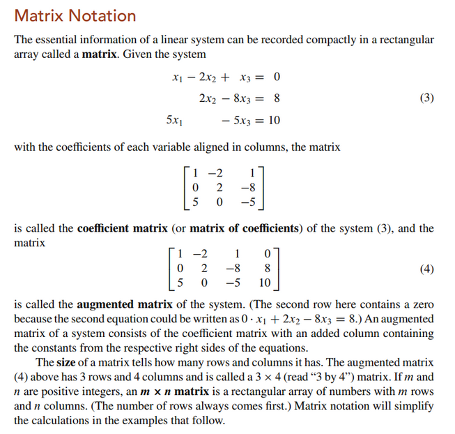
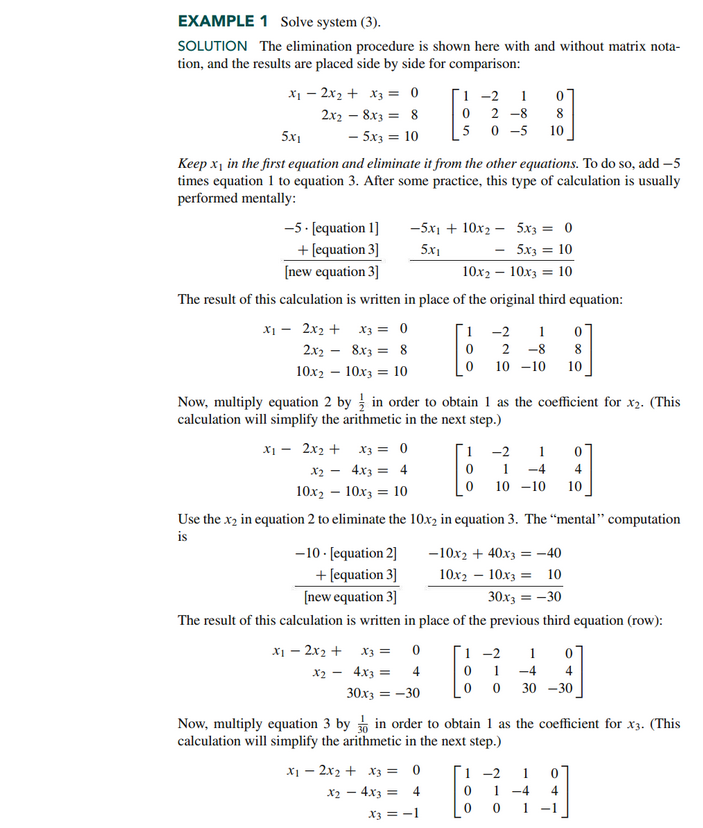
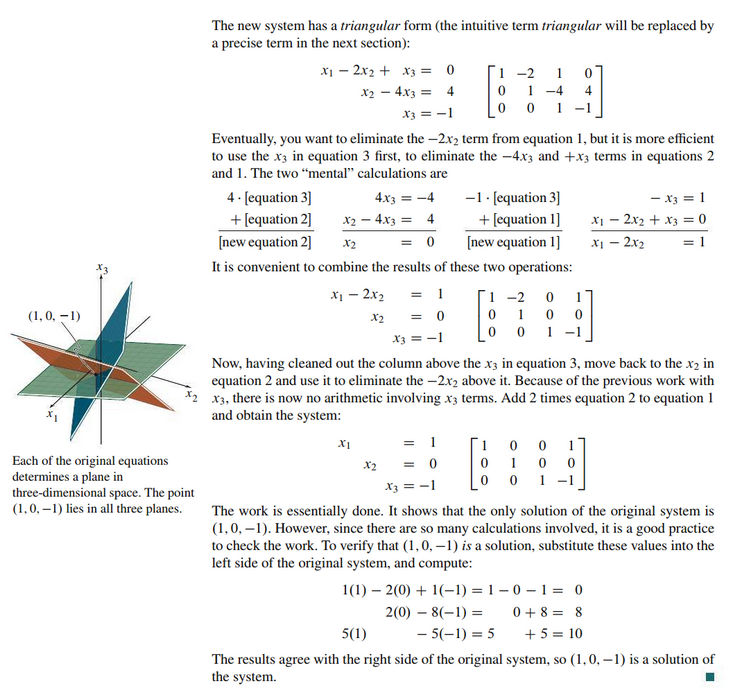
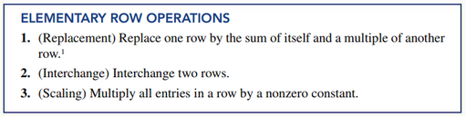
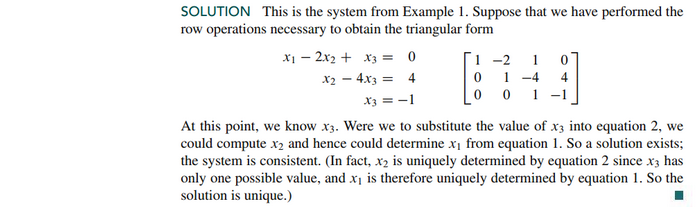
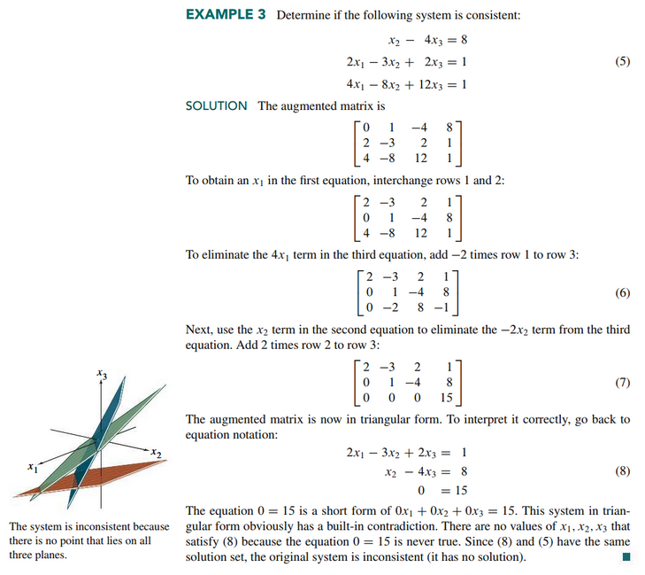
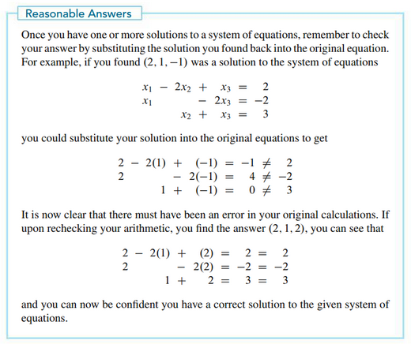

# Section 1.1: Systems of Linear Equations

## Lecture Videos

[📺 1. The Geometry of Linear Equations](https://www.youtube.com/watch?v=J7DzL2_Na80)

## Textbook Notes

- [⬇ Section 1.1 Presentation](file:../../../../../files/summer-2021/MATH-254/notes/ch-1/sec_1-1_presentation.pptx)

 

# Resources

- [📺 1. The Geometry of Linear Equations](https://www.youtube.com/watch?v=J7DzL2_Na80)
- [⬇ Section 1.1 Presentation](file:../../../../../files/summer-2021/MATH-254/notes/ch-1/sec_1-1_presentation.pptx)

Textbook

+ Linear Algebra and Its Applications 6th Edition - David, Steven, Judi
  + ISBN-13: 9780135851159

