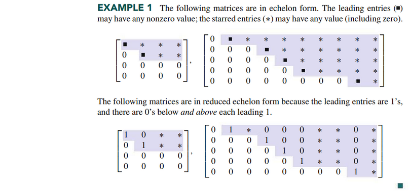

# Section 1.2: Row Reduction and Echelon Forms

## Lecture Videos

[📺 2. Elimination with Matrices](https://www.youtube.com/watch?v=QVKj3LADCnA)

## Textbook Notes

- [⬇ Section 1.2 Presentation](file:../../../../../../files/summer-2021/MATH-254/notes/ch-1/sec_1-2/sec_1-2_presentation.pptx)

### Pivot Positions

### The Row Reduction Algorithm

### Solutions of Linear Systems

### Existence and Uniqueness Questions

 

# Resources

- [📺 2. Elimination with Matrices](https://www.youtube.com/watch?v=QVKj3LADCnA)
- [⬇ Section 1.2 Presentation](file:../../../../../../files/summer-2021/MATH-254/notes/ch-1/sec_1-2/sec_1-2_presentation.pptx)

Textbook

+ Linear Algebra and Its Applications 6th Edition - David, Steven, Judi
  + ISBN-13: 9780135851159

