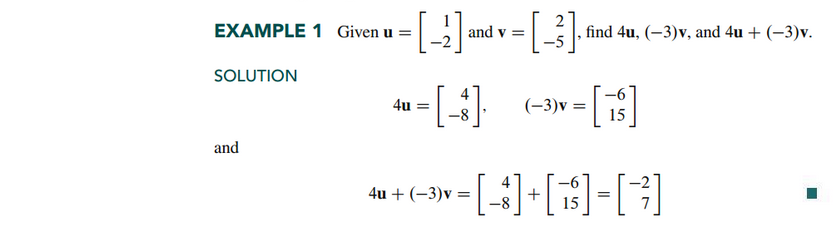
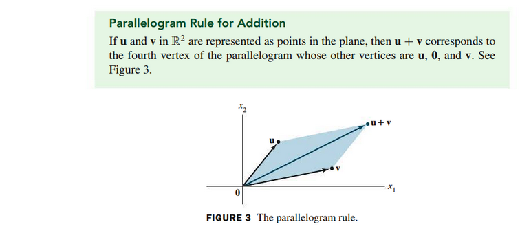
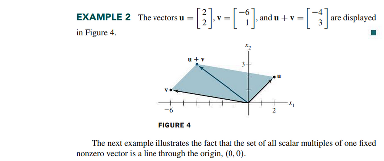
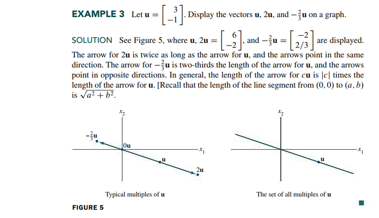
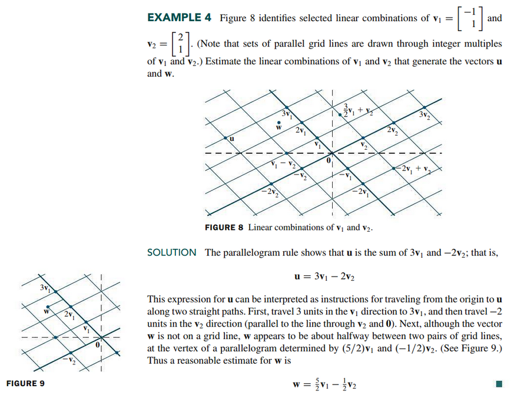
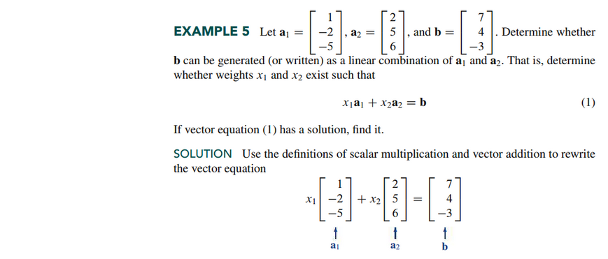
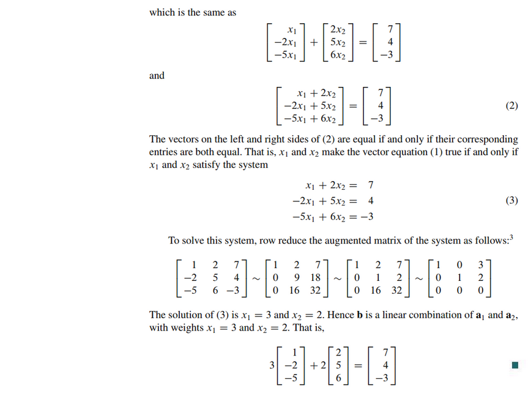
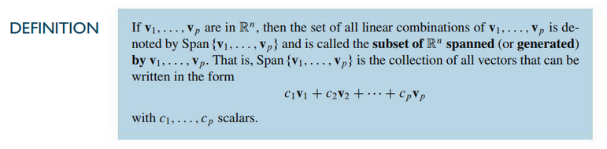
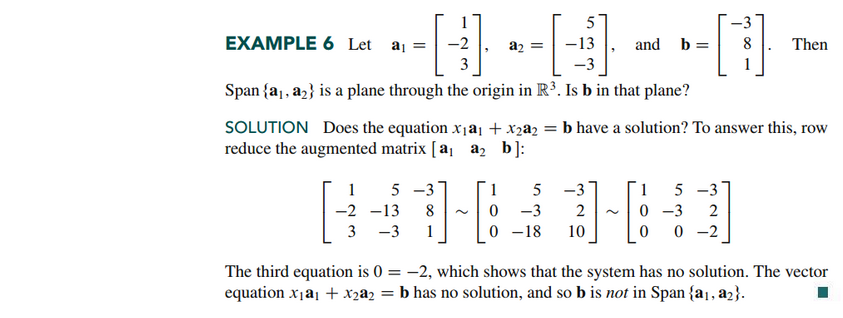
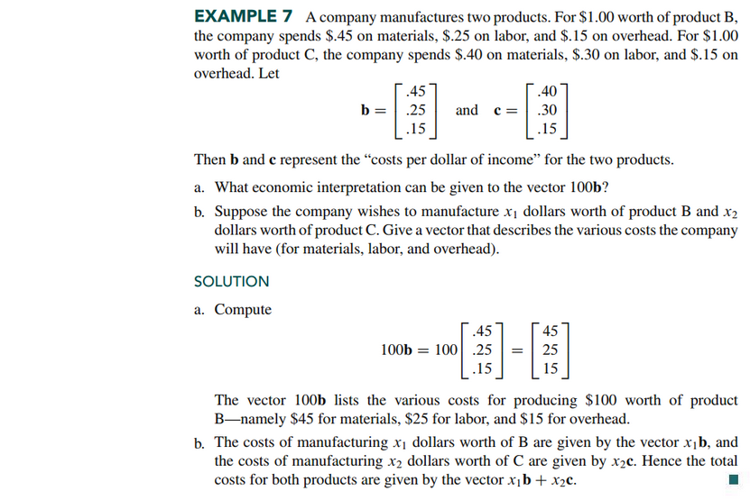

# Section 1.3: Vector Equations

## Textbook Notes

- [⬇ Section 1.3 Presentation](file:../../../../../files/summer-2021/MATH-254/notes/ch-1/sec_1-3_presentation.pptx)

### Vectors in $\mathbb{R}^{2}$

A matrix with only one column is called a **column vector** or simply
a **vector**.

### Geometric Descriptions of $\mathbb{R}^{2}$

### Linear Combinations

### A Geometric Descriptions of Span{v} and Span{u, v}

### Linear Combinations in Applications

 

# Resources

- [⬇ Section 1.3 Presentation](file:../../../../../files/summer-2021/MATH-254/notes/ch-1/sec_1-3_presentation.pptx)

Textbook

+ Linear Algebra and Its Applications 6th Edition - David, Steven, Judi
  + ISBN-13: 9780135851159

