# Section 1.4: The Matrix Equation $Ax = b$

## Textbook Notes

- [⬇ Section 1.4 Presentation](file:../../../../../files/summer-2021/MATH-254/notes/ch-1/sec_1-4_presentation.pptx)

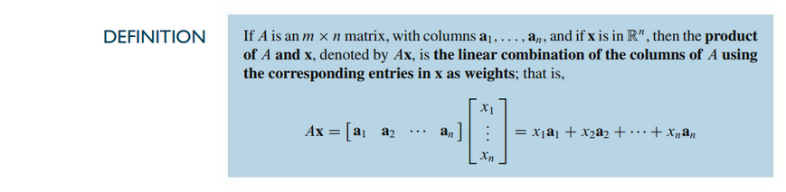

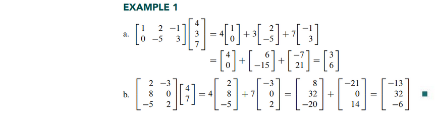
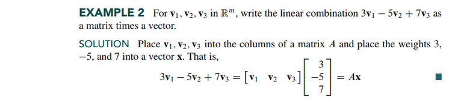

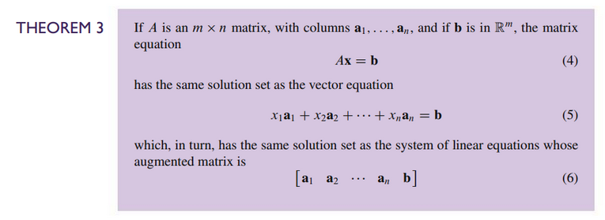

### Existence of Solutions

The equation $Ax = b$ has a solution if and only if $b$ is a linear combination
of the columns of $A$.

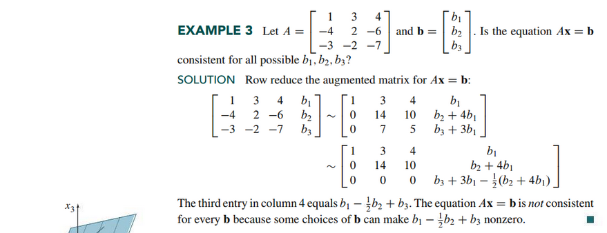

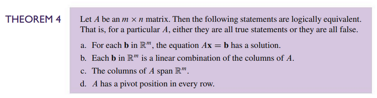
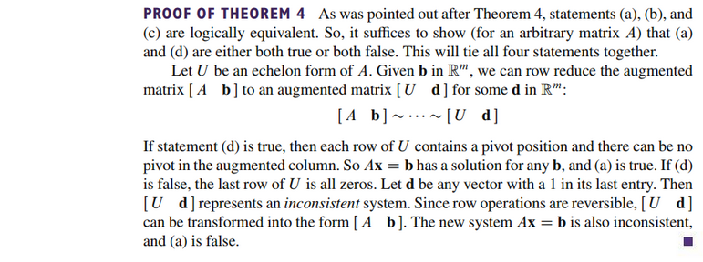

### Computation of $Ax$

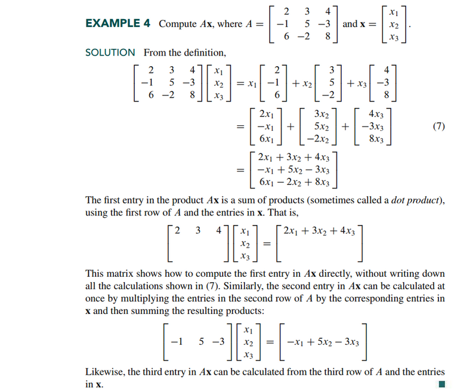

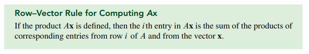

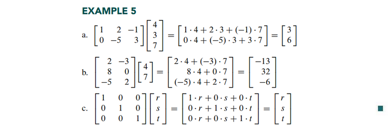

### Properties of the Matrix-Vector Product $Ax$

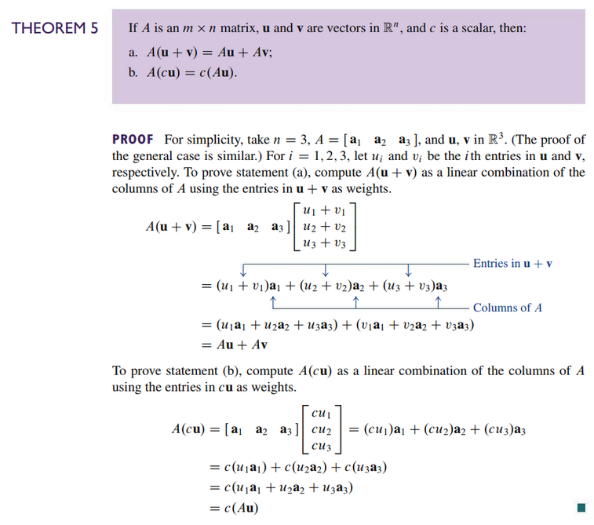

 

# Resources

- [⬇ Section 1.4 Presentation](file:../../../../../files/summer-2021/MATH-254/notes/ch-1/sec_1-4_presentation.pptx)

Textbook

+ Linear Algebra and Its Applications 6th Edition - David, Steven, Judi
  + ISBN-13: 9780135851159

