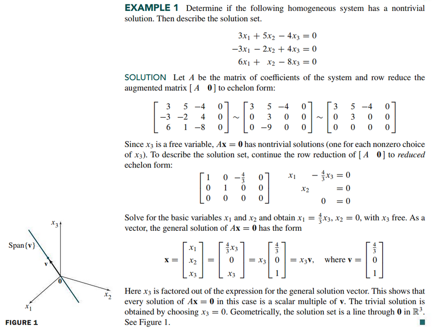
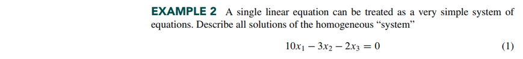
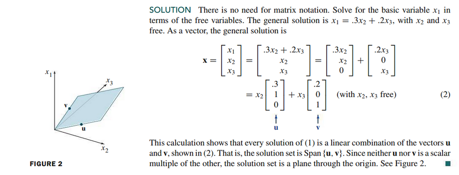
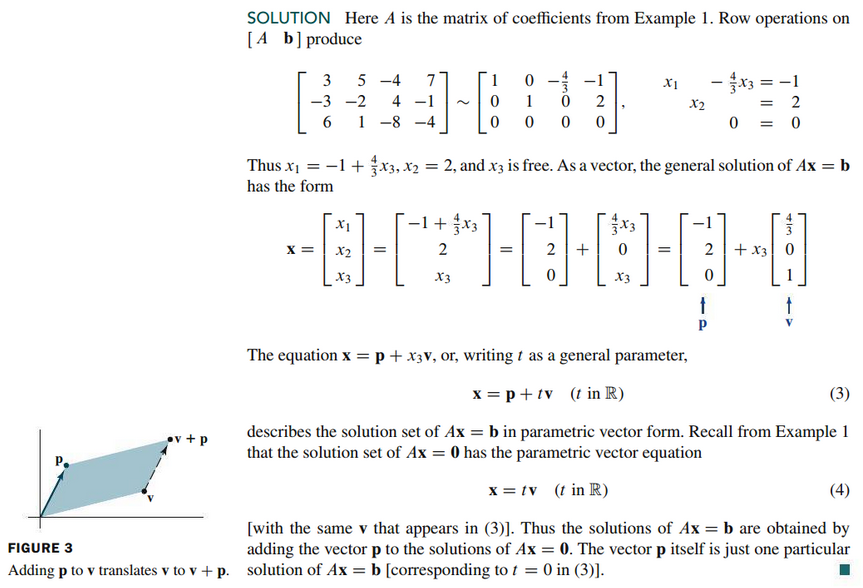
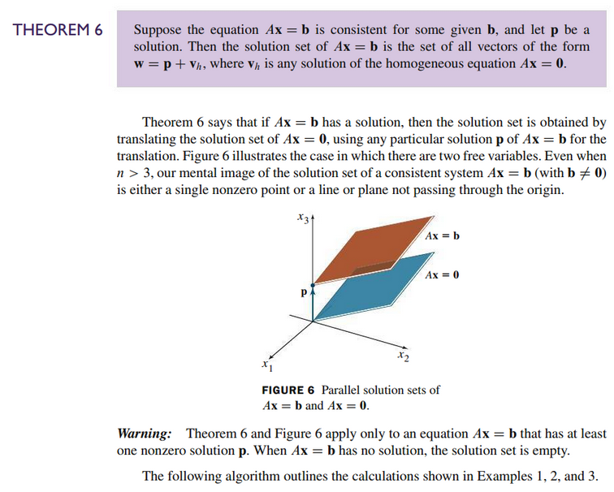
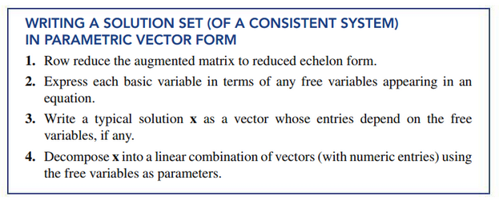
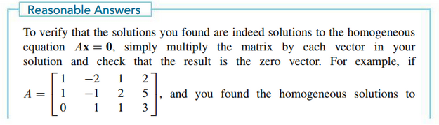
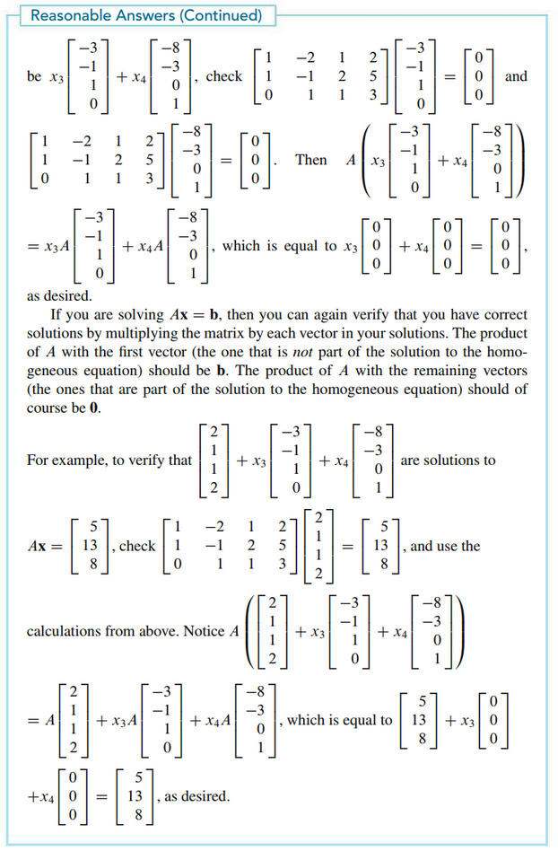

# Section 1.5: Solution Sets of Linear Systems

## Textbook Notes

- [⬇ Section 1.5 Presentation](file:../../../../../files/summer-2021/MATH-254/notes/ch-1/sec_1-5_presentation.pptx)

### Homogeneous Linear Systems

### Solutions of Nonhomogeneous Systems

 

# Resources

Textbook

+ Linear Algebra and Its Applications 6th Edition - David, Steven, Judi
  + ISBN-13: 9780135851159

