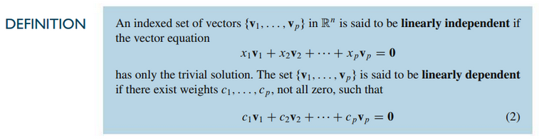
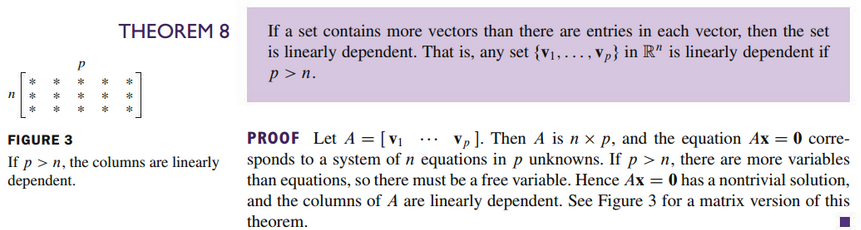

# Section 1.7: Linear Independence

## Textbook Notes

- [⬇ Section 1.7 Presentation](file:../../../../../files/summer-2021/MATH-254/notes/ch-1/sec_1-7_presentation.pptx)

### Linear Independence of Matrix Columns

### Sets of One or Two Vectors

### Sets of Two or More Vectors

 

# Resources

Textbook

+ Linear Algebra and Its Applications 6th Edition - David, Steven, Judi
  + ISBN-13: 9780135851159

