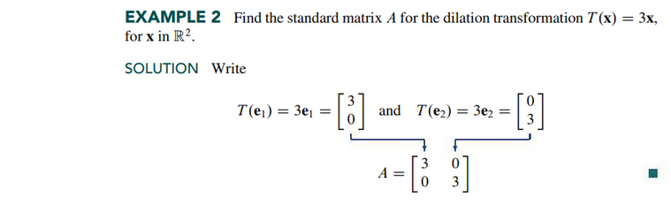

# Section 1.9: The Matrix of a Linear Transformations

## Textbook Notes

- [⬇ Section 1.9 Presentation](file:../../../../../../files/summer-2021/MATH-254/notes/ch-1/sec_1-9/sec_1-9_presentation.pptx)

### Existence and Uniqueness Questions

 

# Resources

- [⬇ Section 1.9 Presentation](file:../../../../../../files/summer-2021/MATH-254/notes/ch-1/sec_1-9/sec_1-9_presentation.pptx)

Textbook

+ Linear Algebra and Its Applications 6th Edition - David, Steven, Judi
  + ISBN-13: 9780135851159

