# Section 2.1: Matrix Operation

## Lecture Videos

[📺 3. Multiplication and Inverse Matrices](https://www.youtube.com/watch?v=FX4C-JpTFgY)

## Textbook Notes

- [⬇ Section 2.1 Presentation](file:../../../../../files/summer-2021/MATH-254/notes/ch-2/sec_2-1_presentation.pptx)

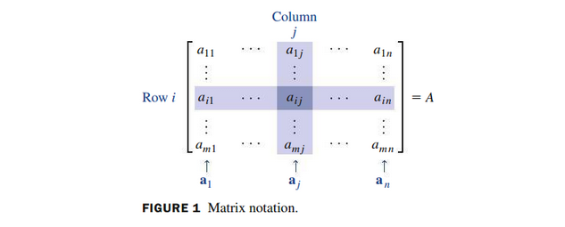

### Sums and Scalar Multiples

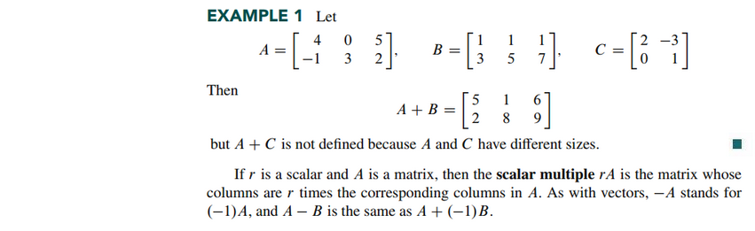
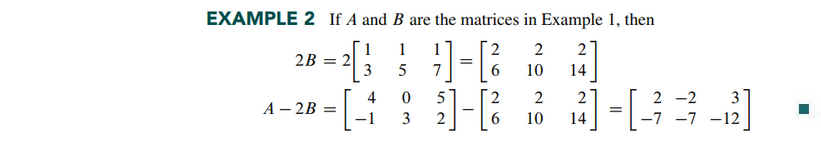

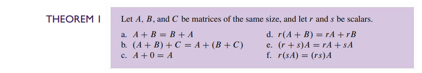

### Matrix Multiplication

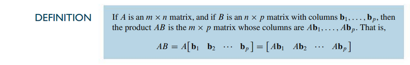

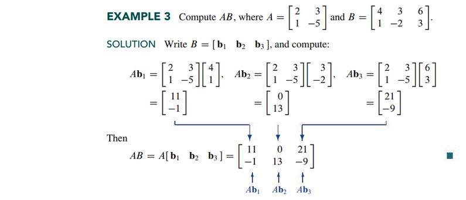

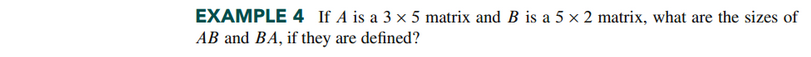
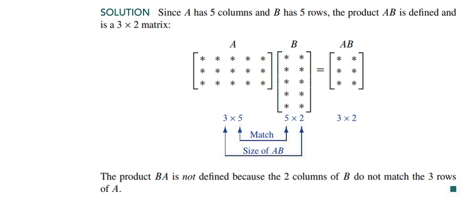

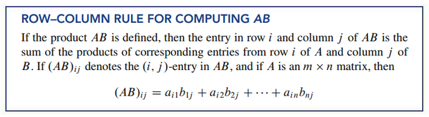

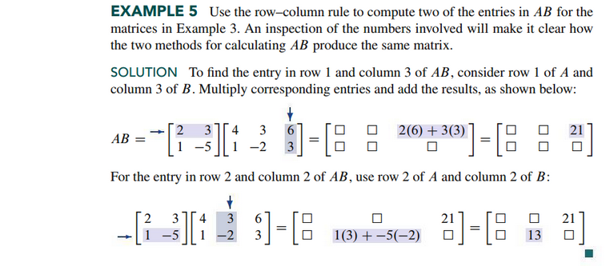
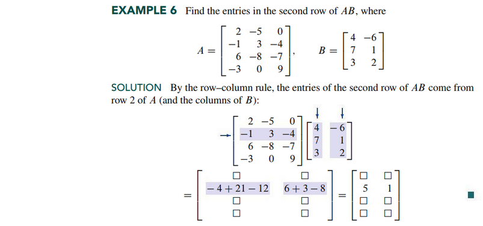

### Properties of Matrix Multiplication

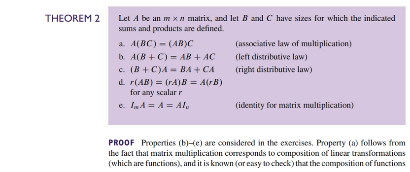
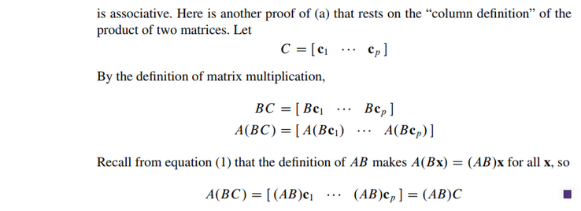

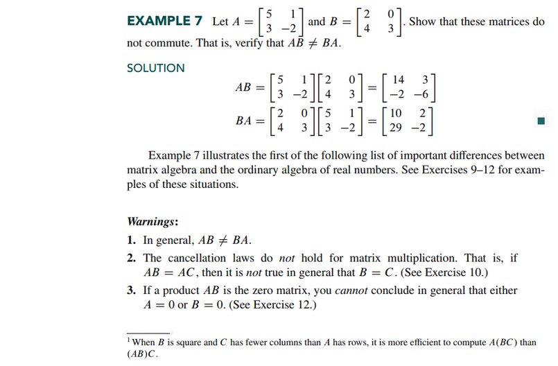

### Powers of a Matrix

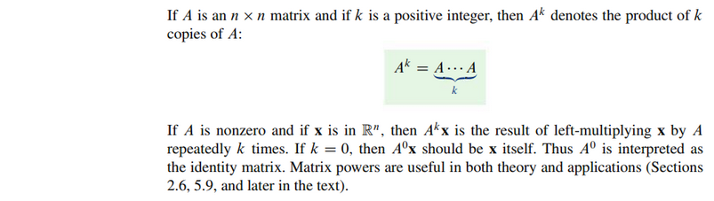

### The Transpose of a Matrix

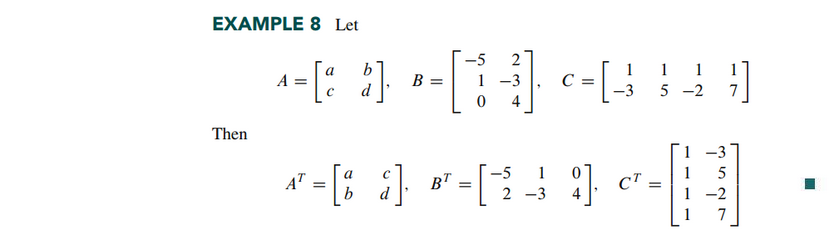

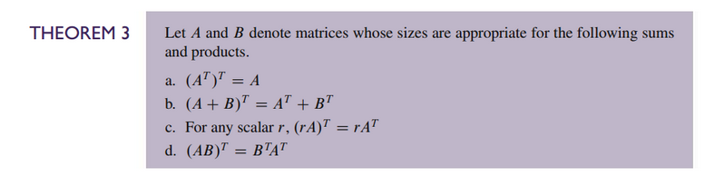

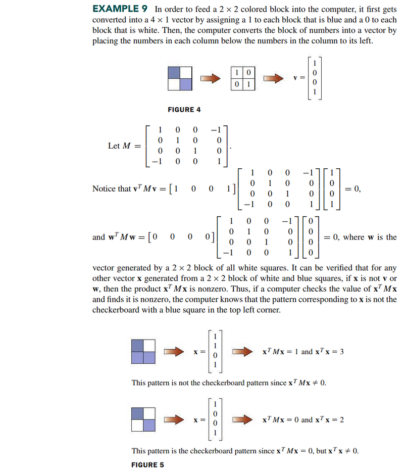
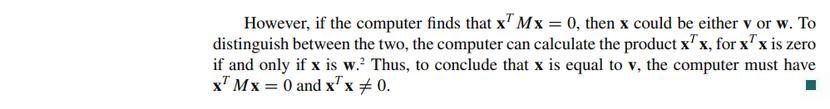

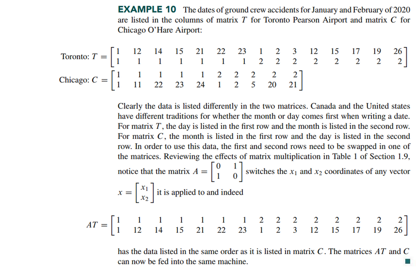

 

# Resources

- [📺 3. Multiplication and Inverse Matrices](https://www.youtube.com/watch?v=FX4C-JpTFgY)
- [⬇ Section 2.1 Presentation](file:../../../../../files/summer-2021/MATH-254/notes/ch-2/sec_2-1_presentation.pptx)

Textbook

+ Linear Algebra and Its Applications 6th Edition - David, Steven, Judi
  + ISBN-13: 9780135851159

