# Section 2.2: The Inverse of a Matrix

## Lecture Videos

[📺 3. Multiplication and Inverse Matrices](https://www.youtube.com/watch?v=FX4C-JpTFgY&t=120s)

## Textbook Notes

- [⬇ Section 2.2 Presentation](file:../../../../../files/summer-2021/MATH-254/notes/ch-2/sec_2-2_presentation.pptx)

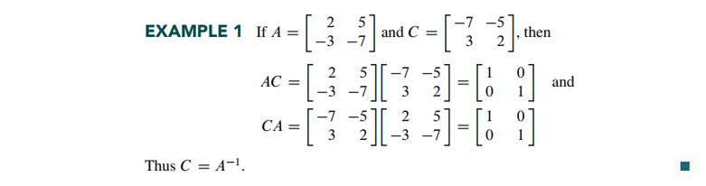

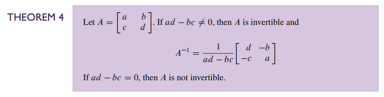

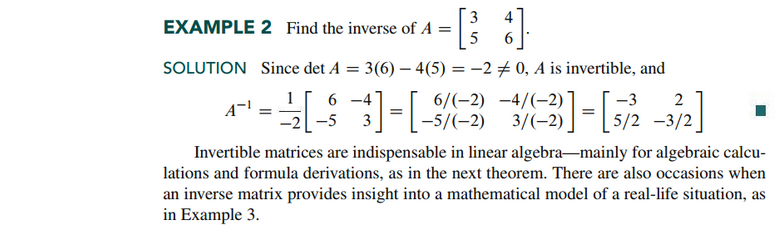

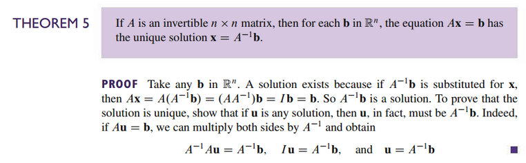
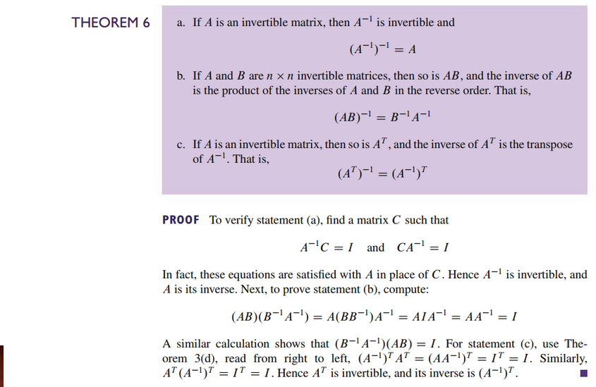

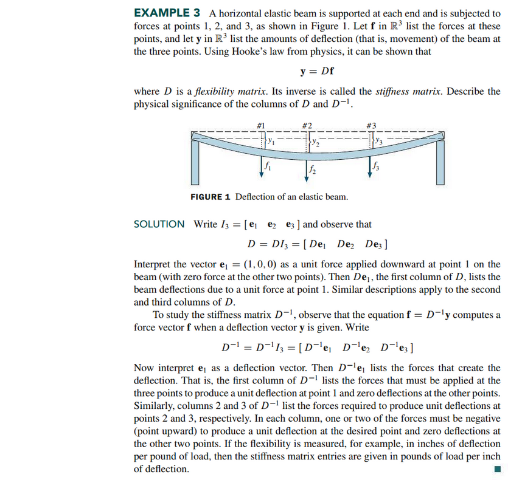
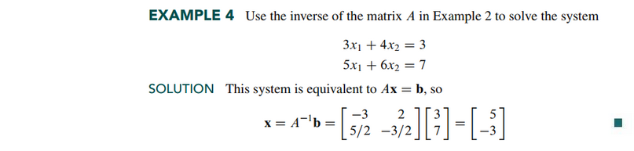

### Elementary Matrices

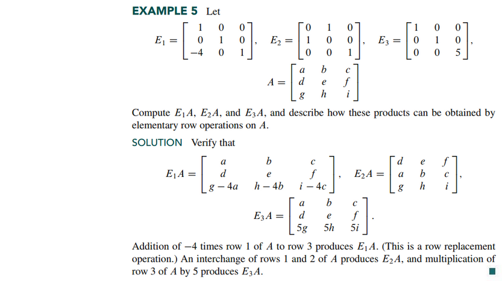
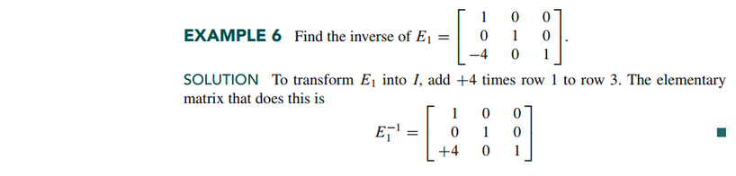

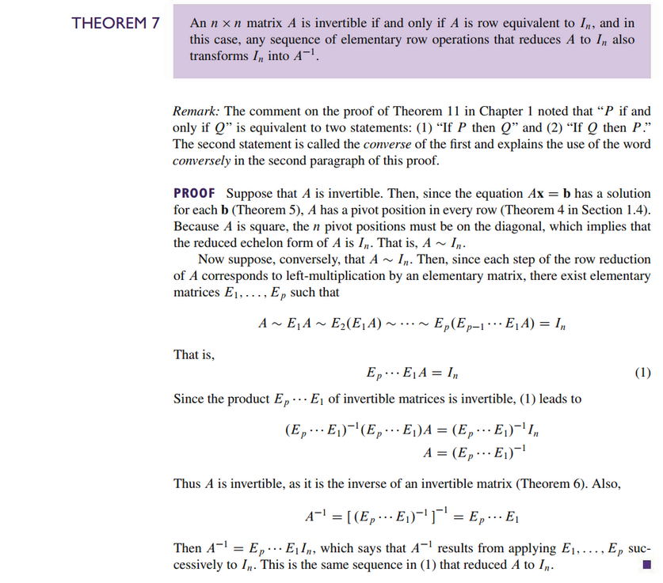

### An Algorithm for Finding $A^{-1}$

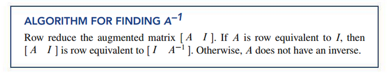

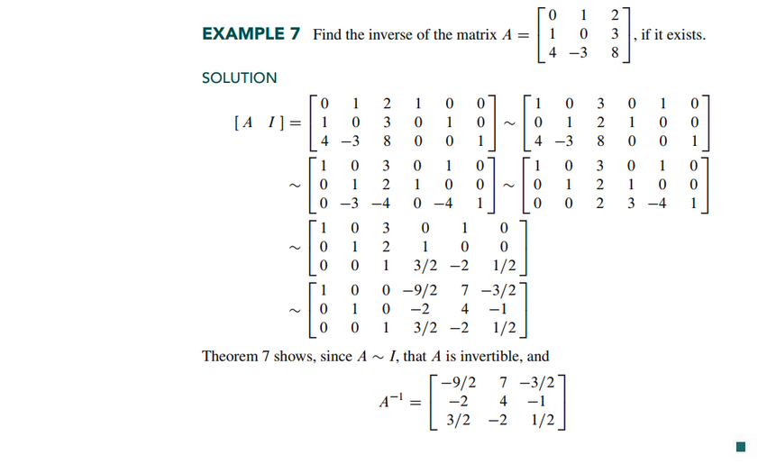

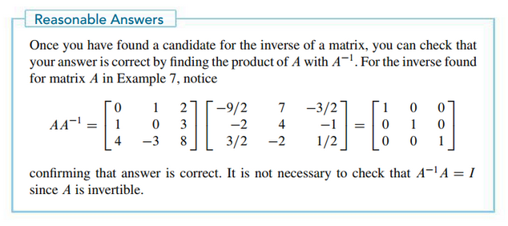

 

# Resources

- [📺 3. Multiplication and Inverse Matrices](https://www.youtube.com/watch?v=FX4C-JpTFgY&t=120s)
- [⬇ Section 2.2 Presentation](file:../../../../../files/summer-2021/MATH-254/notes/ch-2/sec_2-2_presentation.pptx)

Textbook

+ Linear Algebra and Its Applications 6th Edition - David, Steven, Judi
  + ISBN-13: 9780135851159

