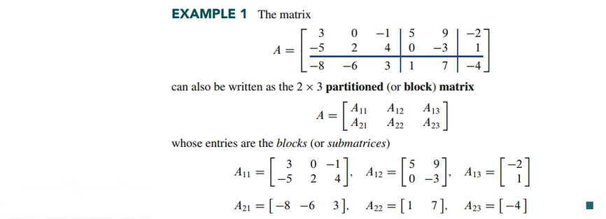
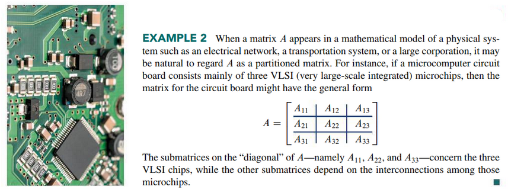
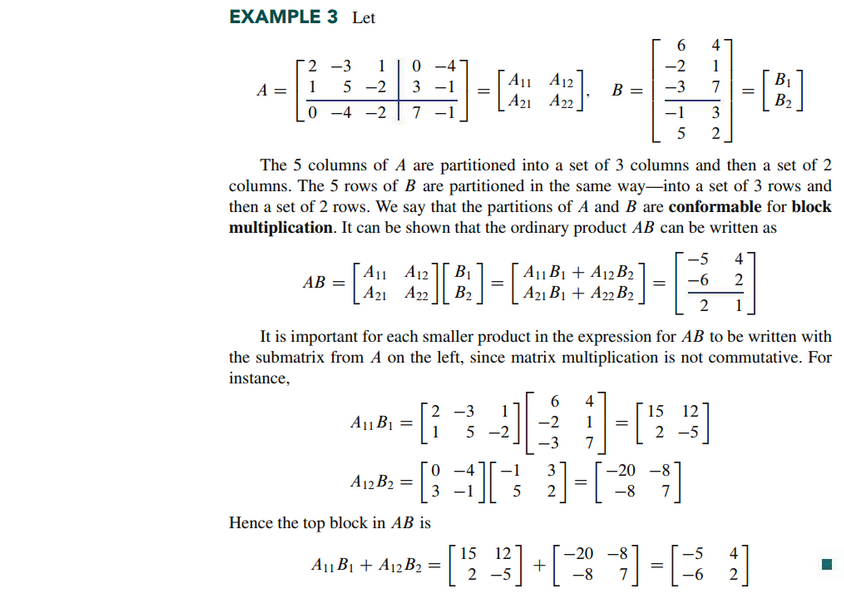
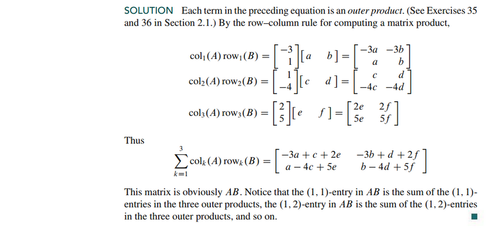
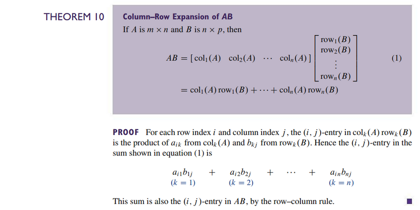
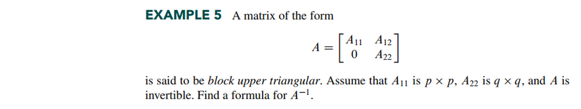
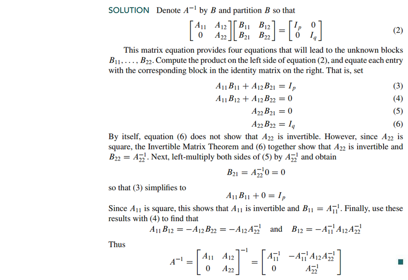

# Section 2.4: Partitioned Matrices

## Textbook Notes

- [⬇ Section 2.4 Presentation](file:../../../../../../files/summer-2021/MATH-254/notes/ch-2/sec_2-4/sec_2-4_presentation.pptx)

### Multiplication of Partitioned Matrices

### Inverses of Partitioned Matrices

 

# Resources

Textbook

+ Linear Algebra and Its Applications 6th Edition - David, Steven, Judi
  + ISBN-13: 9780135851159

