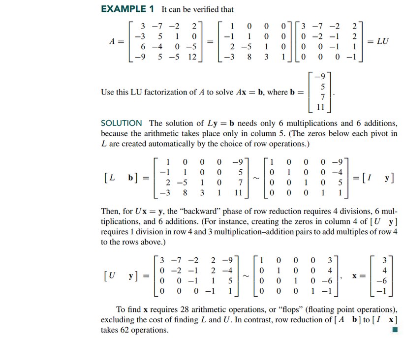
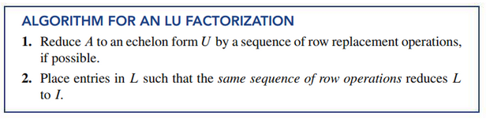
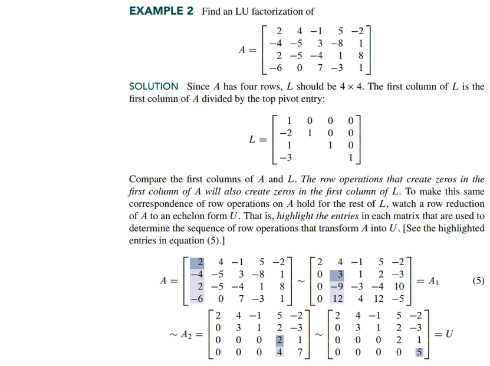
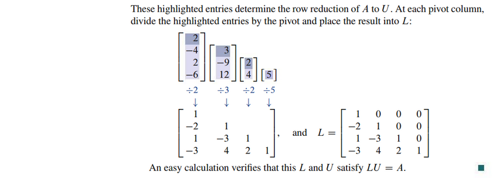
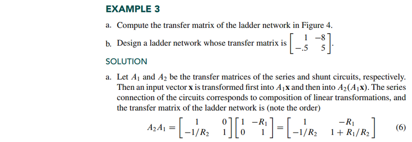
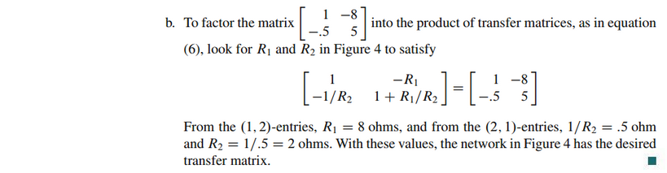

# Section 2.5: Matrix Factorizations

## Lecture Videos

[📺 4. Factorization into A = LU](https://www.youtube.com/watch?v=MsIvs_6vC38)

## Textbook Notes

- [⬇ Section 2.5 Presentation](file:../../../../../../files/summer-2021/MATH-254/notes/ch-2/sec_2-5/sec_2-5_presentation.pptx)

### The LU Factorization

### An LU Factoriation Algorithm

### A Matrix Factorization in Electrical Engineering

 

# Resources

- [📺 4. Factorization into A = LU](https://www.youtube.com/watch?v=MsIvs_6vC38)
- [⬇ Section 2.5 Presentation](file:../../../../../../files/summer-2021/MATH-254/notes/ch-2/sec_2-5/sec_2-5_presentation.pptx)

Textbook

+ Linear Algebra and Its Applications 6th Edition - David, Steven, Judi
  + ISBN-13: 9780135851159

