# Section 2.8: Subspaces of $\mathbb{R}^{n}$

## Lecture Videos

[📺 6. Column Space and Nullspace](https://www.youtube.com/watch?v=8o5Cmfpeo6g)

## Textbook Notes

- [⬇ Section 2.8 Presentation](file:../../../../../files/summer-2021/MATH-254/notes/ch-2/sec_2-8_presentation.pptx)

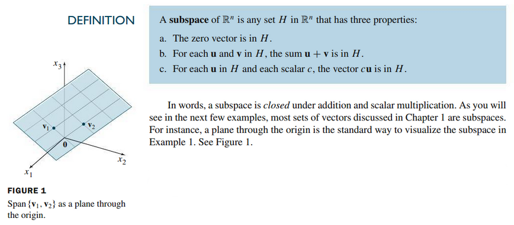

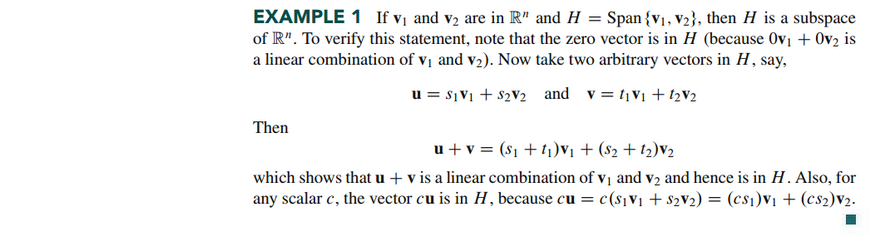
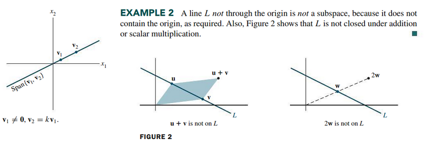
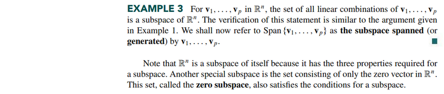

### Column Spaces and Null Space of a Matrix

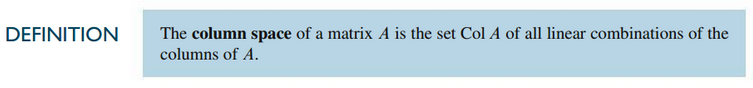

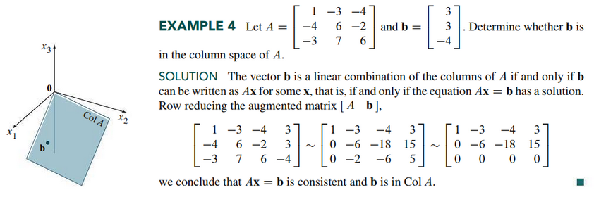

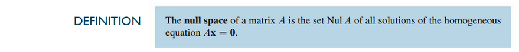

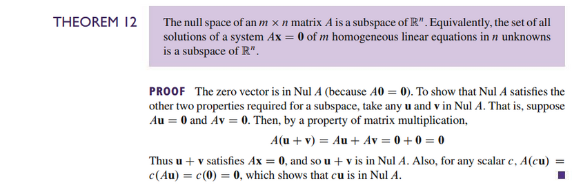

### Basis for a Subspace

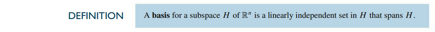

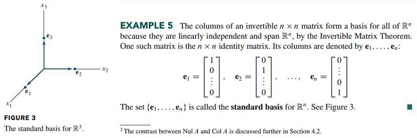
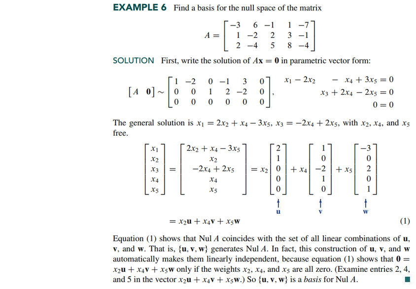
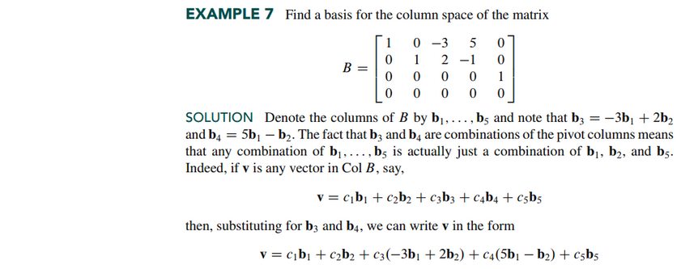
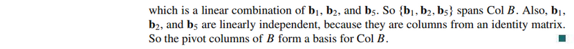
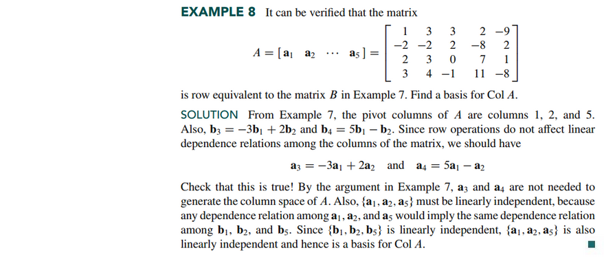

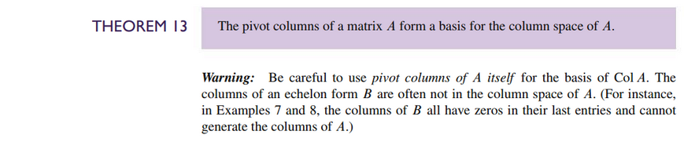

 

# Resources

- [📺 6. Column Space and Nullspace](https://www.youtube.com/watch?v=8o5Cmfpeo6g)
- [⬇ Section 2.8 Presentation](file:../../../../../files/summer-2021/MATH-254/notes/ch-2/sec_2-8_presentation.pptx)

Textbook

+ Linear Algebra and Its Applications 6th Edition - David, Steven, Judi
  + ISBN-13: 9780135851159

