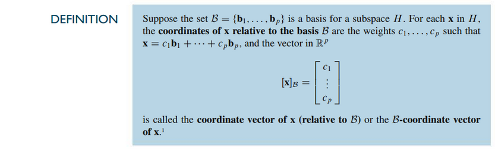
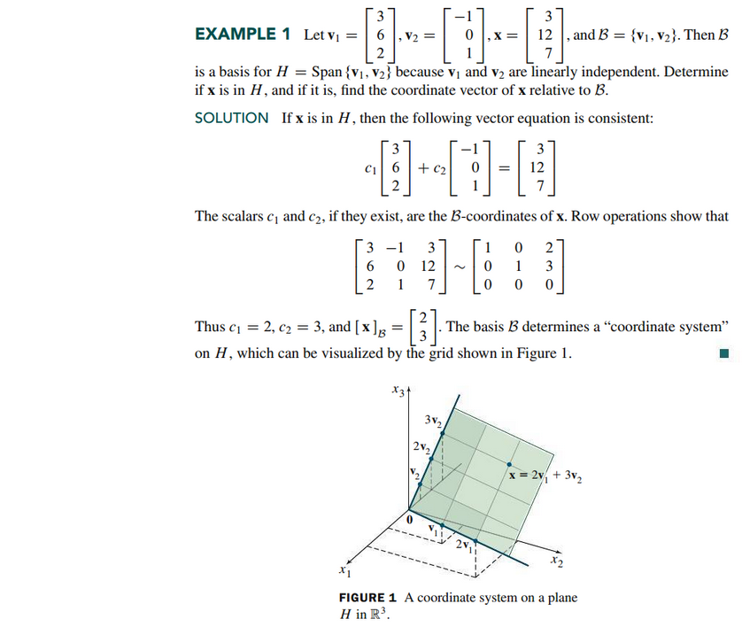
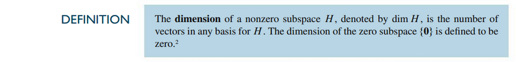
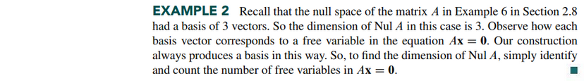
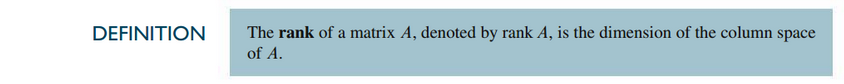
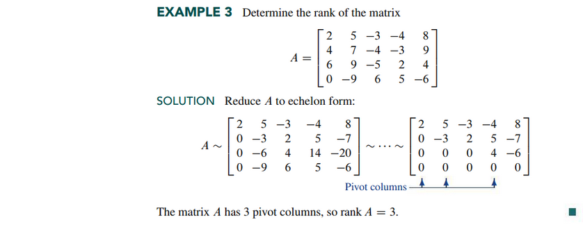
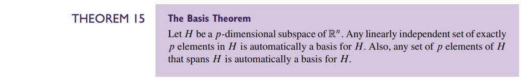
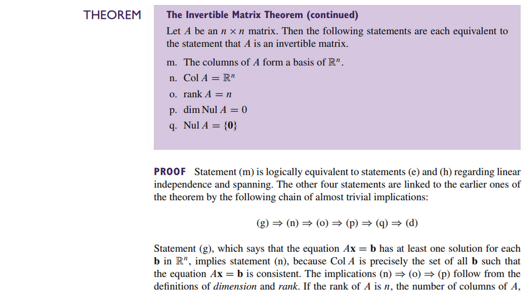
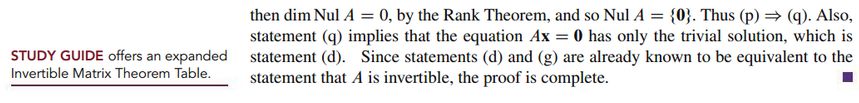

# Section 2.9: Dimension and Rank

## Textbook Notes

- [⬇ Section 2.9 Presentation](file:../../../../../files/summer-2021/MATH-254/notes/ch-2/sec_2-9_presentation.pptx)

### Coordinate Systems

### The Dimension of a Subspace

### Rank and the Invertible Matrix Theorem

 

# Resources

- [⬇ Section 2.9 Presentation](file:../../../../../files/summer-2021/MATH-254/notes/ch-2/sec_2-9_presentation.pptx)

Textbook

+ Linear Algebra and Its Applications 6th Edition - David, Steven, Judi
  + ISBN-13: 9780135851159

