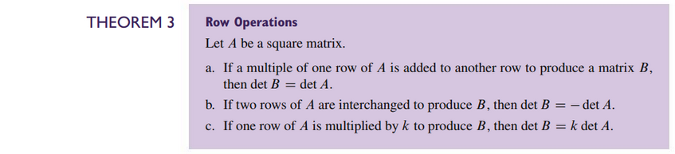
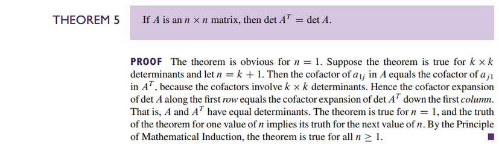
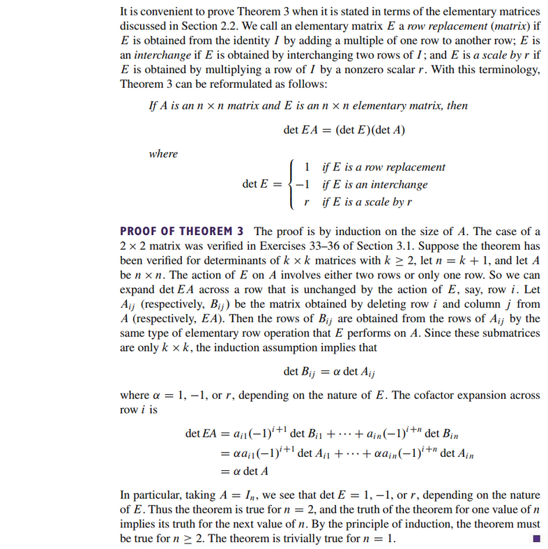

# Section 3.2: Properties of Determinants

## Textbook Notes

- [⬇ Section 3.2 Presentation](file:../../../../../../files/summer-2021/MATH-254/notes/ch-3/sec_3-2/sec_3-2_presentation.pptx)

### Column Operations

### Multiplicative Property

### Proofs of Theorems 3 and 6

 

# Resources

- [⬇ Section 3.2 Presentation](file:../../../../../../files/summer-2021/MATH-254/notes/ch-3/sec_3-2/sec_3-2_presentation.pptx)

Textbook

+ Linear Algebra and Its Applications 6th Edition - David, Steven, Judi
  + ISBN-13: 9780135851159

