# Section 3.3: Cramer's Rule, Volume, and Linear Transformations

## Lecture Videos

[📺 20. Cramer's Rule, Inverse Matrix, and Volume](https://www.youtube.com/watch?v=QNpj-gOXW9M)

## Textbook Notes

- [⬇ Section 3.3 Presentation](file:../../../../../../files/summer-2021/MATH-254/notes/ch-3/sec_3-3/sec_3-3_presentation.pptx)

### Cramer's Rule

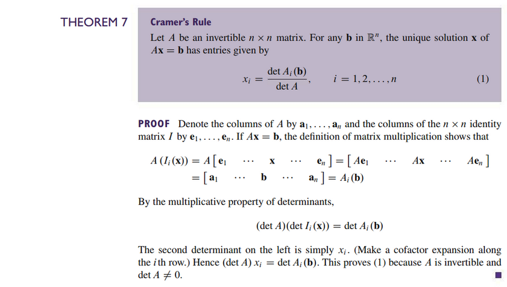

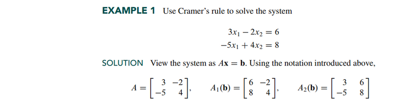
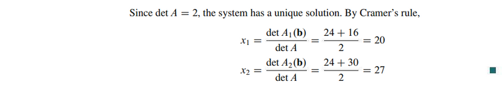

### Application to Engineering

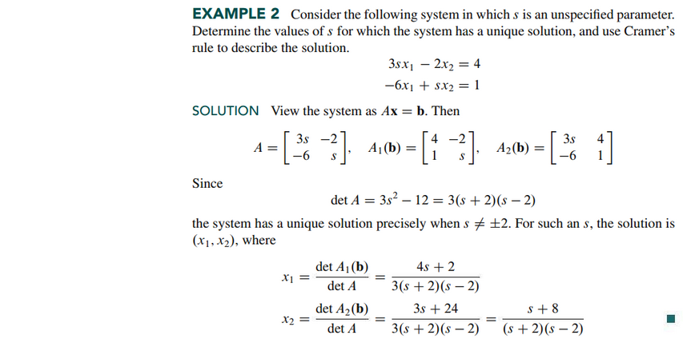

### A Formula for $A^{-1}$

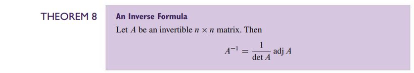

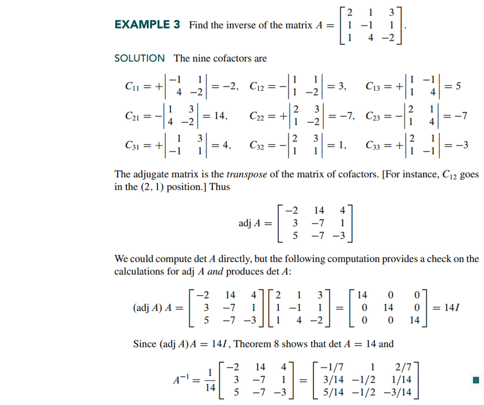

### Determinants as Area or Volume

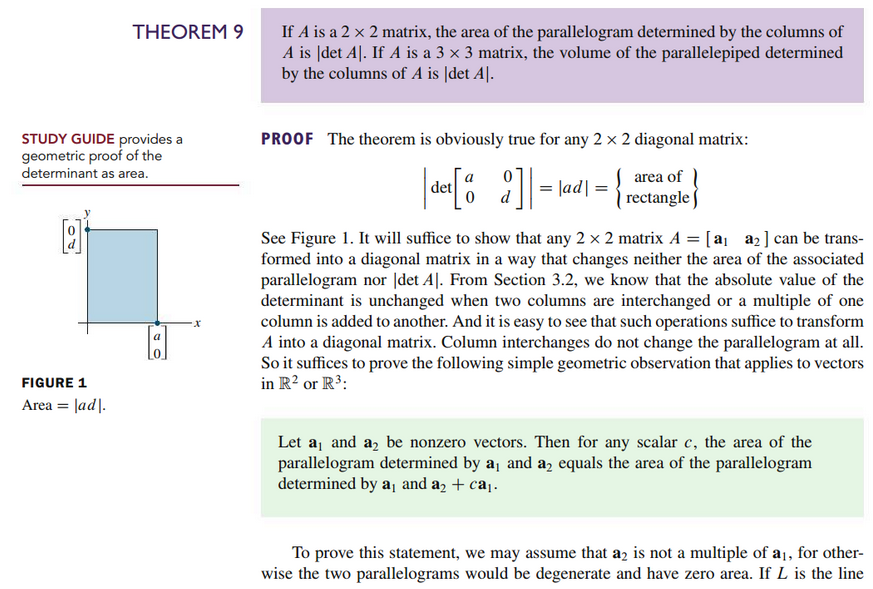
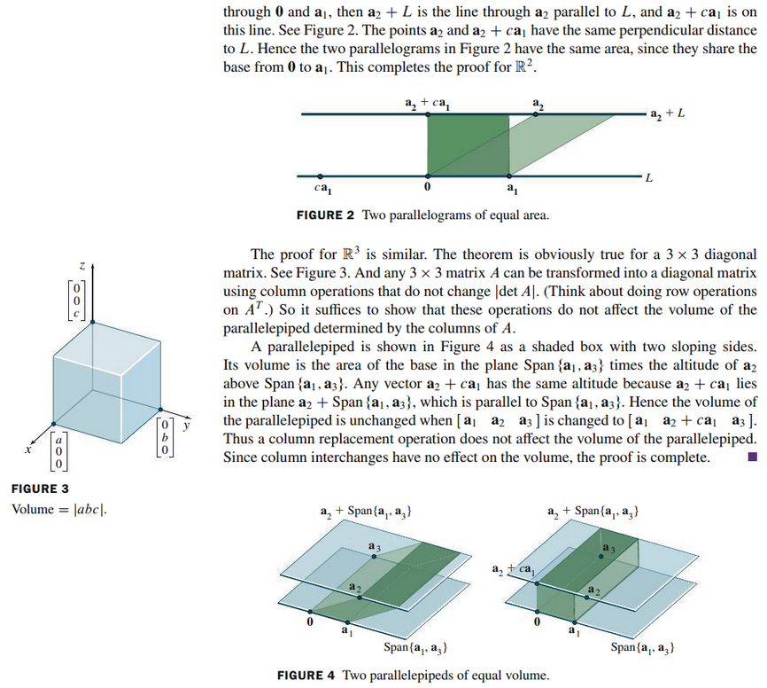

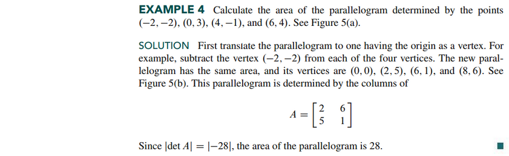

### Linear Transformations

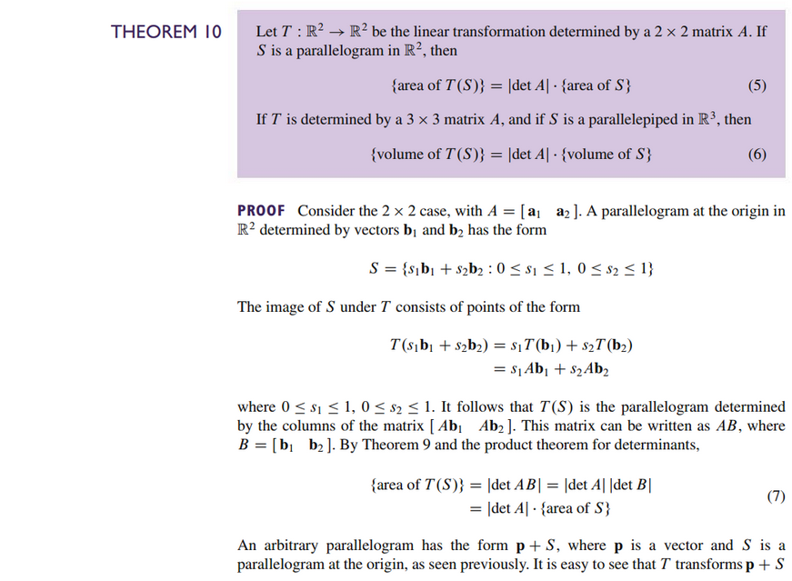
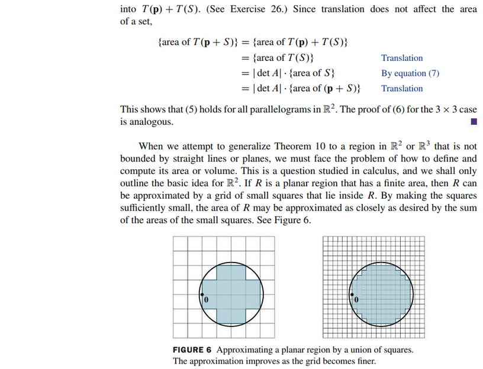
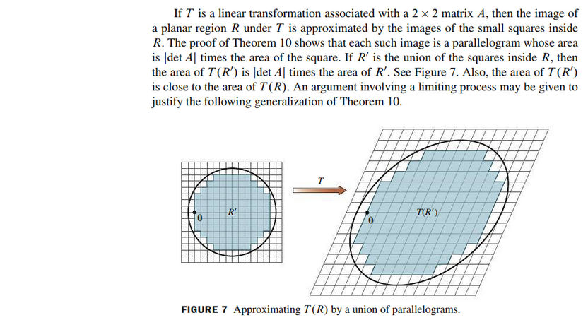

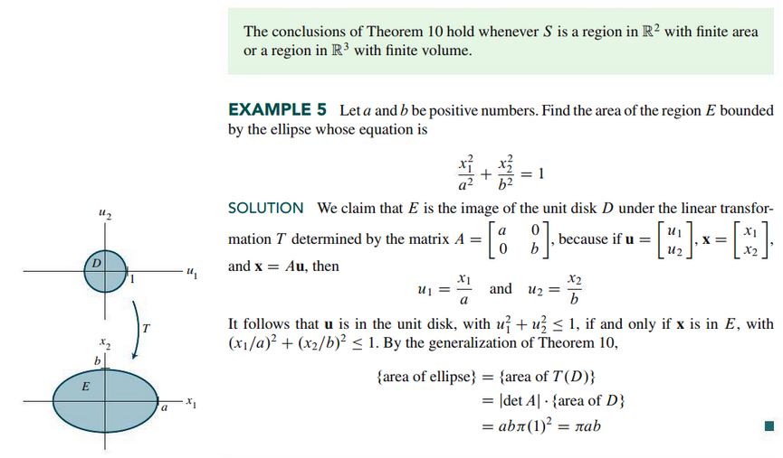

 

# Resources

- [📺 20. Cramer's Rule, Inverse Matrix, and Volume](https://www.youtube.com/watch?v=QNpj-gOXW9M)
- [⬇ Section 3.3 Presentation](file:../../../../../../files/summer-2021/MATH-254/notes/ch-3/sec_3-3/sec_3-3_presentation.pptx)

Textbook

+ Linear Algebra and Its Applications 6th Edition - David, Steven, Judi
  + ISBN-13: 9780135851159

