# Section 4.1: Vector Spaces and Subspaces

## Textbook Notes

- [⬇ Section 4.1 Presentation](file:../../../../../../files/summer-2021/MATH-254/notes/ch-4/sec_4-1/sec_4-1_presentation.pptx)

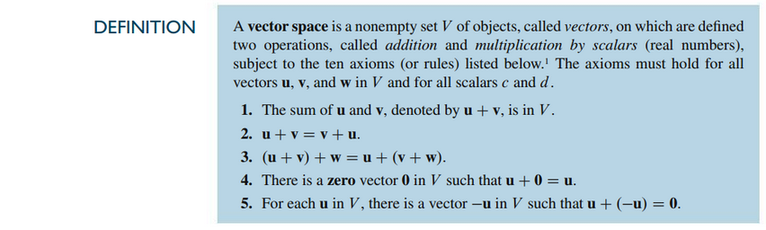
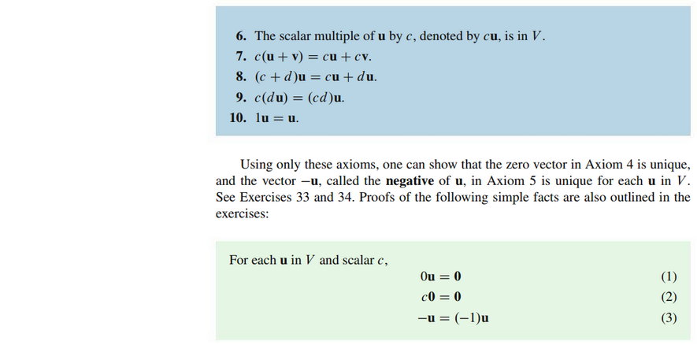

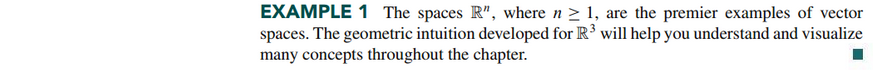
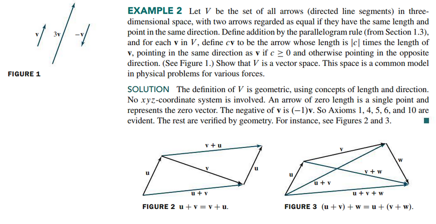
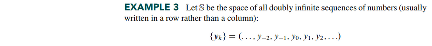
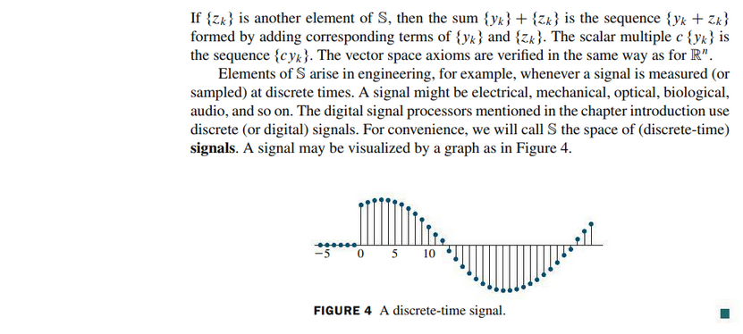
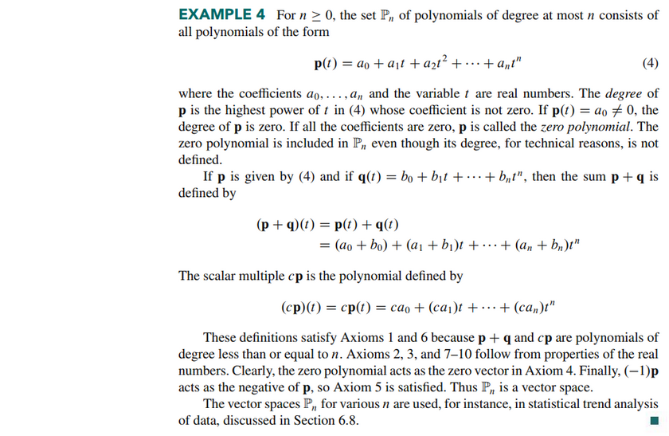
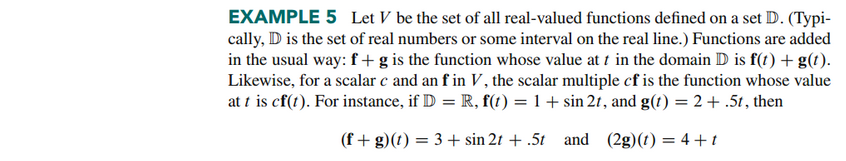
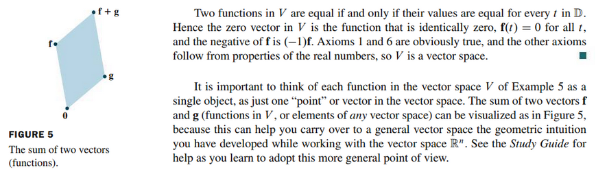

## Subspaces

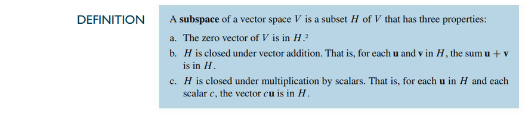

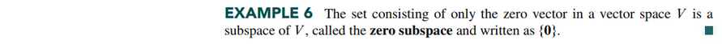
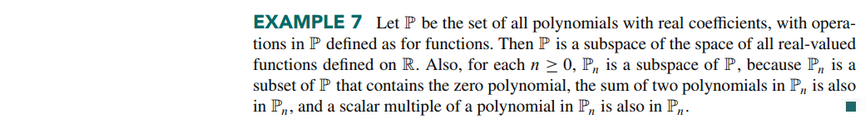
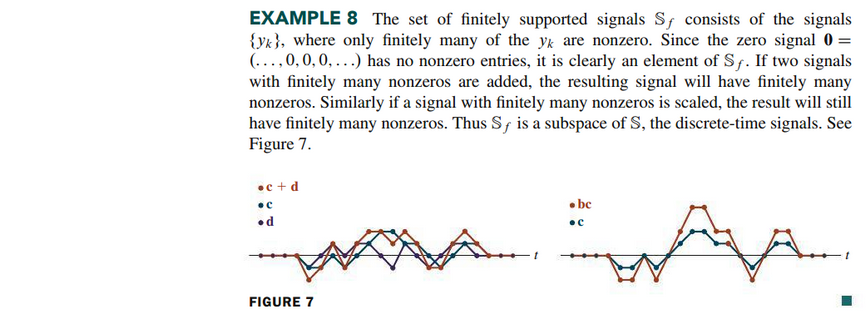
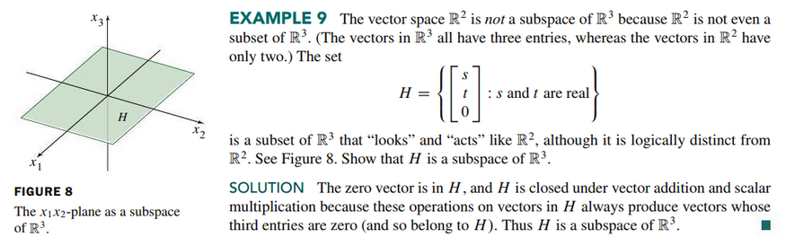
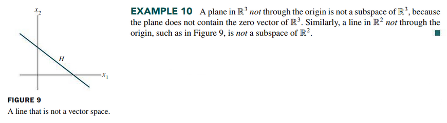

## A Subspace Spanned by a Set

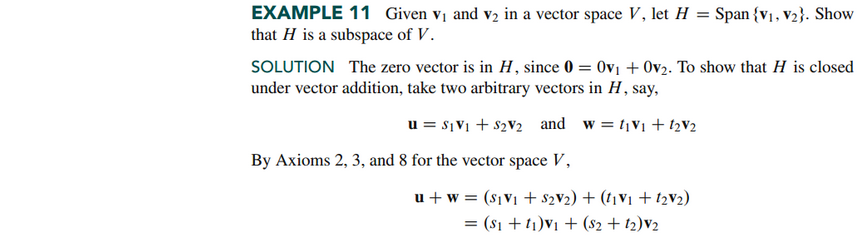
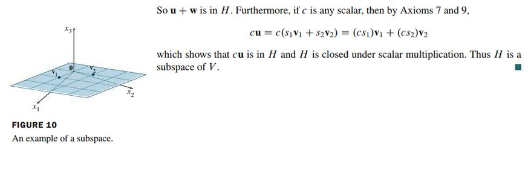

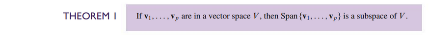

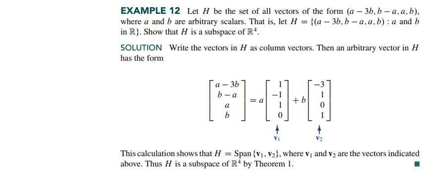
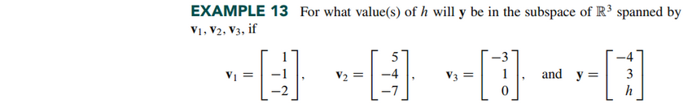
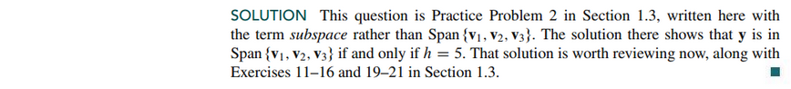

 

# Resources

- [⬇ Section 4.1 Presentation](file:../../../../../../files/summer-2021/MATH-254/notes/ch-4/sec_4-1/sec_4-1_presentation.pptx)

Textbook

+ Linear Algebra and Its Applications 6th Edition - David, Steven, Judi
  + ISBN-13: 9780135851159

