# Section 4.2: Null Spaces, Column Spaces, Row Spaces, and Linear Transformations

## Textbook Notes

- [⬇ Section 4.2 Presentation](file:../../../../../../files/summer-2021/MATH-254/notes/ch-4/sec_4-2/sec_4-2_presentation.pptx)

### The Null Space of a Matrix

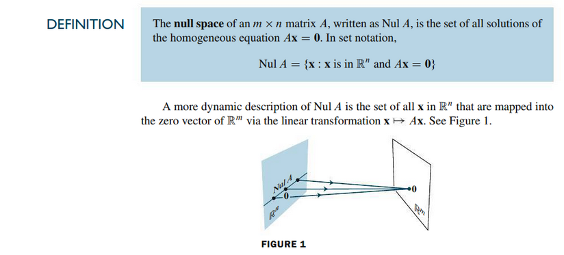

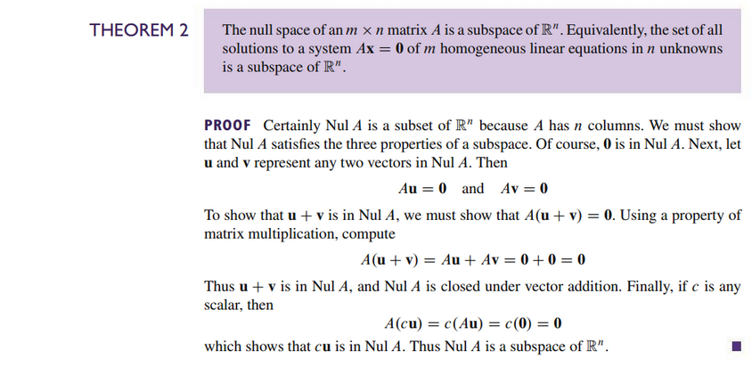

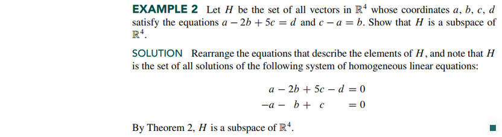

### An Explicit Description of Nul A

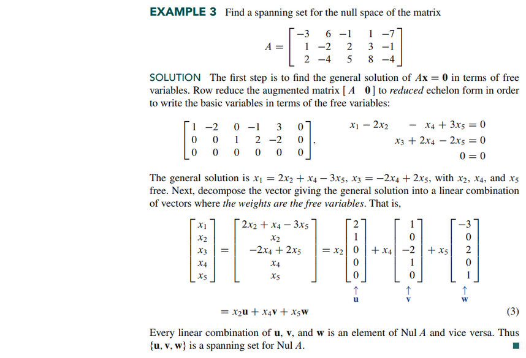

### The Column Space of a Matrix

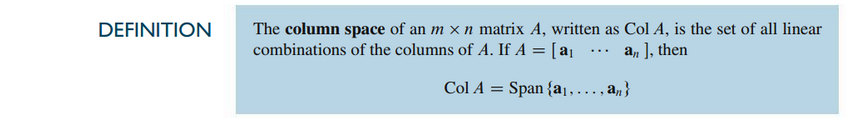

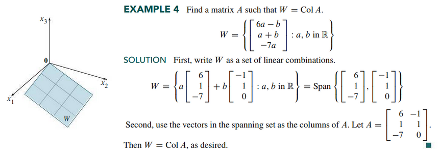

### The Row Space

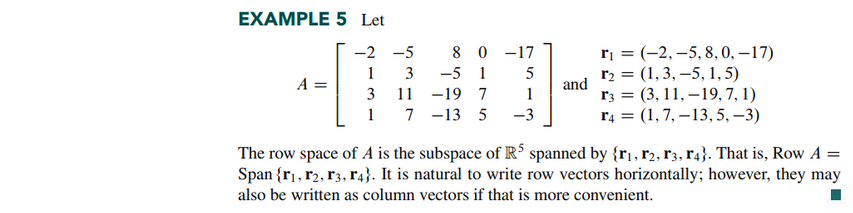

### The Contrast Between Nul A and Col A

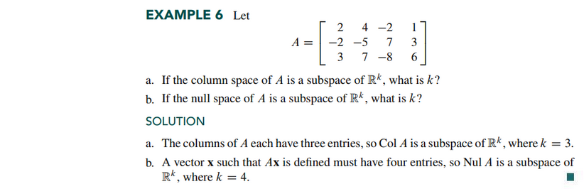
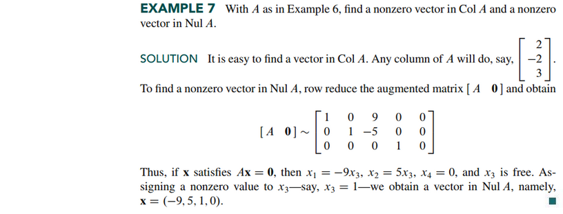
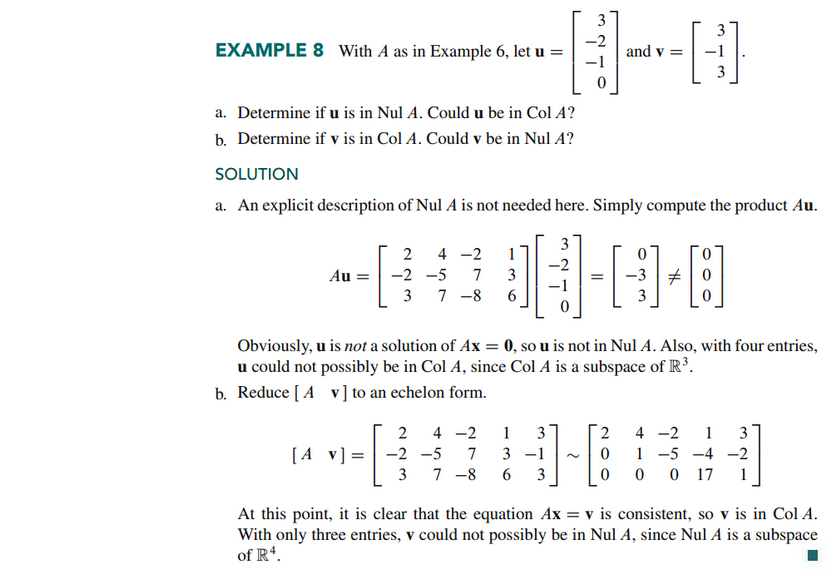

### Kernel and Range of a Linear Transformation

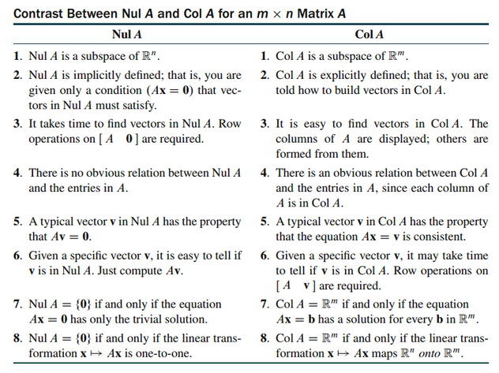

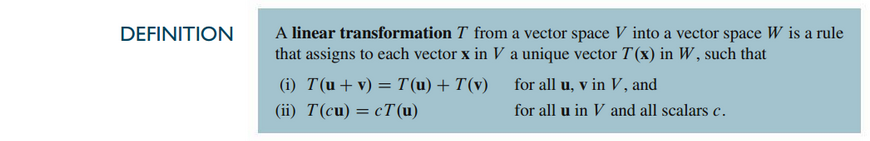

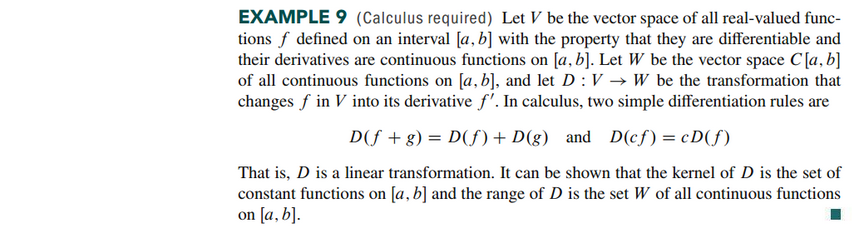
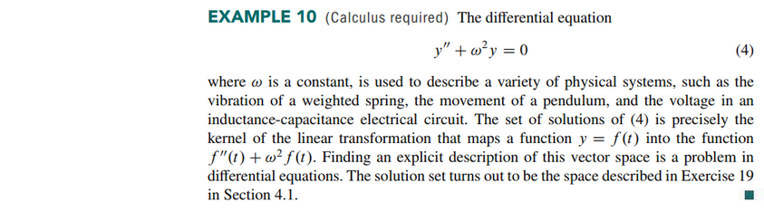
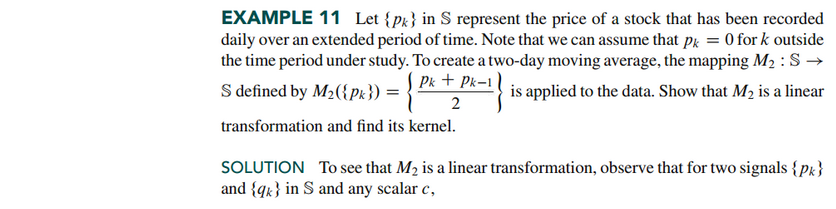
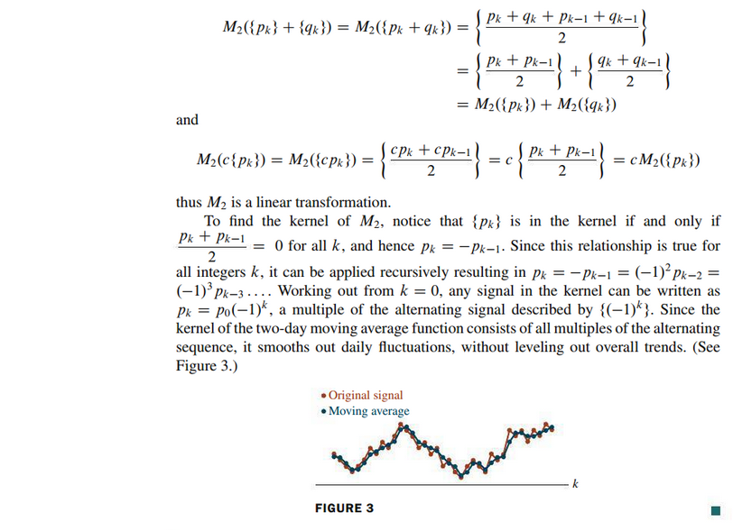

 

# Resources

- [⬇ Section 4.2 Presentation](file:../../../../../../files/summer-2021/MATH-254/notes/ch-4/sec_4-2/sec_4-2_presentation.pptx)

Textbook

+ Linear Algebra and Its Applications 6th Edition - David, Steven, Judi
  + ISBN-13: 9780135851159

