# Section 4.3: Linearly Independent Sets; Bases

## Textbook Notes

- [⬇ Section 4.3 Presentation](file:../../../../../../files/summer-2021/MATH-254/notes/ch-4/sec_4-3/sec_4-3_presentation.pptx)

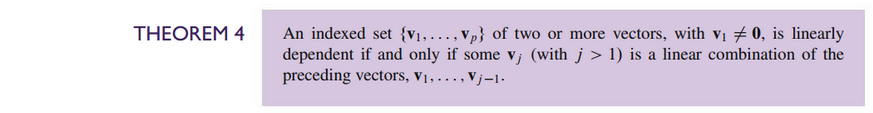

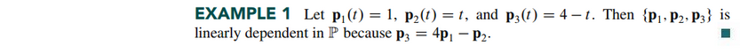
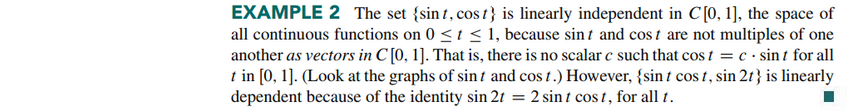

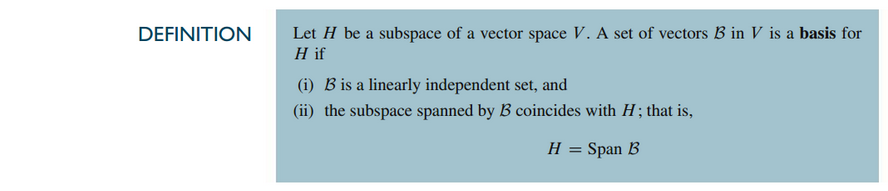

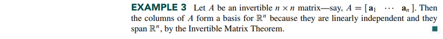
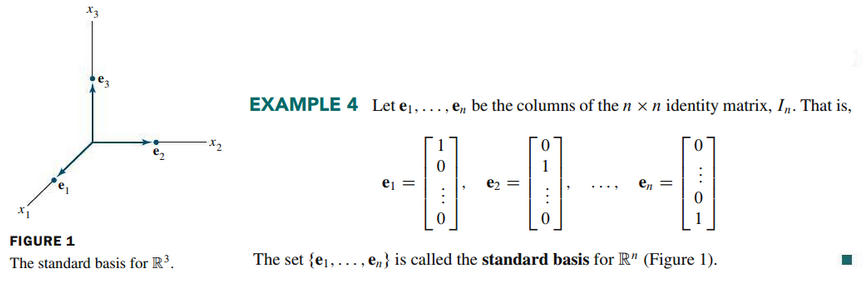

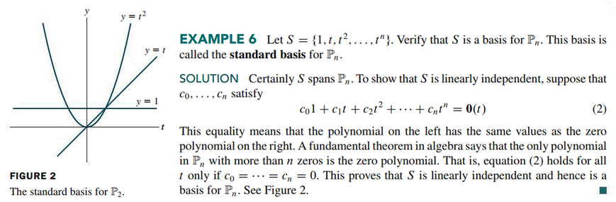

### The Spanning Set Theorem

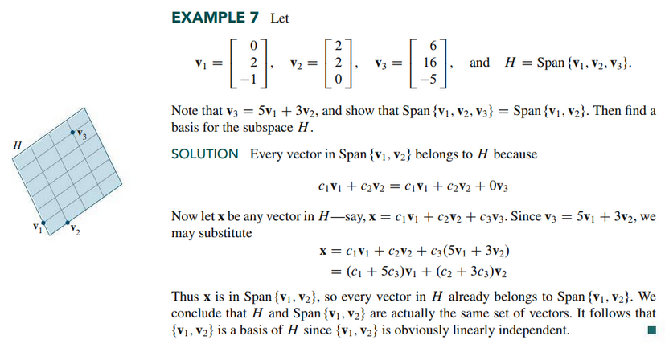

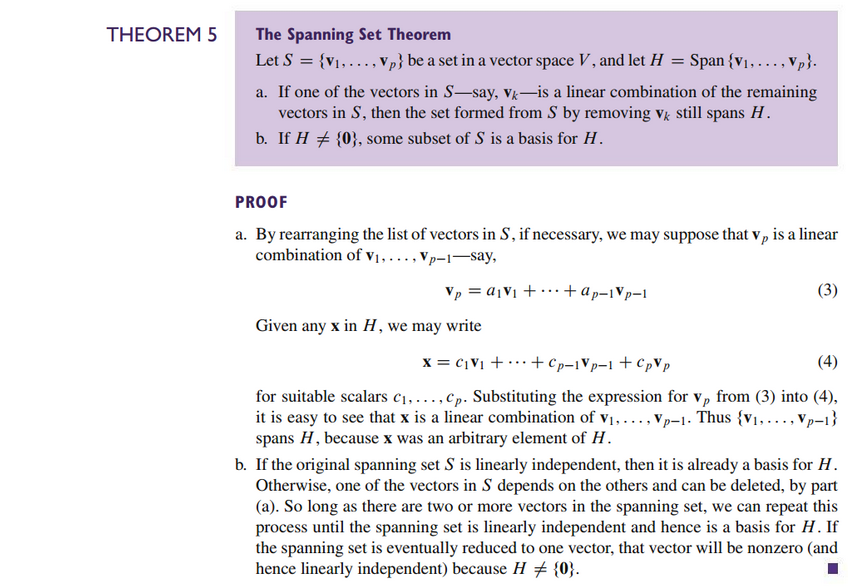

### Bases for Nul A, Col A, and Row A

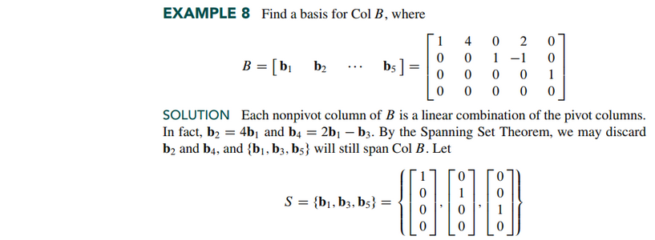
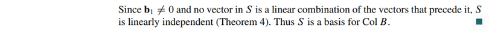
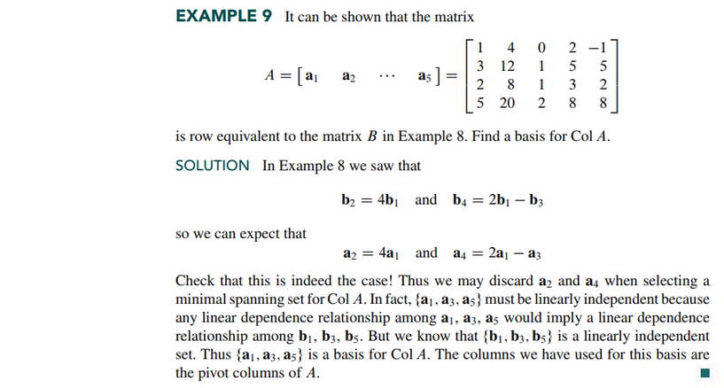

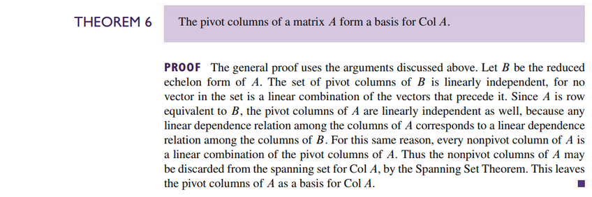
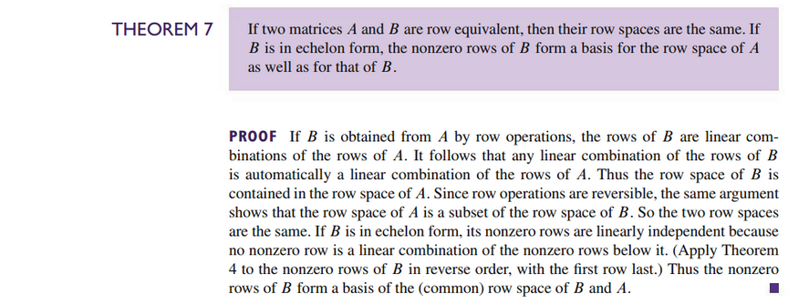

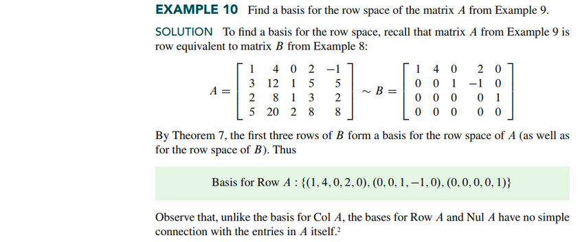

### Two Views of a Basis

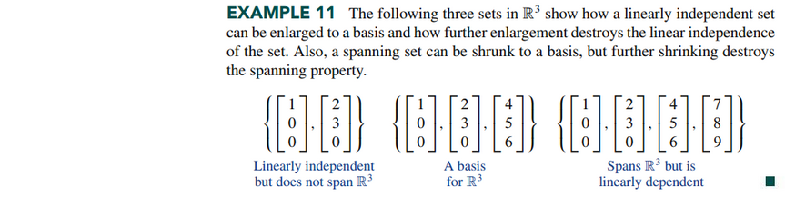

 

# Resources

- [⬇ Section 4.3 Presentation](file:../../../../../../files/summer-2021/MATH-254/notes/ch-4/sec_4-3/sec_4-3_presentation.pptx)

Textbook

+ Linear Algebra and Its Applications 6th Edition - David, Steven, Judi
  + ISBN-13: 9780135851159

