# Section 4.4: Coordinate Systems

## Textbook Notes

- [⬇ Section 4.4 Presentation](file:../../../../../../files/summer-2021/MATH-254/notes/ch-4/sec_4-4/sec_4-4_presentation.pptx)

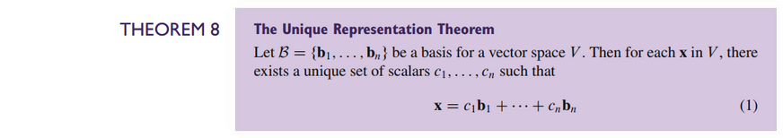
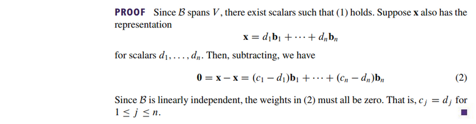

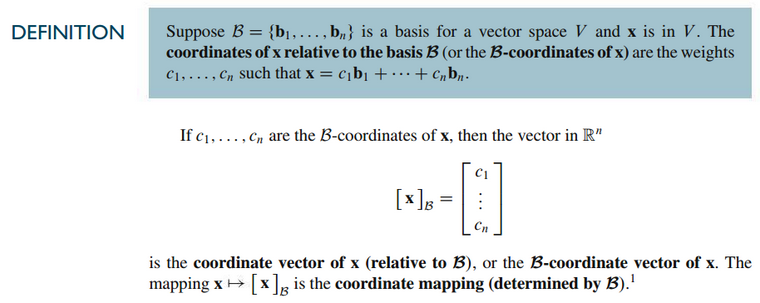

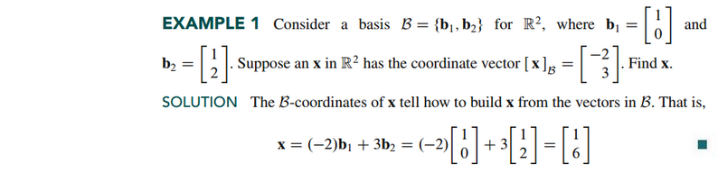
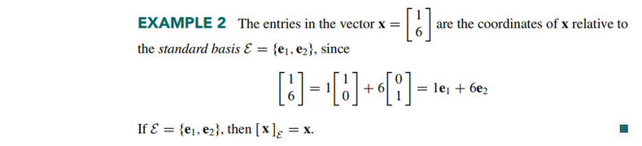

### A Graphical Interpretation of Coordinates

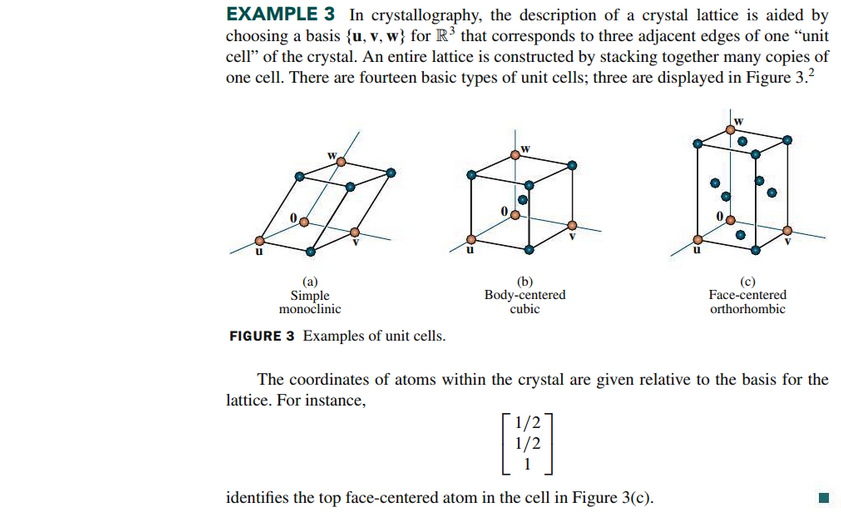

### Coordinates in $\mathbb{R}^{n}$

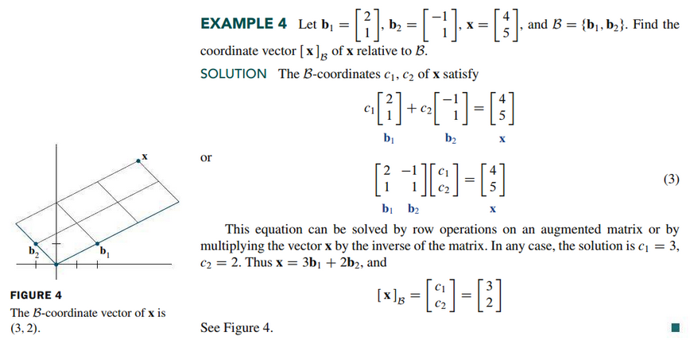

### The Coordinate Mapping

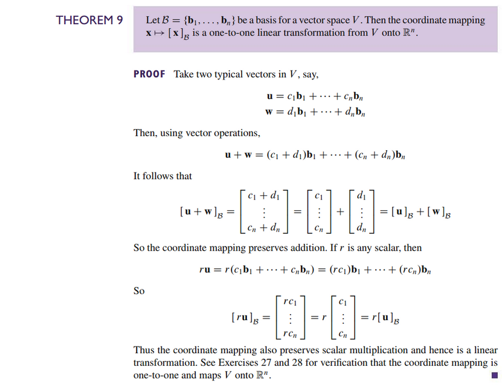

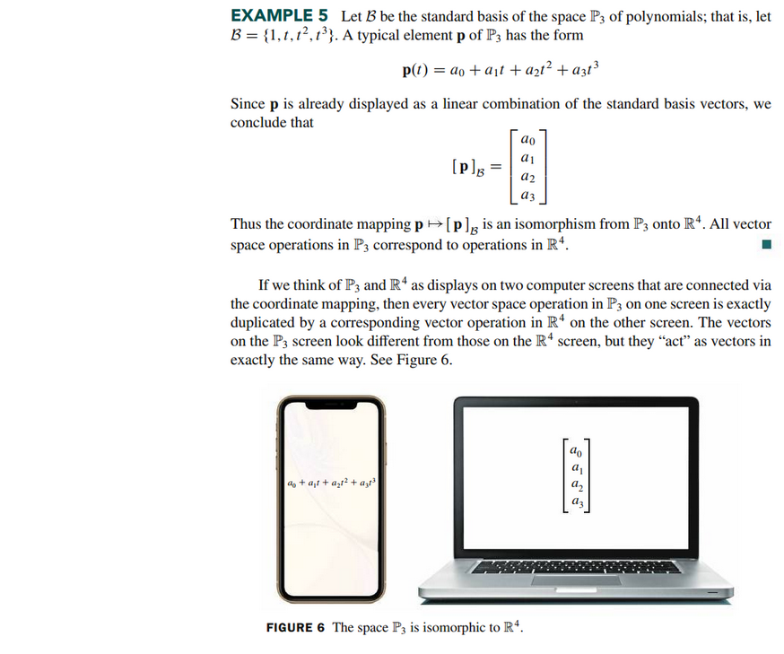
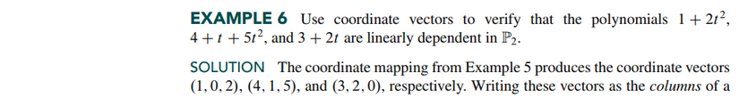
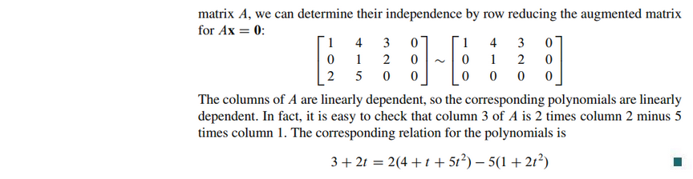
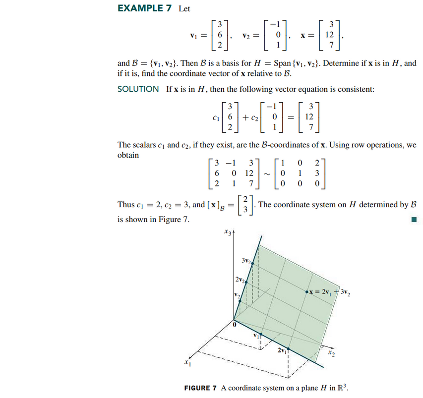

 

# Resources

- [⬇ Section 4.4 Presentation](file:../../../../../../files/summer-2021/MATH-254/notes/ch-4/sec_4-4/sec_4-4_presentation.pptx)

Textbook

+ Linear Algebra and Its Applications 6th Edition - David, Steven, Judi
  + ISBN-13: 9780135851159

