# Section 4.5: The Dimension of a Vector Space

## Textbook Notes

- [⬇ Section 4.5 Presentation](file:../../../../../../files/summer-2021/MATH-254/notes/ch-4/sec_4-5/sec_4-5_presentation.pptx)

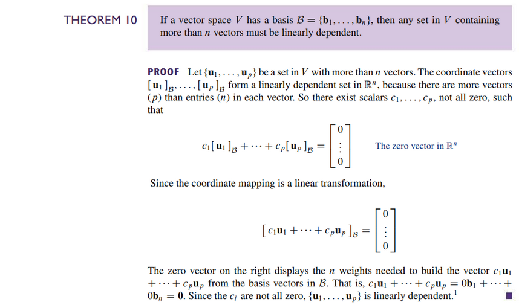
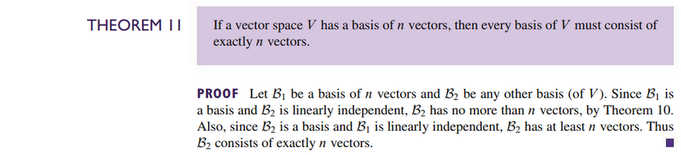

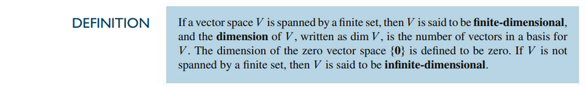

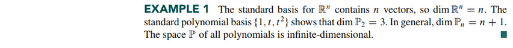
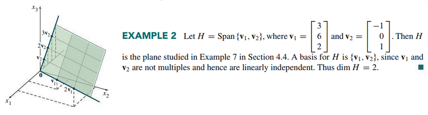
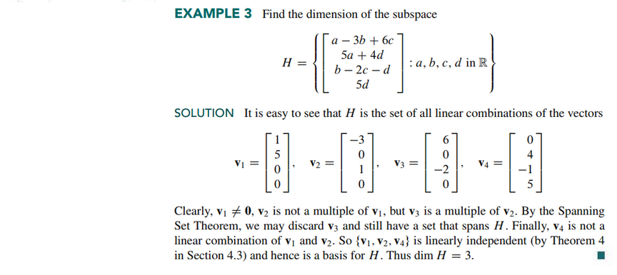

### Subspaces of a Finite-Dimensional Space

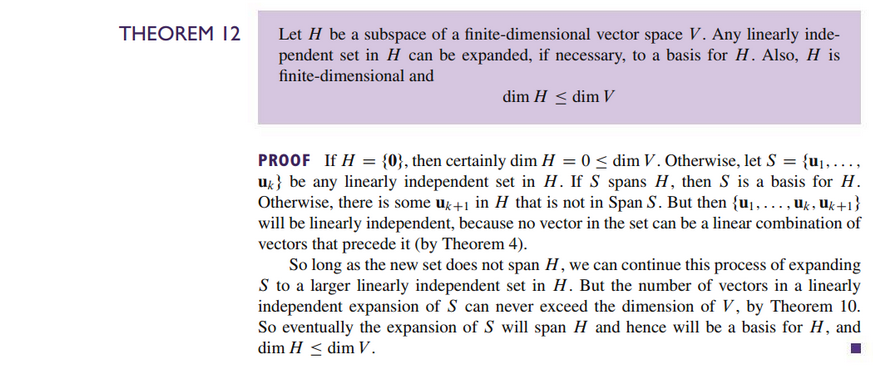
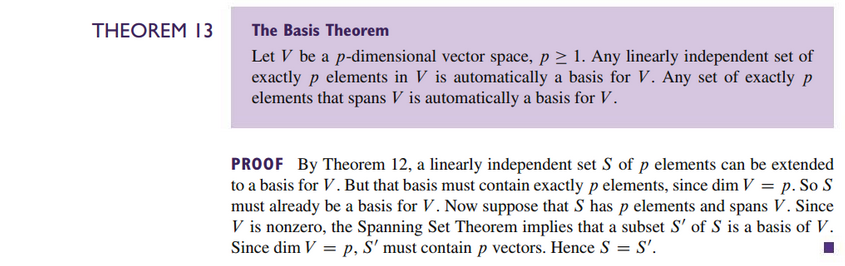

### The Dimensions of Nul A, Col A, and Row A

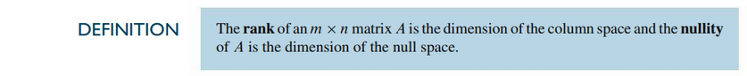

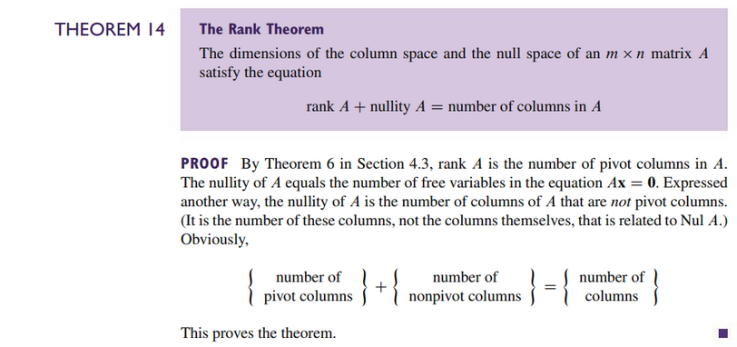

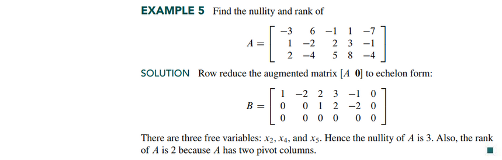
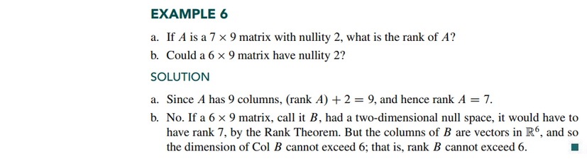
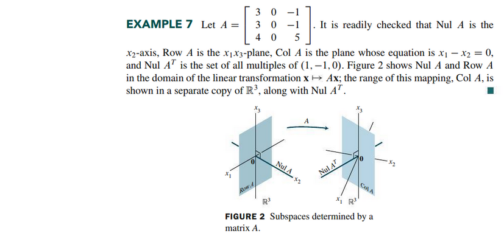

### Applications to Systems of Equations

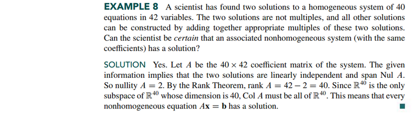

### Rank and the Invertible Matrix Theorem

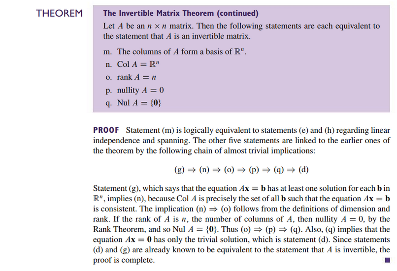

 

# Resources

- [⬇ Section 4.5 Presentation](file:../../../../../../files/summer-2021/MATH-254/notes/ch-4/sec_4-5/sec_4-5_presentation.pptx)

Textbook

+ Linear Algebra and Its Applications 6th Edition - David, Steven, Judi
  + ISBN-13: 9780135851159

