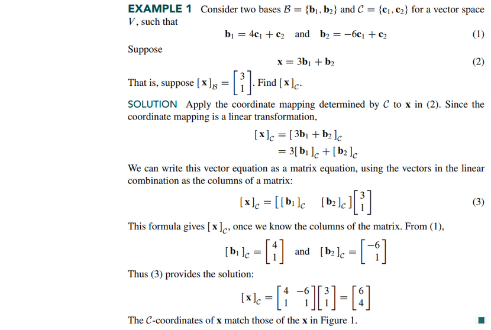
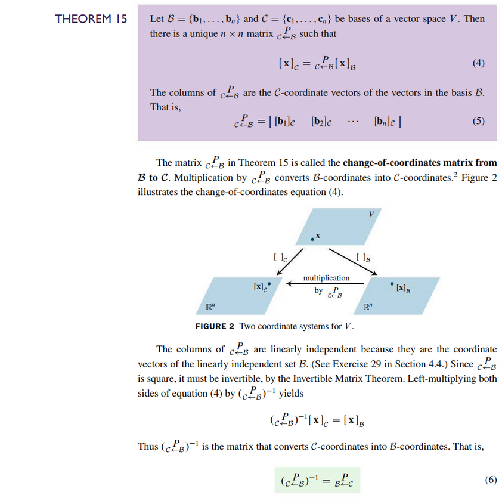
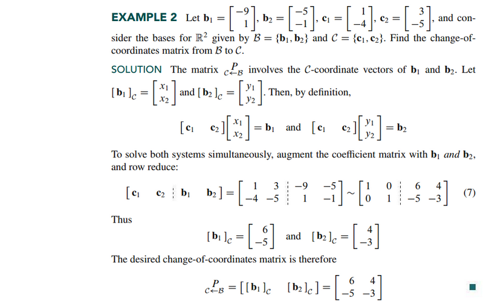
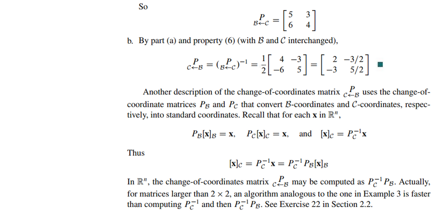

# Section 4.6: Change of Basis

## Textbook Notes

- [⬇ Section 4.6 Presentation](file:../../../../../../files/summer-2021/MATH-254/notes/ch-4/sec_4-6/sec_4-6_presentation.pptx)

### Change of Basis in $\mathbb{R}^{n}$

 

# Resources

- [⬇ Section 4.6 Presentation](file:../../../../../../files/summer-2021/MATH-254/notes/ch-4/sec_4-6/sec_4-6_presentation.pptx)

Textbook

+ Linear Algebra and Its Applications 6th Edition - David, Steven, Judi
  + ISBN-13: 9780135851159

