# Section 5.1: Eigenvectors and Eigenvalues

## Textbook Notes

- [⬇ Section 5.1 Presentation](file:../../../../../../files/summer-2021/MATH-254/notes/ch-5/sec_5-1/sec_5-1_presentation.pptx)

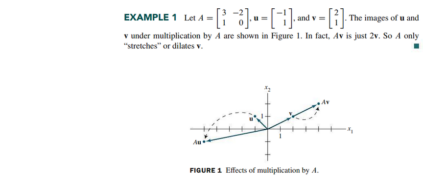

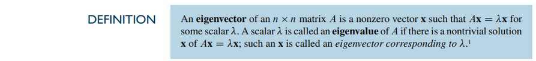

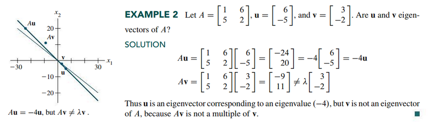
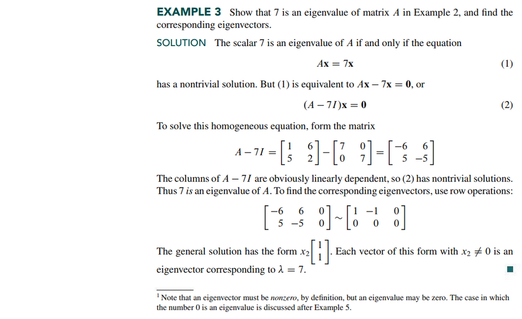

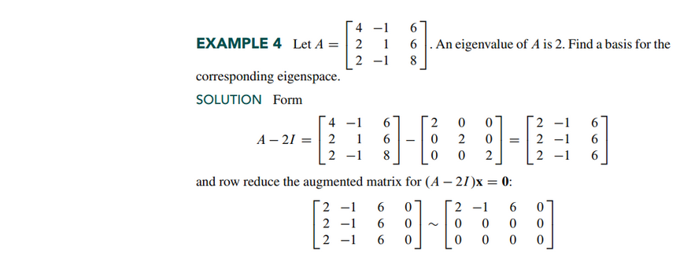
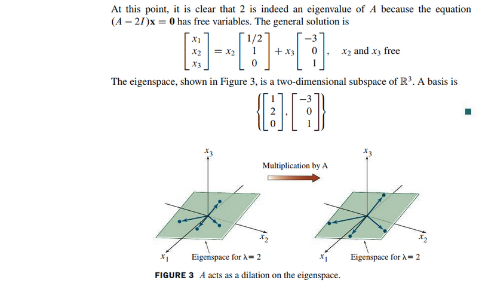

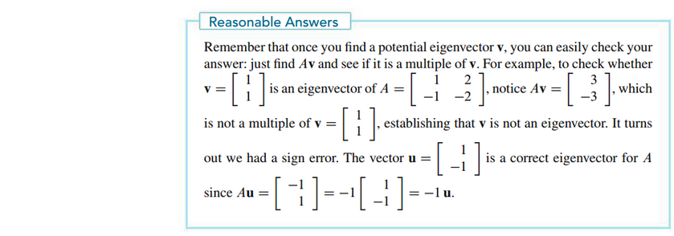

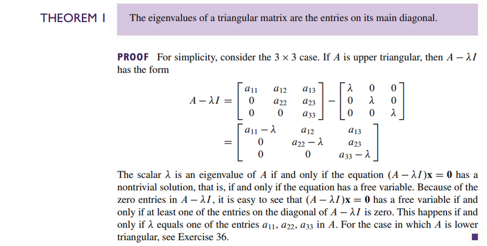

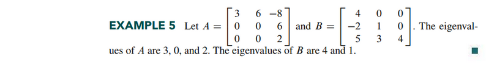

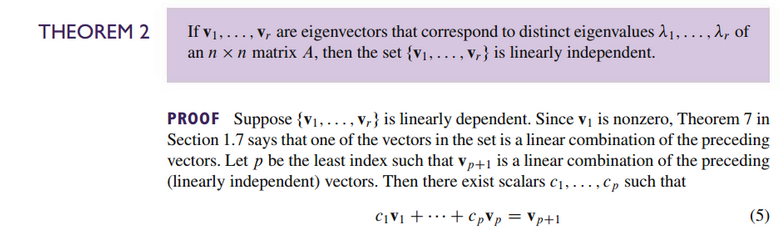
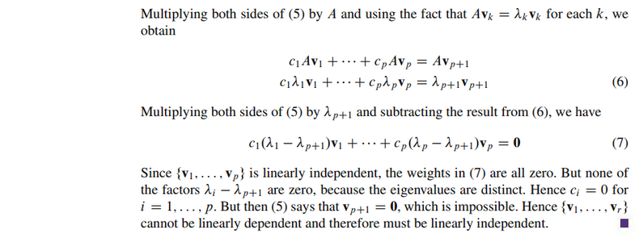

### Eigenvectors and Difference Equations

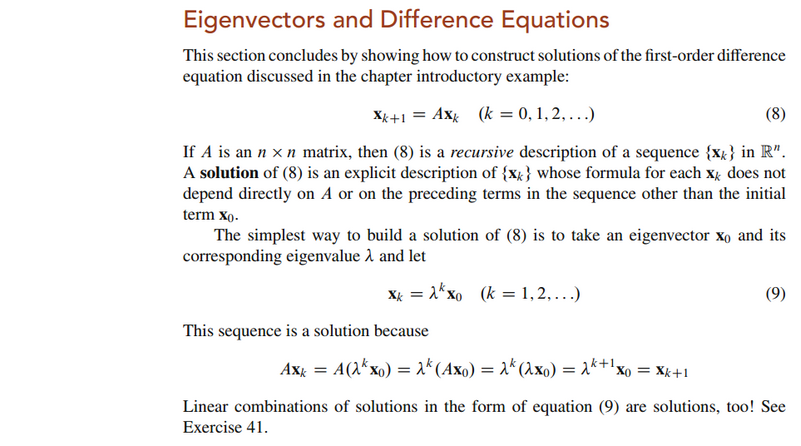

 

# Resources

- [⬇ Section 5.1 Presentation](file:../../../../../../files/summer-2021/MATH-254/notes/ch-5/sec_5-1/sec_5-1_presentation.pptx)

Textbook

+ Linear Algebra and Its Applications 6th Edition - David, Steven, Judi
  + ISBN-13: 9780135851159

