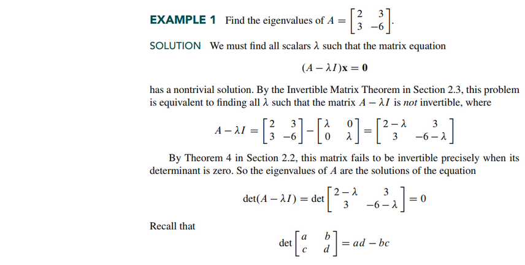
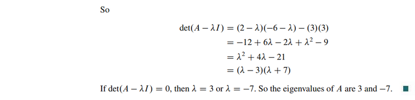
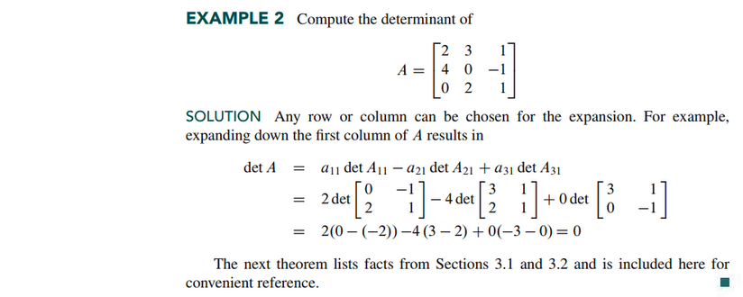
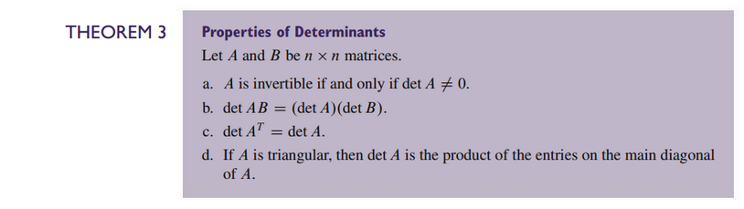
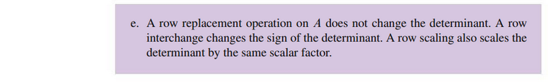
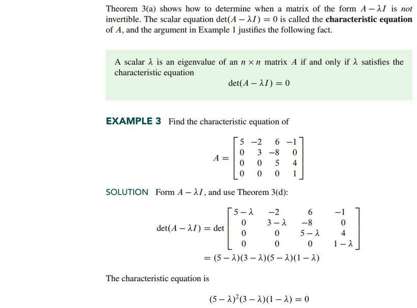
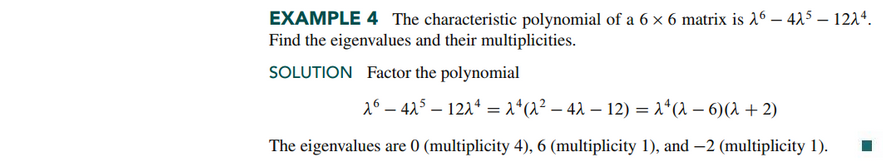
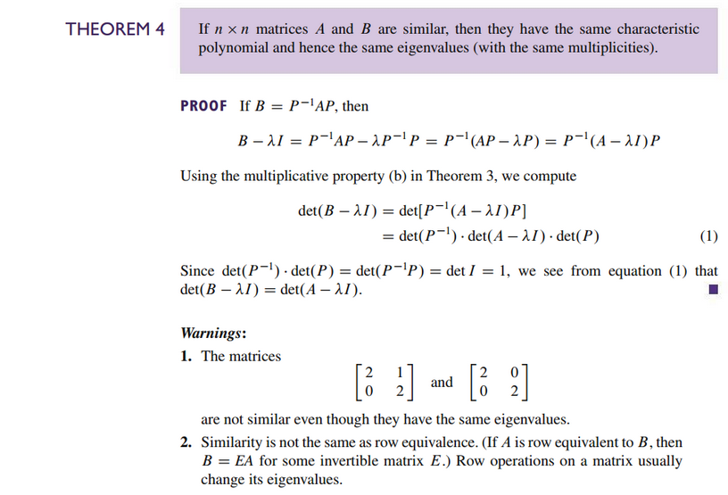
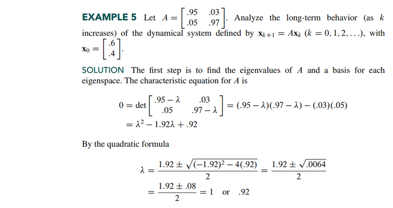
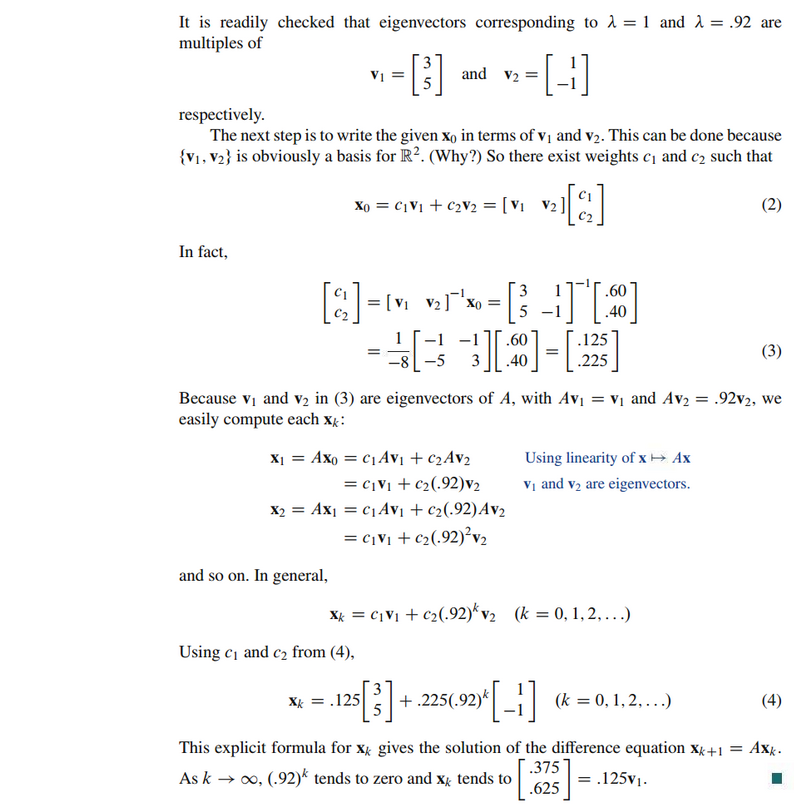

# Section 5.2: The Charactristic Equation

## Textbook Notes

- [⬇ Section 5.2 Presentation](file:../../../../../../files/summer-2021/MATH-254/notes/ch-5/sec_5-2/sec_5-2_presentation.pptx)

### Determinants

### The Characteristic Equation

### Similarity

### Application to Dynamical Systems

 

# Resources

Textbook

+ Linear Algebra and Its Applications 6th Edition - David, Steven, Judi
  + ISBN-13: 9780135851159

