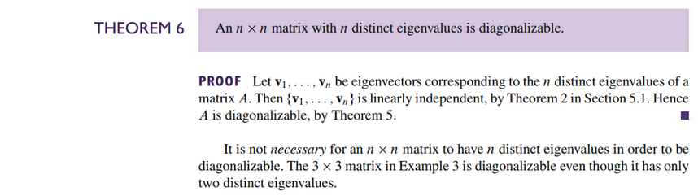

# Section 5.3: Diagonalization

## Textbook Notes

- [⬇ Section 5.3 Presentation](file:../../../../../../files/summer-2021/MATH-254/notes/ch-5/sec_5-3/sec_5-3_presentation.pptx)

### Diagonalizing Matrices

### Matrices Whose Eigenvalues Are Not Distinct

 

# Resources

- [⬇ Section 5.3 Presentation](file:../../../../../../files/summer-2021/MATH-254/notes/ch-5/sec_5-3/sec_5-3_presentation.pptx)

Textbook

+ Linear Algebra and Its Applications 6th Edition - David, Steven, Judi
  + ISBN-13: 9780135851159

