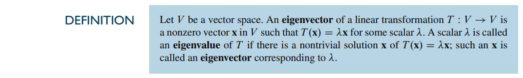
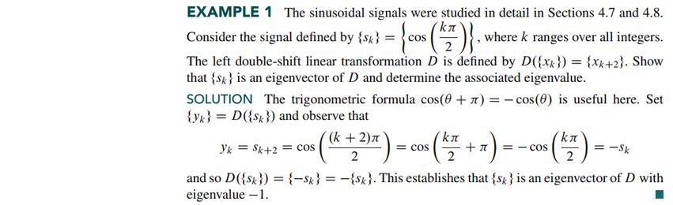
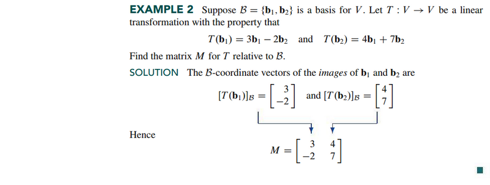
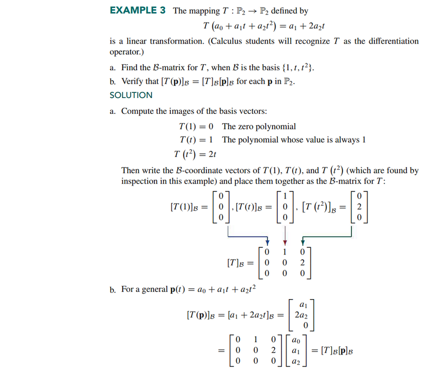
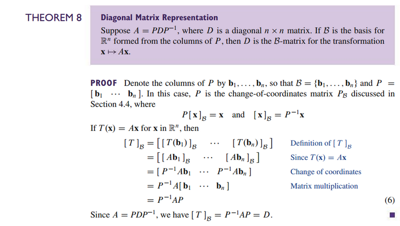
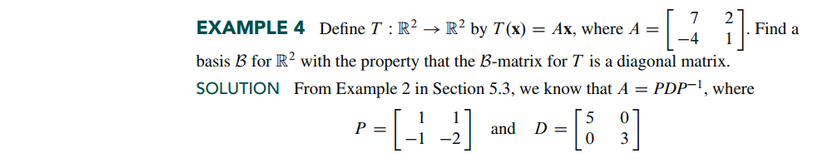
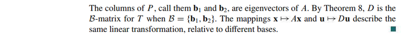
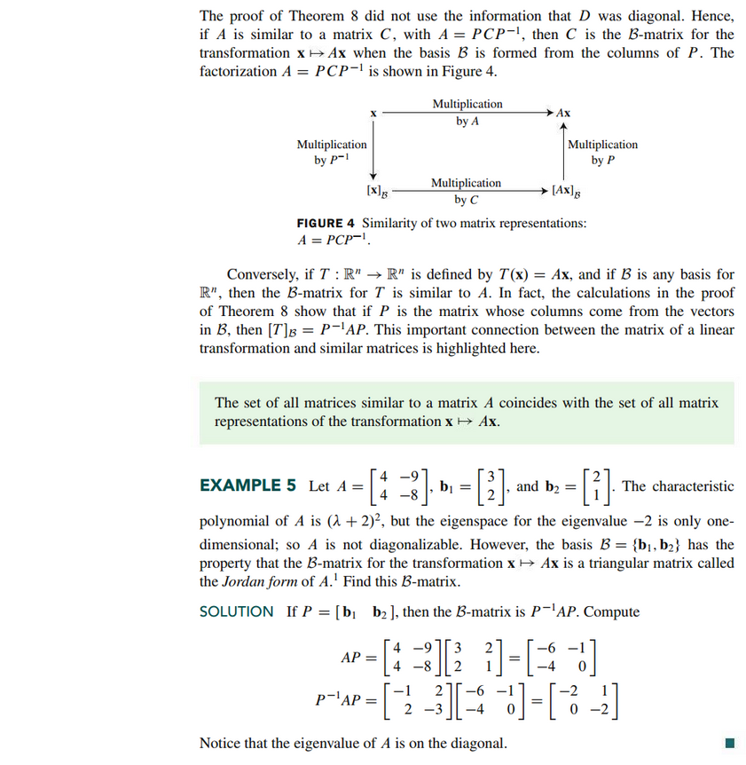

# Section 5.4: Eigenvectors and Linear Transformations

## Textbook Notes

- [⬇ Section 5.4 Presentation](file:../../../../../../files/summer-2021/MATH-254/notes/ch-5/sec_5-4/sec_5-4_presentation.pptx)

### Eigenvectors and Linear Transformations

### The Matrix of a Linear Transformation

### Linear Transformations on $\mathbb{R}^{n}$

### Similarity of Matrix Representations

 

# Resources

- [⬇ Section 5.4 Presentation](file:../../../../../../files/summer-2021/MATH-254/notes/ch-5/sec_5-4/sec_5-4_presentation.pptx)

Textbook

+ Linear Algebra and Its Applications 6th Edition - David, Steven, Judi
  + ISBN-13: 9780135851159

