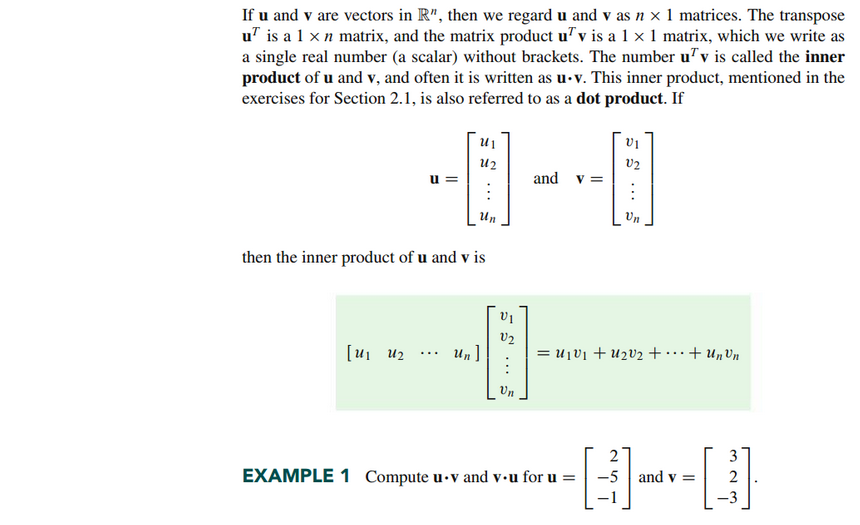
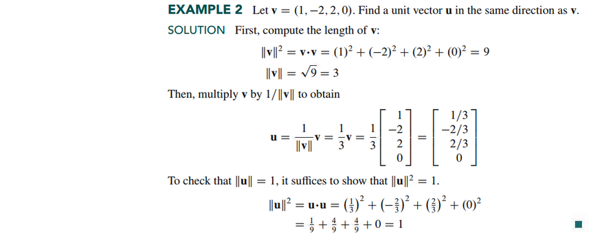
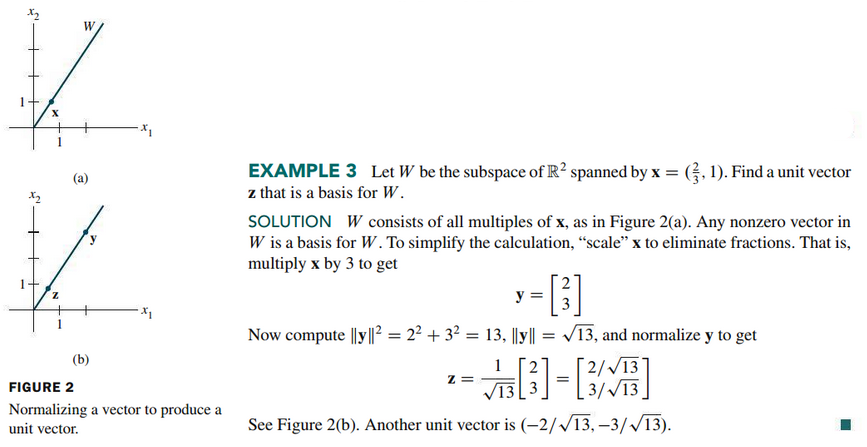
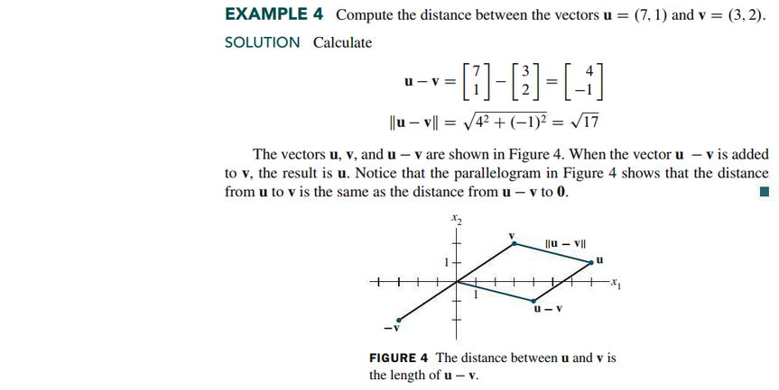
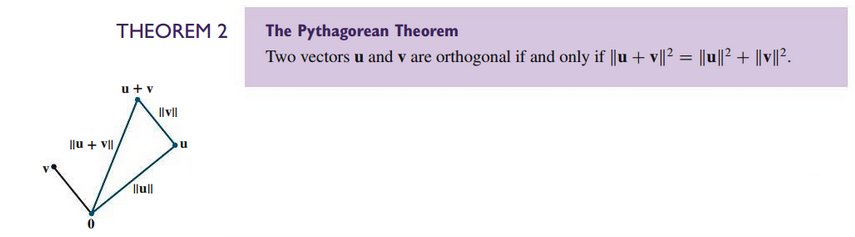
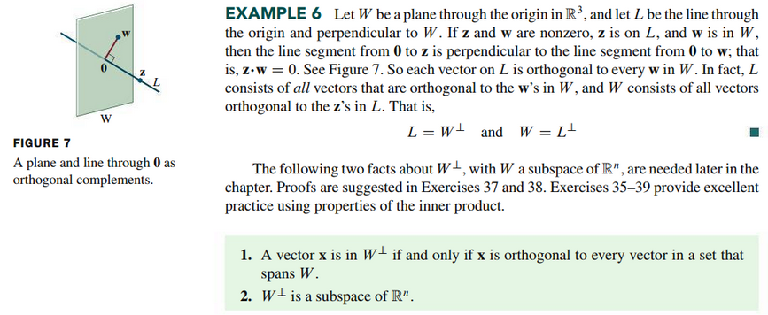
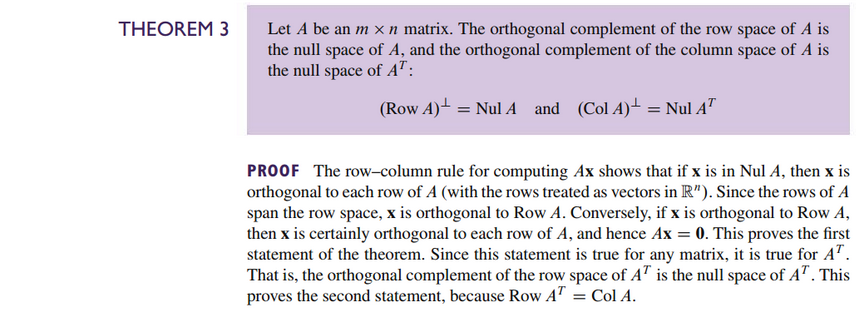

# Section 6.1: Inner Product, Length, and Orthogonality

## Textbook Notes

- [⬇ Section 6.1 Presentation](file:../../../../../../files/summer-2021/MATH-254/notes/ch-6/sec_6-1/sec_6-1_presentation.pptx)

### The Inner Product

### Distance in $\mathbb{R}^{n}$

### Orthogonal Vectors

### Orthogonal Complements

 

# Resources

- [⬇ Section 6.1 Presentation](file:../../../../../../files/summer-2021/MATH-254/notes/ch-6/sec_6-1/sec_6-1_presentation.pptx)

Textbook

+ Linear Algebra and Its Applications 6th Edition - David, Steven, Judi
  + ISBN-13: 9780135851159

