# Section 6.2: Orthogonal Sets

## Textbook Notes

- [⬇ Section 6.2 Presentation](file:../../../../../../files/summer-2021/MATH-254/notes/ch-6/sec_6-2/sec_6-2_presentation.pptx)

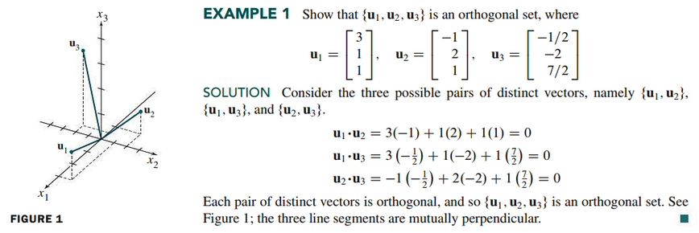

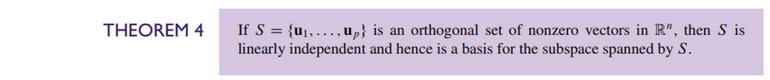
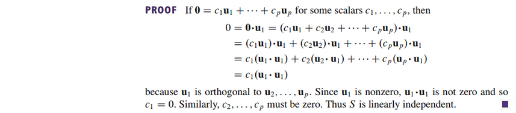

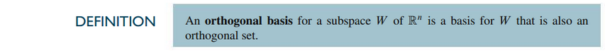

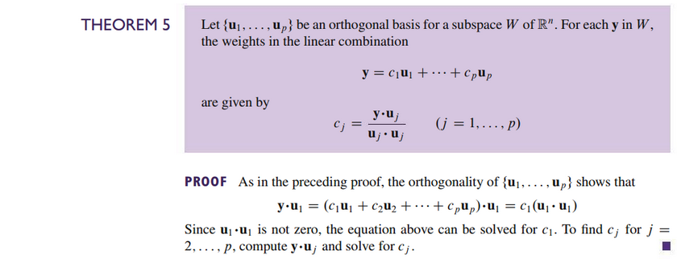

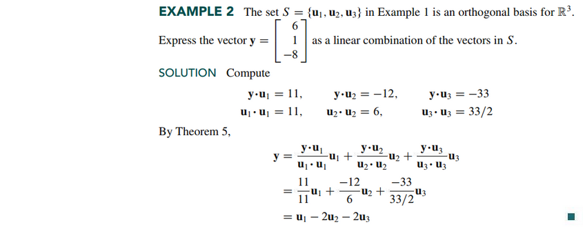

### An Orthogonal Projection

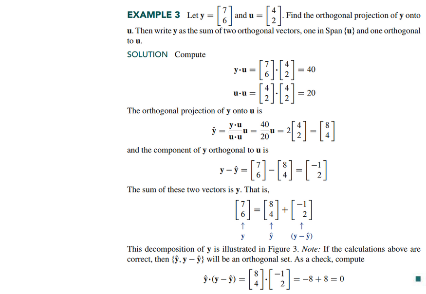
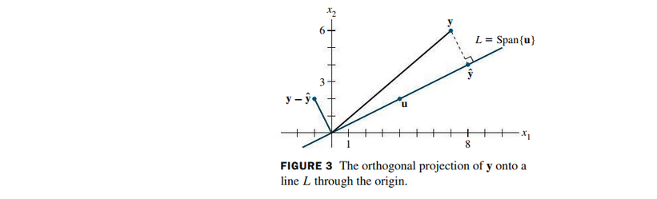
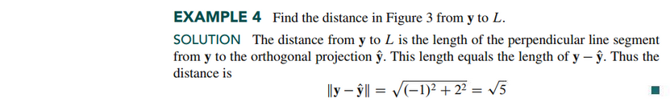

### Orthonormal Sets

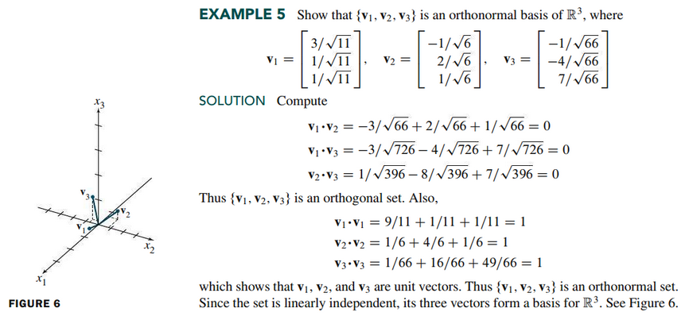

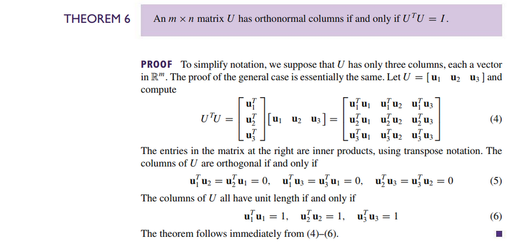
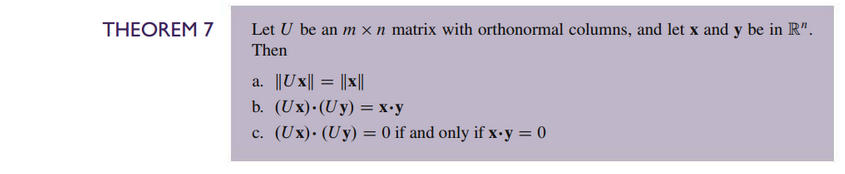

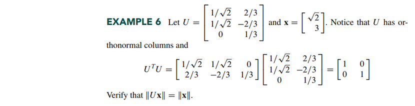

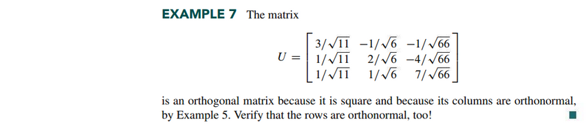

 

# Resources

Textbook

+ Linear Algebra and Its Applications 6th Edition - David, Steven, Judi
  + ISBN-13: 9780135851159

