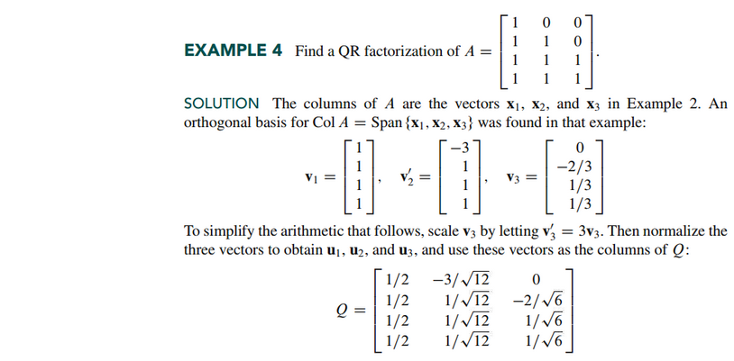

# Section 6.4: The Gram-Schmidt Process

## Textbook Notes

- [⬇ Section 6.4 Presentation](file:../../../../../../files/summer-2021/MATH-254/notes/ch-6/sec_6-4/sec_6-4_presentation.pptx)

### Orthogonal Bases

### QR Factorization of Matrices

 

# Resources

- [⬇ Section 6.4 Presentation](file:../../../../../../files/summer-2021/MATH-254/notes/ch-6/sec_6-4/sec_6-4_presentation.pptx)

Textbook

+ Linear Algebra and Its Applications 6th Edition - David, Steven, Judi
  + ISBN-13: 9780135851159

