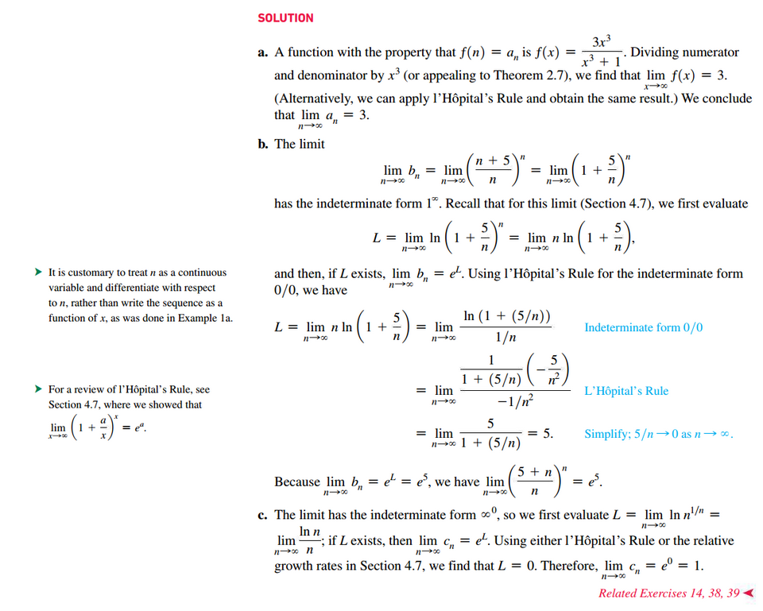

# Section 10.2: Sequences

## Limit of a Sequence and Limit Laws

## Geometric Sequences

## The Squeeze Theorem

## Bounded Monotonic Sequence

## Growth Rates of Sequences

## Formal Definition of a Limit of a Sequence

 

# Resources

Textbook

+ Calculus, Early Transcendentals 3rd Edition - Briggs, Cochran, and Gillet

