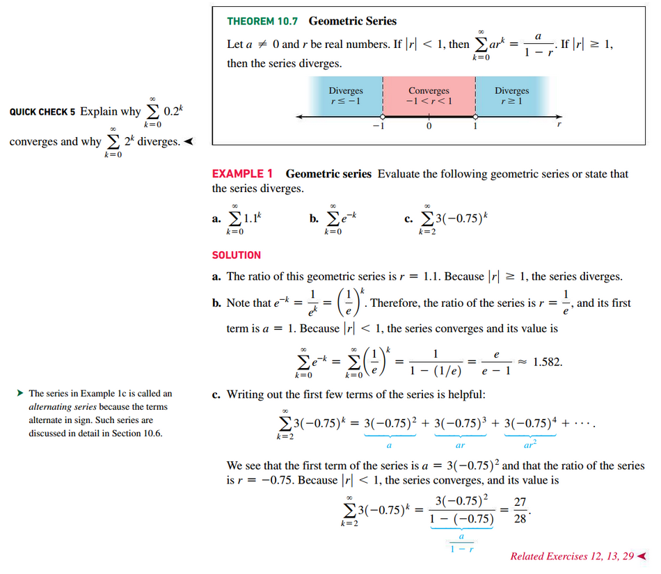
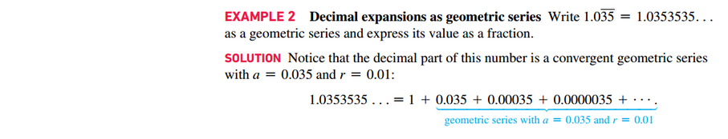
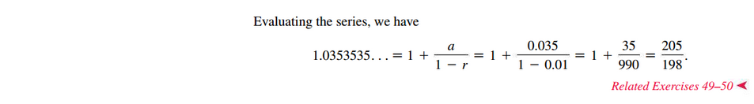
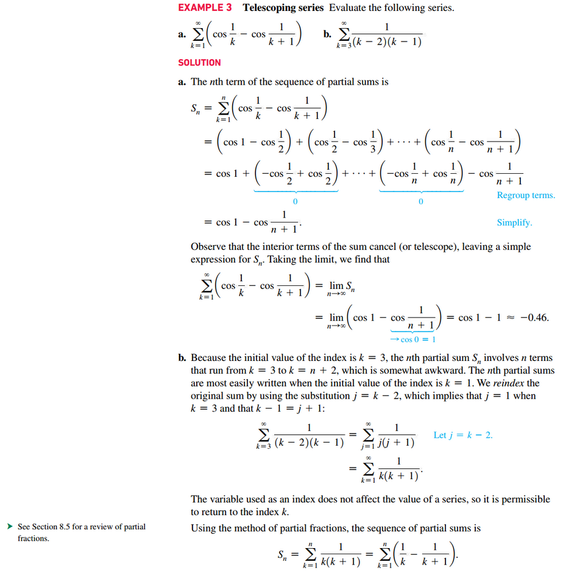
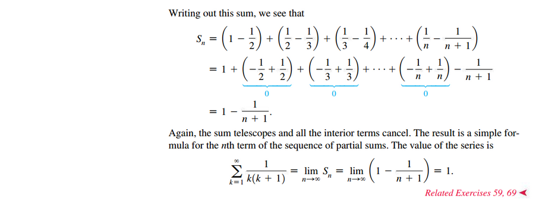
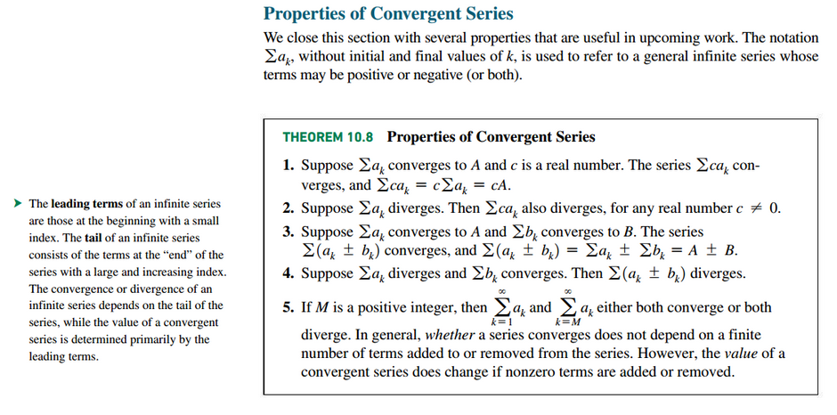
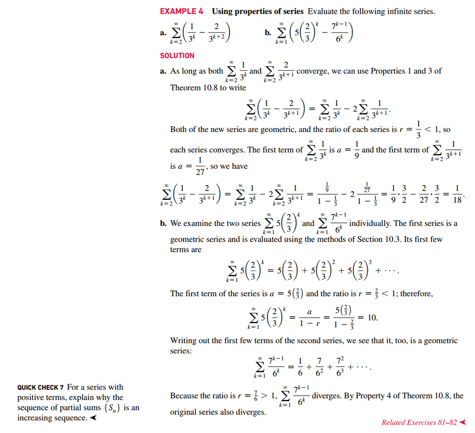

# Section 10.3: Infinite Series

## Geometric Sums and Series

## Telescoping Series

## Properties of Convergent Series

 

# Resources

Textbook

+ Calculus, Early Transcendentals 3rd Edition - Briggs, Cochran, and Gillet

