# Section 10.4: The Divergence and Integral Tests

## The Divergence Test

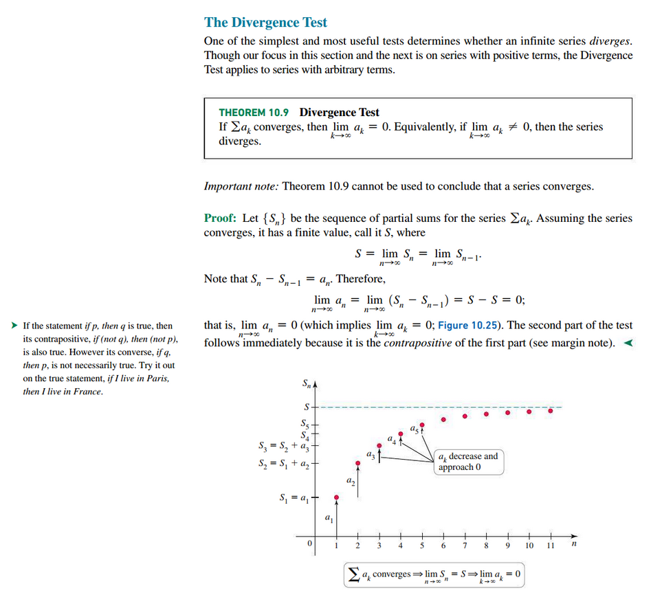

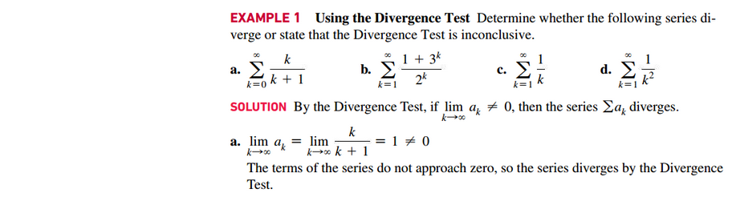
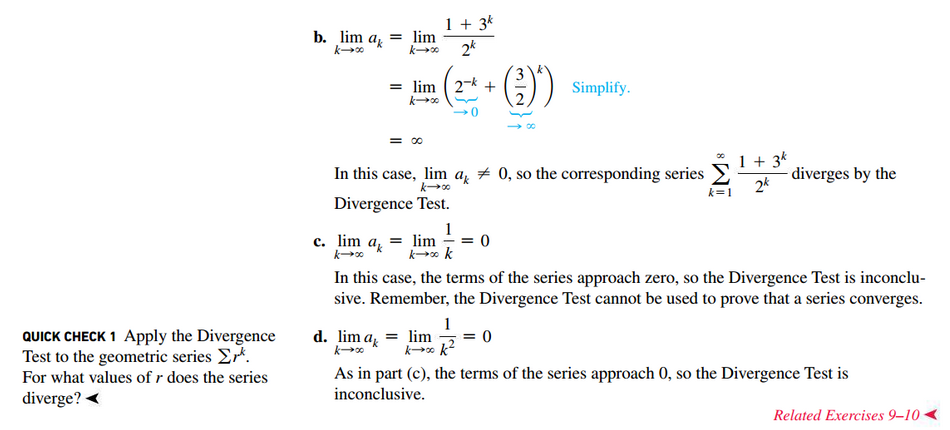

## The Harmonic Series

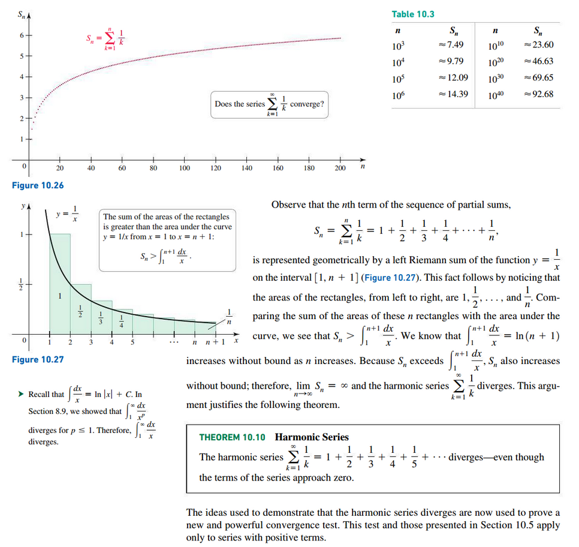

## The Integral Test

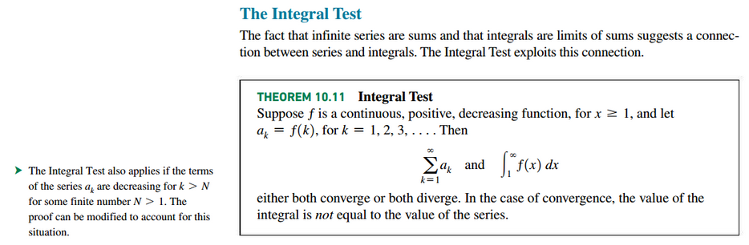
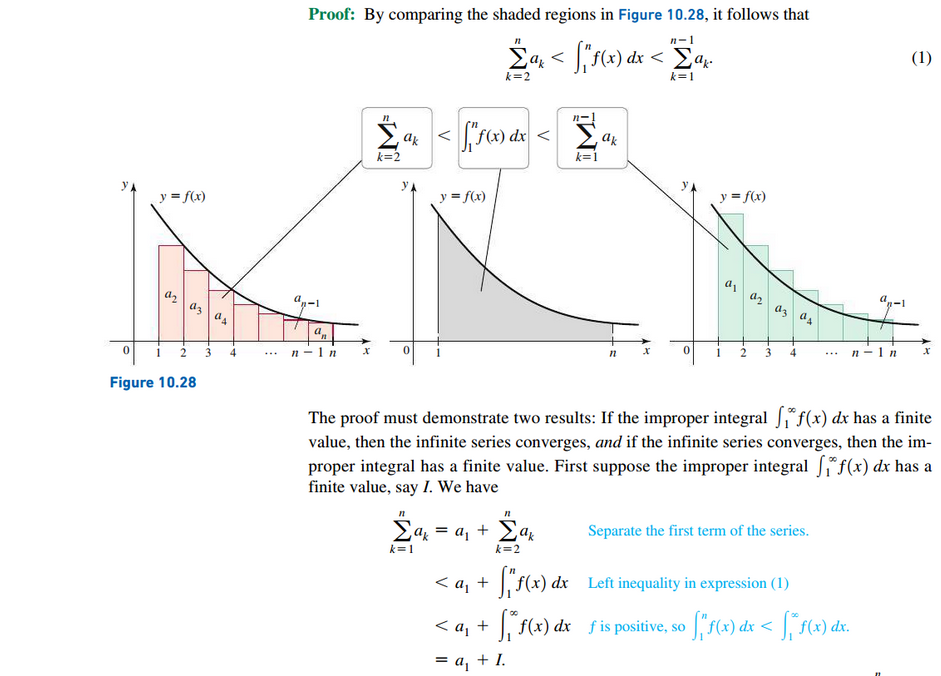
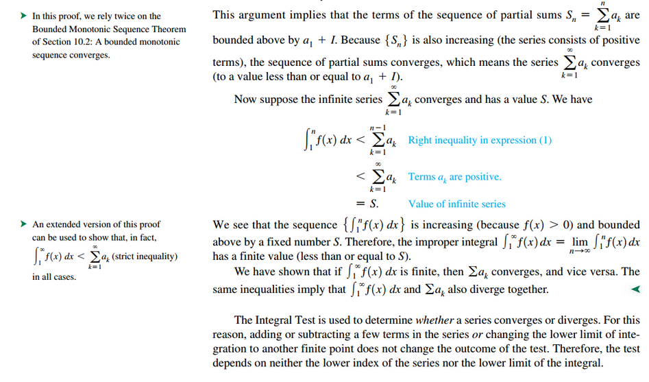

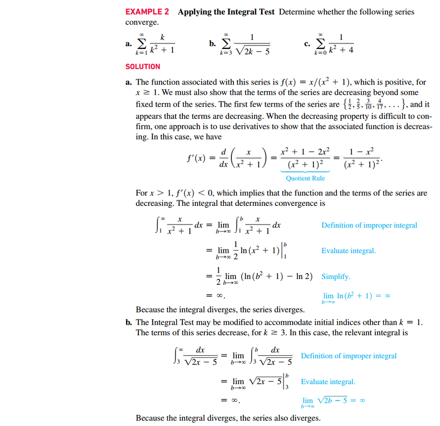
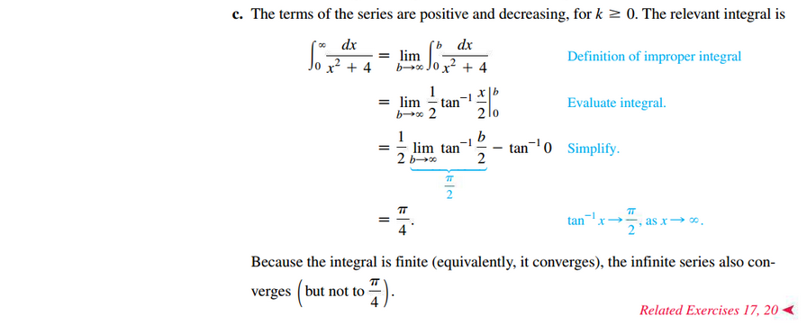

## The $p$-series

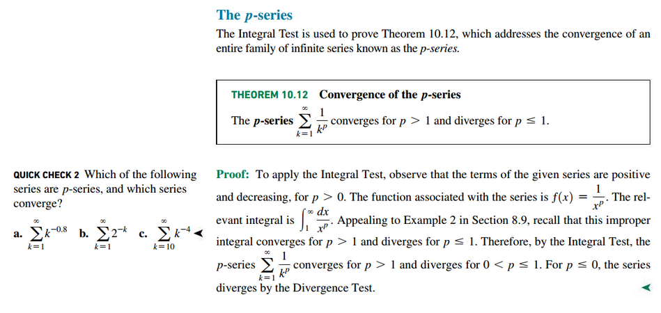

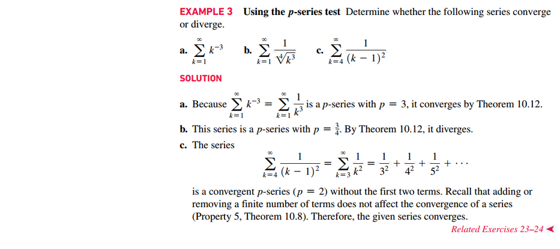

### Estimating the Value of Infinite Series

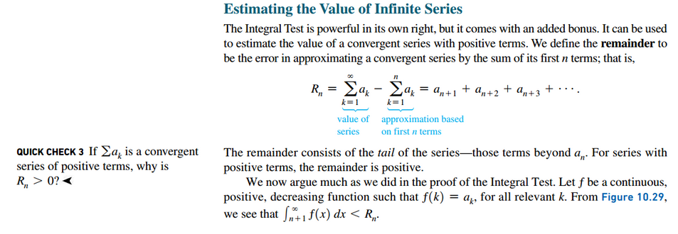
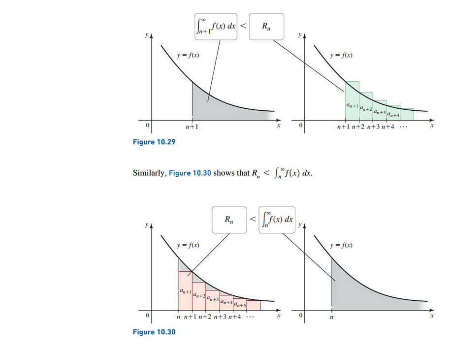
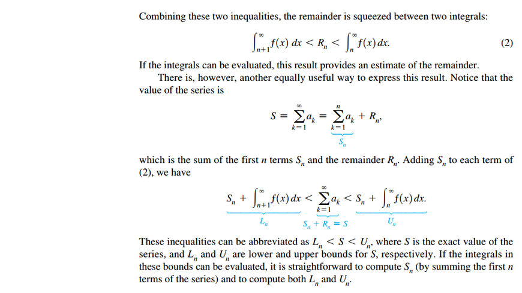

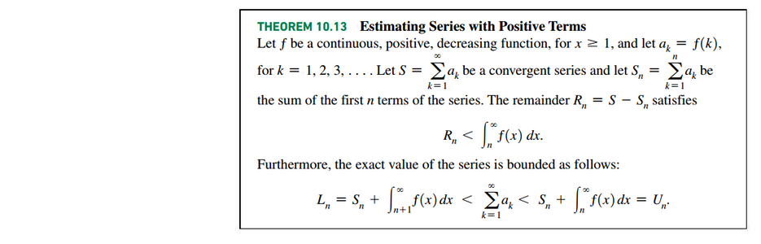

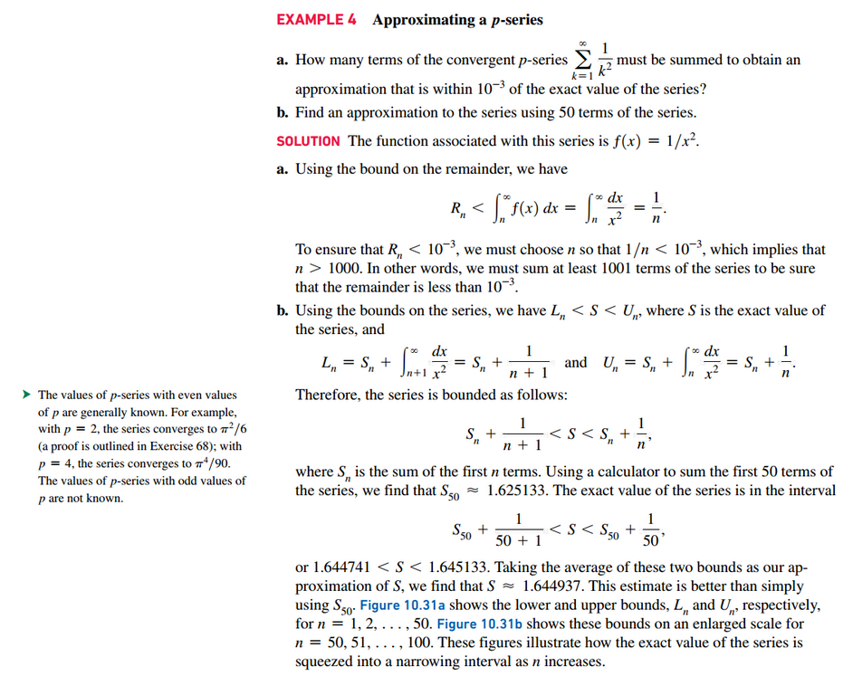
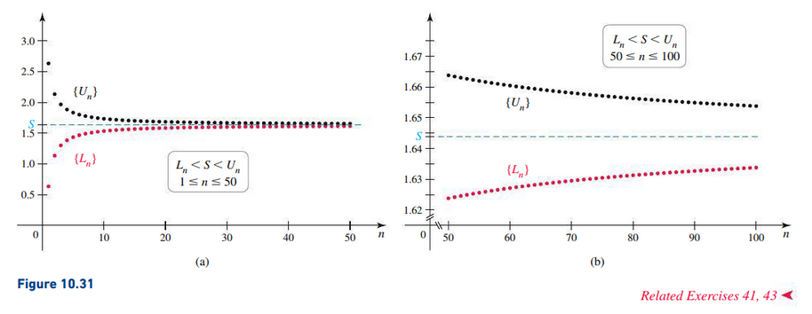

 

# Resources

Textbook

+ Calculus, Early Transcendentals 3rd Edition - Briggs, Cochran, and Gillet

