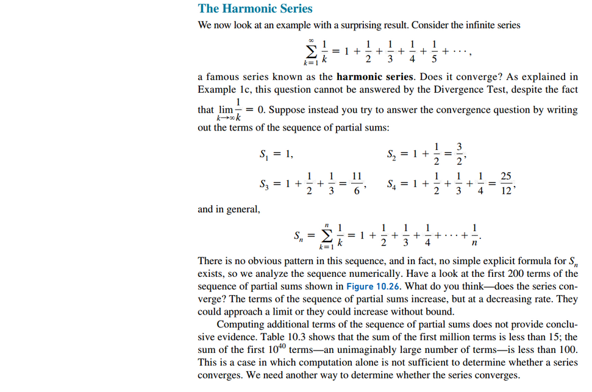

# Section 10.4: The Divergence and Integral Tests

## The Divergence Test

## The Harmonic Series

## The Integral Test

## The $p$-series

### Estimating the Value of Infinite Series

 

# Resources

Textbook

+ Calculus, Early Transcendentals 3rd Edition - Briggs, Cochran, and Gillet

